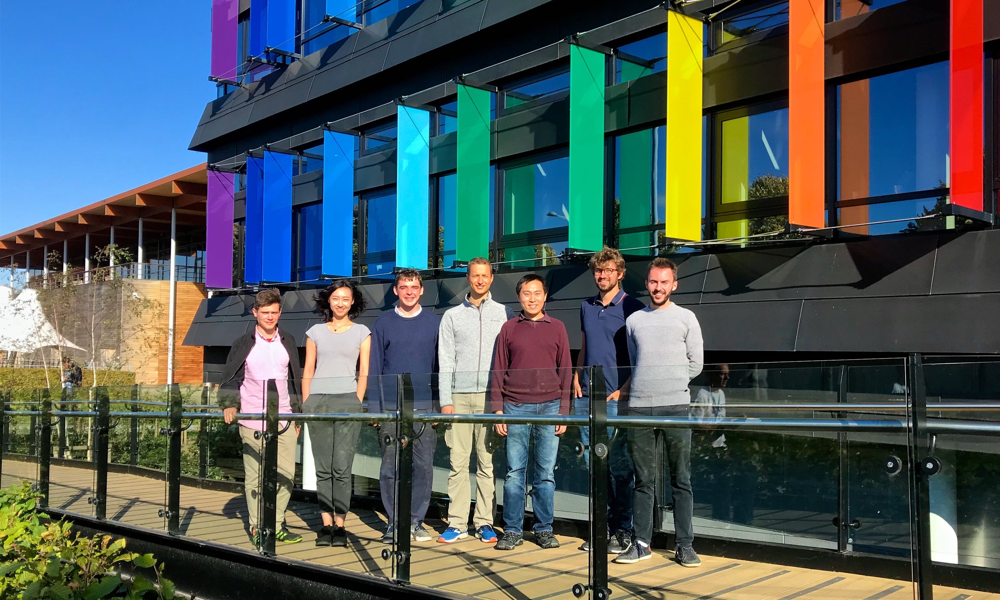

import { ButtonLink } from 'components/styles'
import { Github } from 'styled-icons/fa-brands'

I'm currently working at [Cambridge University's Maxwell Centre](https://www.maxwell.cam.ac.uk) under the supervision of [Alpha Lee](https://alpha-lee.com) on applications of machine learning in materials discovery.

Specifically, we embarked on a project that aims to discover efficient (high figure of merit $zT > 1$), sustainable and scalable (lead-free and rare earth-free) bulk thermoelectrics using machine learning-guided experimentation. The key advance is going beyond 'big data' – both first principles calculations and experimental synthesis and characterization of bulk thermoelectrics are costly and low throughput – and instead move towards 'optimal data' by developing novel algorithms that optimize thermoelectric performance ($zT$) with minimal number of expensive calculations and experiments.

To date there has been no statistically robust approach to simultaneously incorporate experimental and model error into machine learning models in a search space with high opportunity cost and high latency (i.e. large time between prediction and validation).

Consequently, searches have been unable to effectively guide experimentalists in the selection of exploring or exploiting new materials when the validation step is inherently low throughput and resource-intensive, such as the case of developing new bulk functional materials like thermoelectrics.

Our project will realize a holistic pipeline to discover novel thermoelectrics: machine learning is used to predict $zT$ for a large database of structures together with estimated uncertainty. Candidate structures are then selected, based on maximizing $zT$ subject to a tolerable level of uncertainty. The final stage consists of expensive experimental synthesis and characterization of high-$zT$ candidates using Bayesian optimization and active machine learning.

If you're interested, take a look at our Github org:

<ButtonLink href="https://github.com/Lee-Group">
  <Github alt="GitHub" size="2em" />
  &ensp;Lee Group
</ButtonLink>
