Advanced quantum field theory was given by [Prof. Jürgen Berges](https://www.thphys.uni-heidelberg.de/~berges/people.htm) at Heidelberg University in the summer of 2015.

Below is some material I used to prepare for the exam as well as all the assignment sheets and my solutions.

## Exam Preparation

<DocsGrid>

[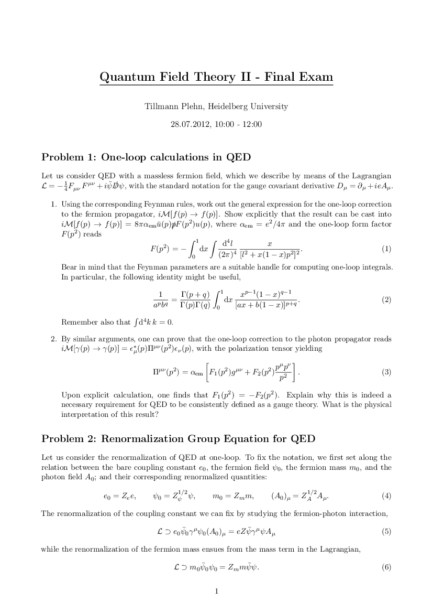 Plehn exam](pdfs/plehn-exam.pdf)

[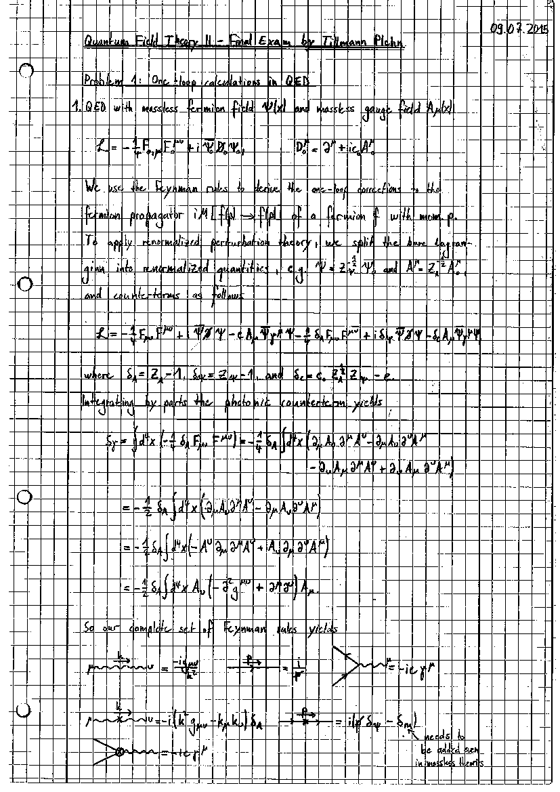 Plehn exam solution](pdfs/plehn-exam-sol.pdf)

[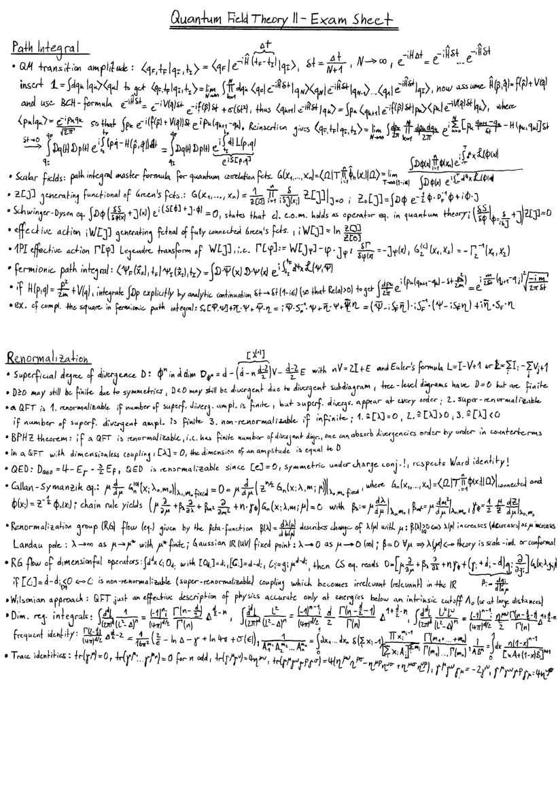 Exam sheet](pdfs/exam-sheet.pdf)

[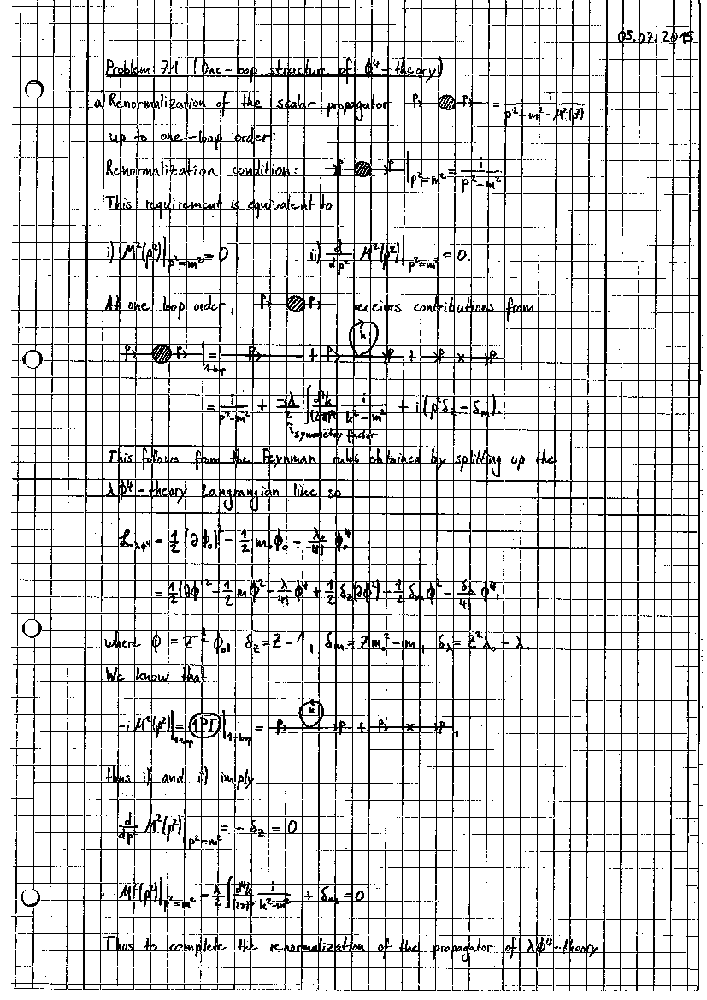 Relevant exercises](pdfs/relevant-exercises.pdf)

</DocsGrid>

## Exercises

<DocsGrid>

[ Exercise 1](pdfs/ex-01.pdf)

[ Exercise 2](pdfs/ex-02.pdf)

[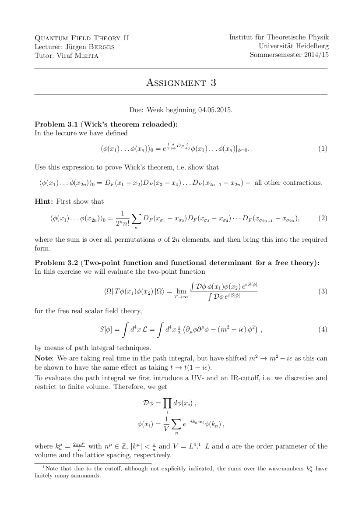 Exercise 3](pdfs/ex-03.pdf)

[ Exercise 4](pdfs/ex-04.pdf)

[ Exercise 5](pdfs/ex-05.pdf)

[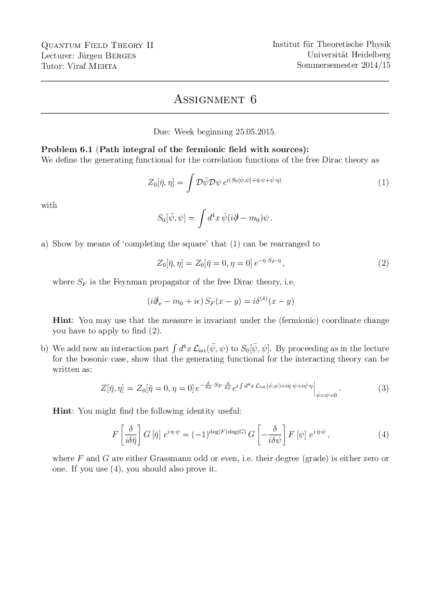 Exercise 6](pdfs/ex-06.pdf)

[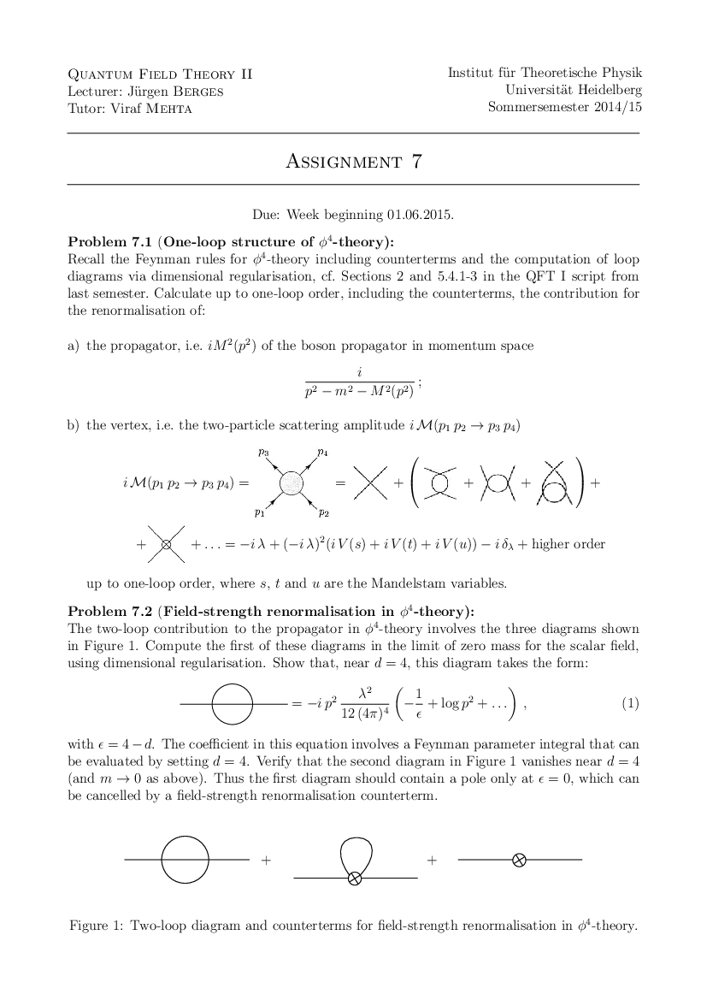 Exercise 7](pdfs/ex-07.pdf)

[ Exercise 8](pdfs/ex-08.pdf)

[ Exercise 9](pdfs/ex-09.pdf)

[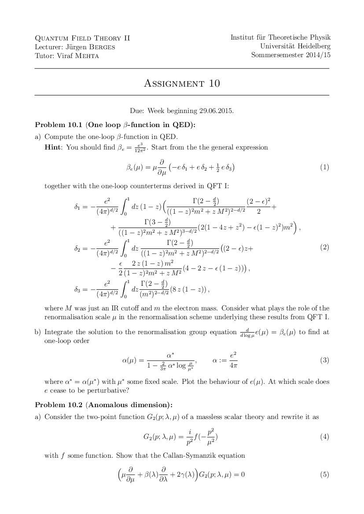 Exercise 10](pdfs/ex-10.pdf)

[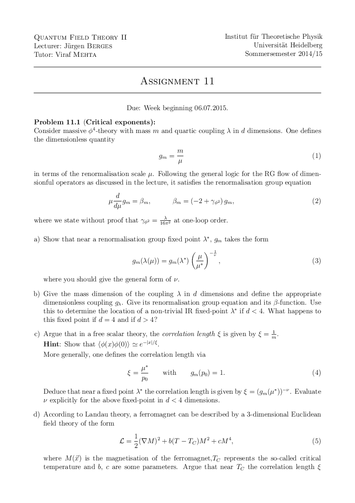 Exercise 11](pdfs/ex-11.pdf)

[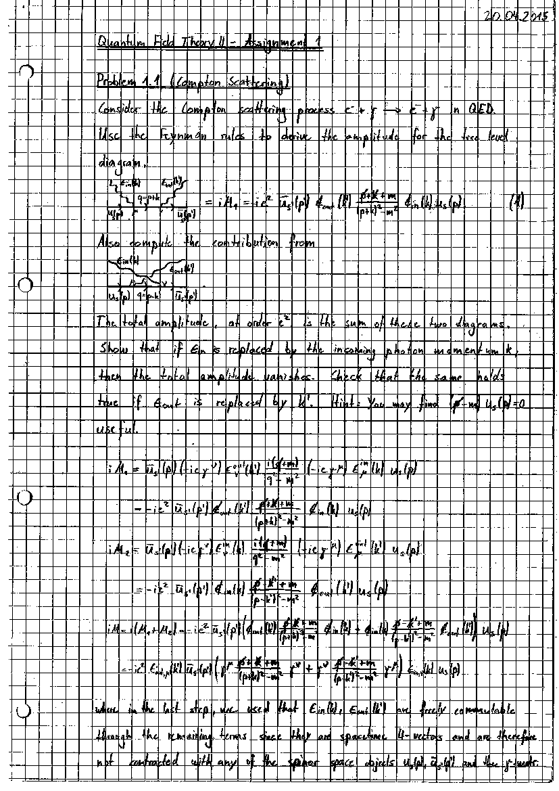 Solution 1](pdfs/sol-01.pdf)

[ Solution 2](pdfs/sol-02.pdf)

[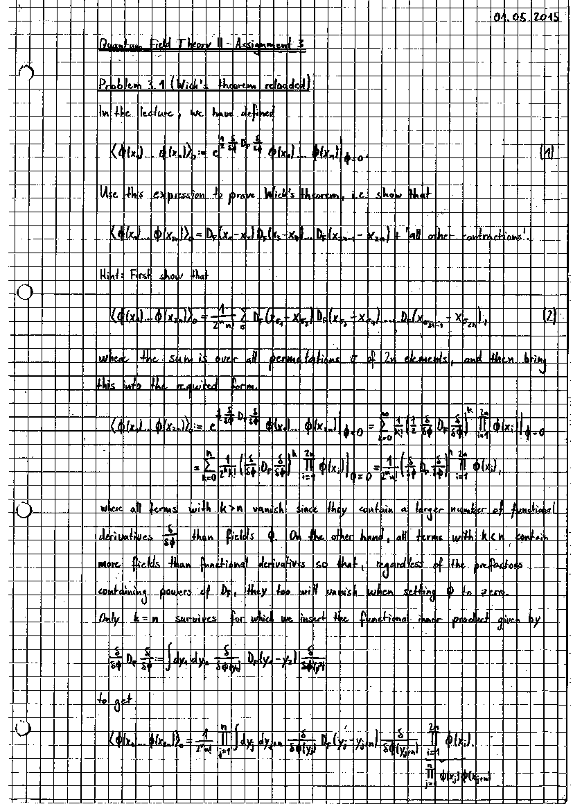 Solution 3](pdfs/sol-03.pdf)

[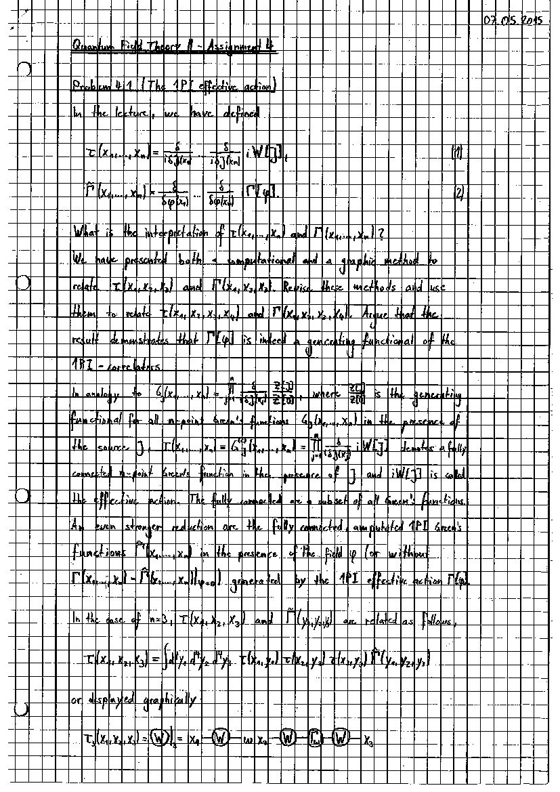 Solution 4](pdfs/sol-04.pdf)

[ Solution 5](pdfs/sol-05.pdf)

[ Solution 6](pdfs/sol-06.pdf)

[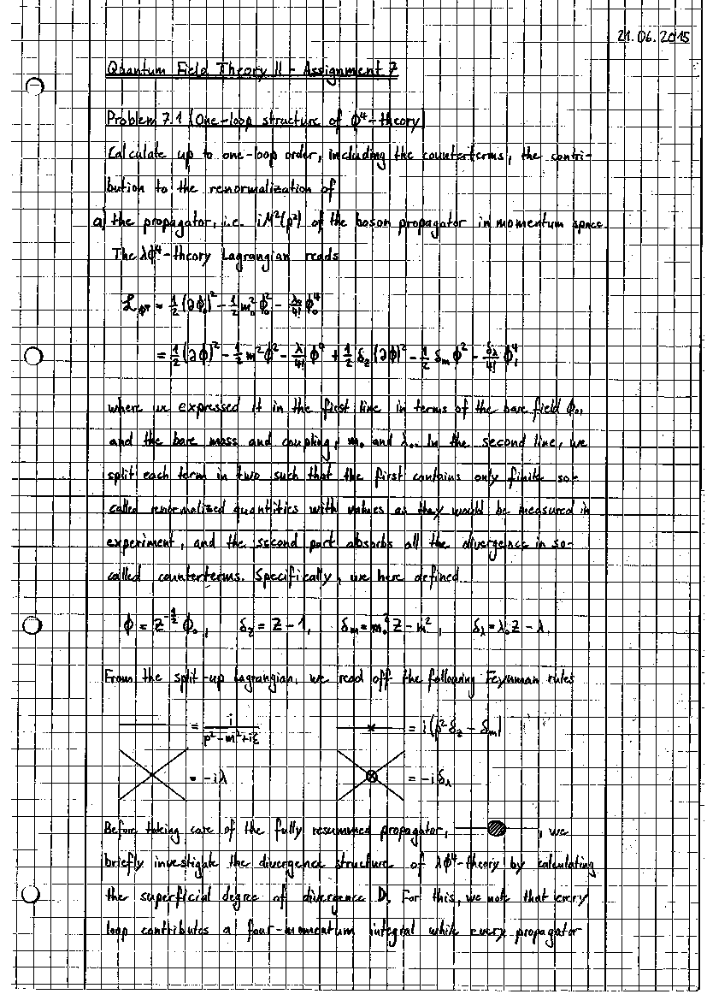 Solution 7](pdfs/sol-07.pdf)

[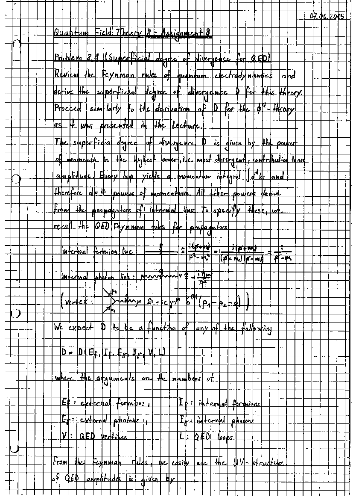 Solution 8](pdfs/sol-08.pdf)

[ Solution 9](pdfs/sol-09.pdf)

[ Solution 10](pdfs/sol-10.pdf)

[ Solution 11](pdfs/sol-11.pdf)

</DocsGrid>
