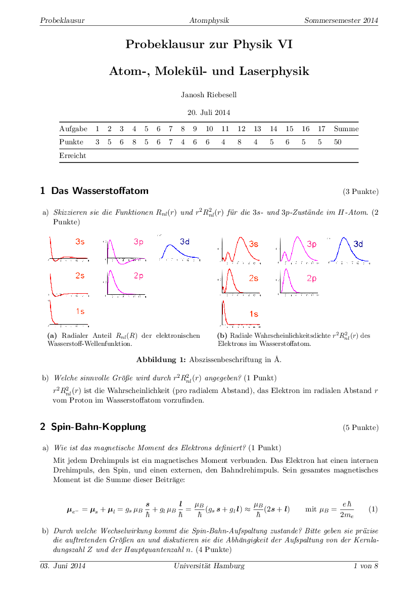
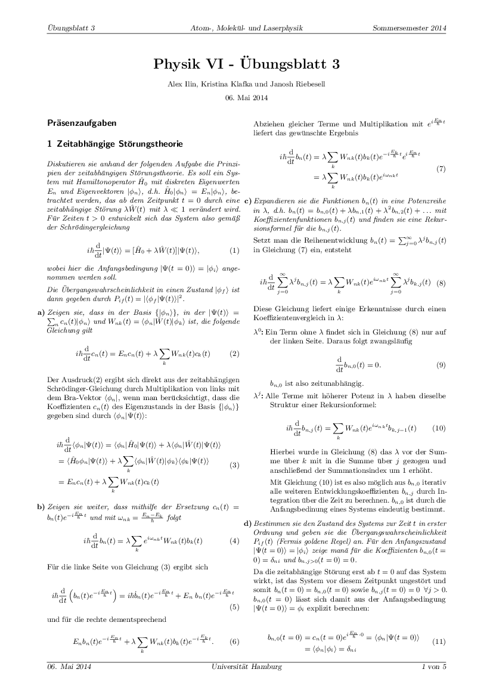
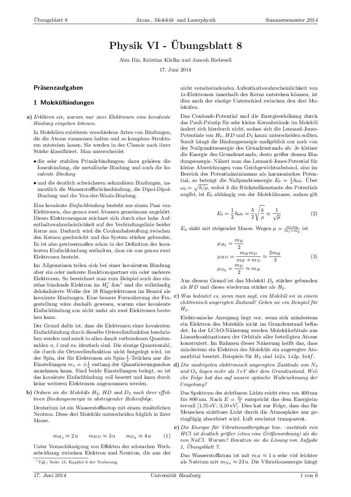
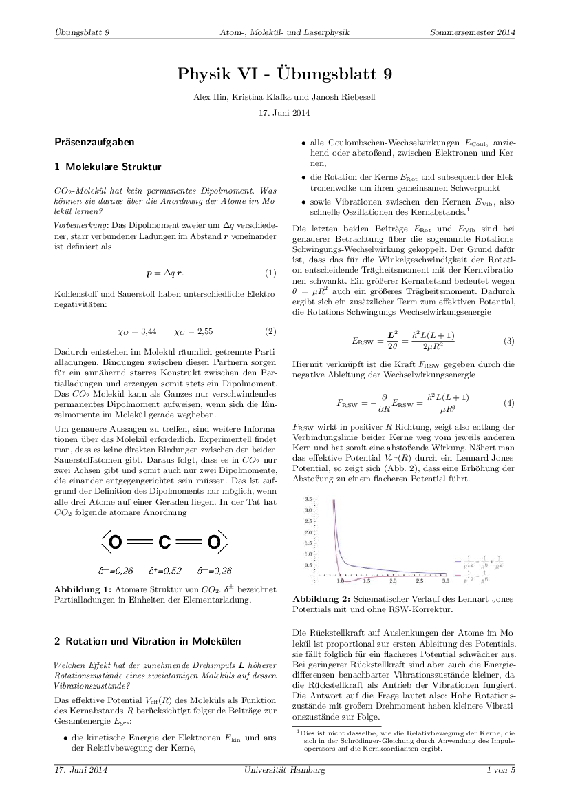
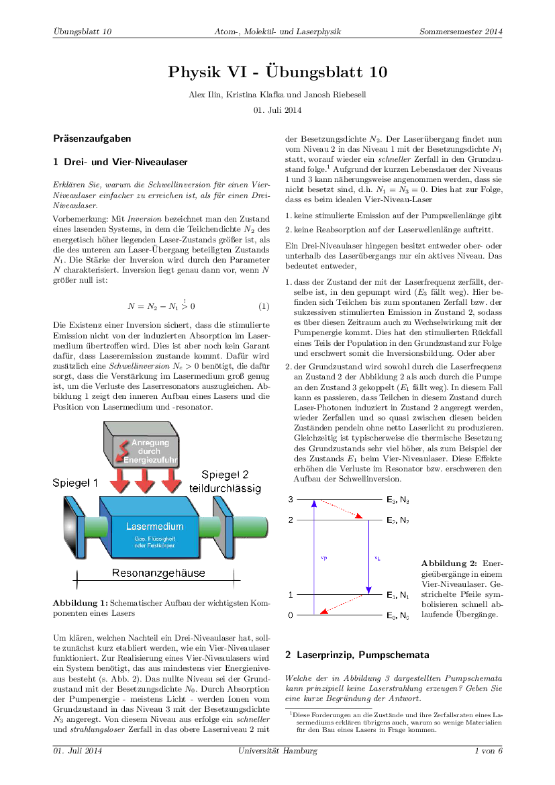

Atomic physics was an undergrad lecture jointly held by [Prof. Klaus Sengstock](https://physik.uni-hamburg.de/en/ilp/sengstock/personen/sengstock) and [Prof. Henning Moritz](https://physik.uni-hamburg.de/en/ilp/moritz/personen/moritz) at Hamburg University in the summer of 2014.

Below are solutions to the exercise sheets as well as the final exam. Fair warning though, it's all in German.

## Exam preparation

<DocsGrid>

[ Mock exam](pdfs/mock-exam.pdf)

</DocsGrid>

## Exercises

<DocsGrid>

[ Exercise 1](pdfs/sol-01.pdf)

[ Exercise 2](pdfs/sol-02.pdf)

[ Exercise 3](pdfs/sol-03.pdf)

[ Exercise 4](pdfs/sol-04.pdf)

[ Exercise 5](pdfs/sol-05.pdf)

[ Exercise 6](pdfs/sol-06.pdf)

[ Exercise 7](pdfs/sol-07.pdf)

[ Exercise 8](pdfs/sol-08.pdf)

[ Exercise 9](pdfs/sol-09.pdf)

[ Exercise 10](pdfs/sol-10.pdf)

</DocsGrid>
