I attended the lecture on General relativity by [Prof. Björn Schäfer](http://www.ita.uni-heidelberg.de/~spirou) at Heidelberg University in the summer of 2015.

Below are solutions to the exercises and the mock exam.

## Exam material

<DocsGrid>

[ Exam sheet](pdfs/exam-sheet.pdf)

[ Mock exam](pdfs/mock-exam.pdf)

</DocsGrid>

## Exercises

<DocsGrid>

[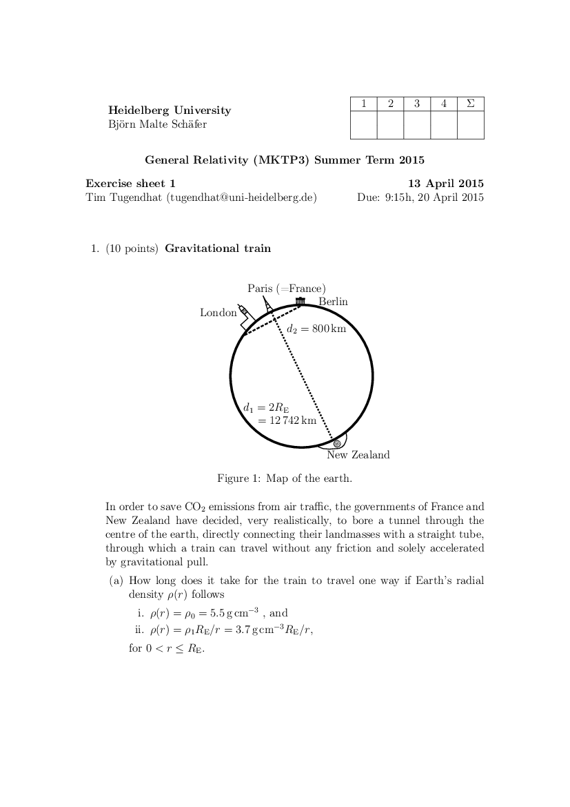 Exercise 1](pdfs/ex-01.pdf)

[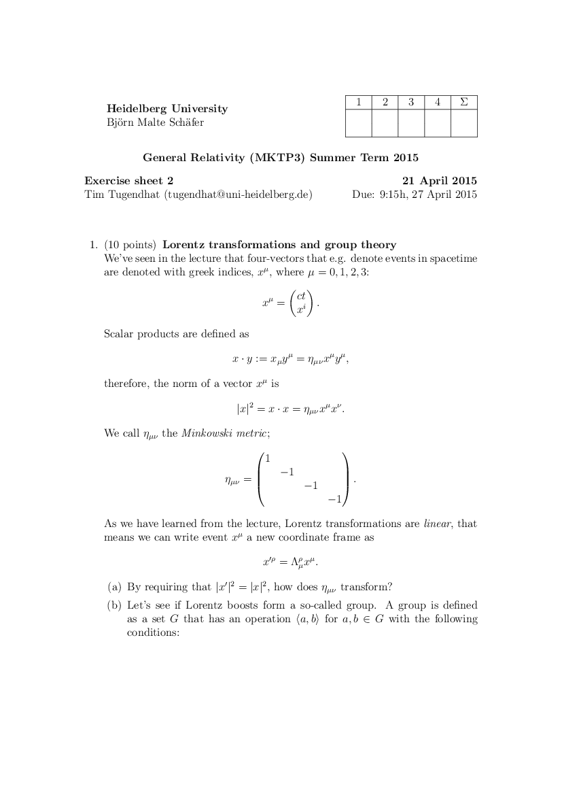 Exercise 2](pdfs/ex-02.pdf)

[ Exercise 3](pdfs/ex-03.pdf)

[ Exercise 4](pdfs/ex-04.pdf)

[ Exercise 5](pdfs/ex-05.pdf)

[ Exercise 6](pdfs/ex-06.pdf)

[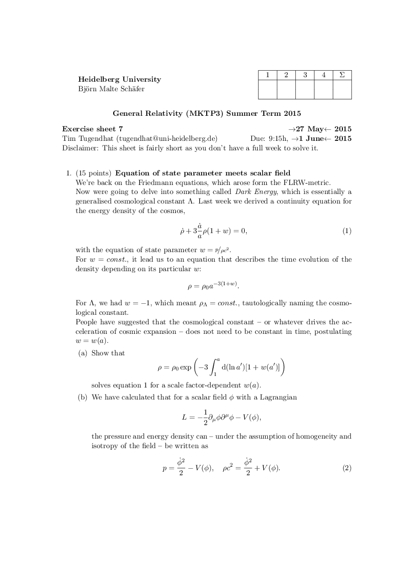 Exercise 7](pdfs/ex-07.pdf)

[ Exercise 8](pdfs/ex-08.pdf)

[ Exercise 9](pdfs/ex-09.pdf)

[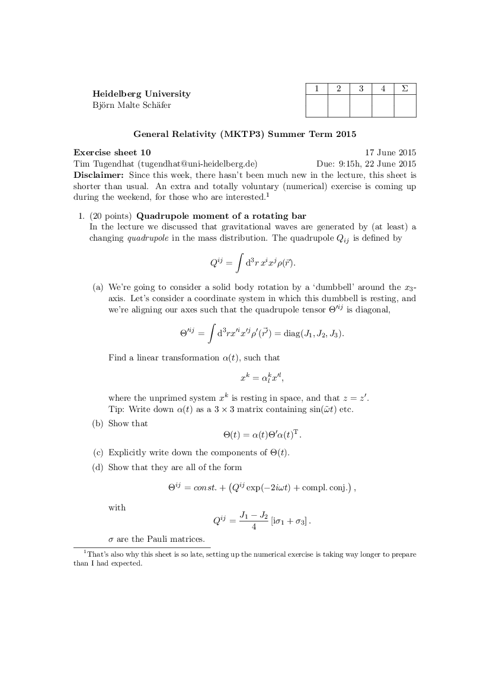 Exercise 10](pdfs/ex-10.pdf)

[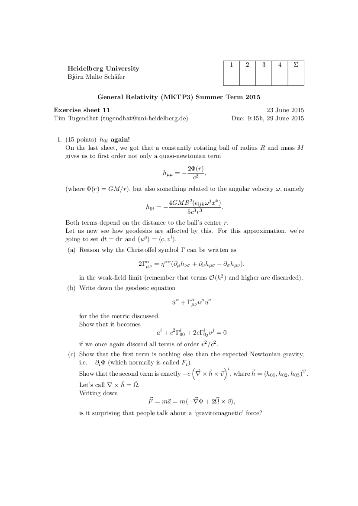 Exercise 11](pdfs/ex-11.pdf)

[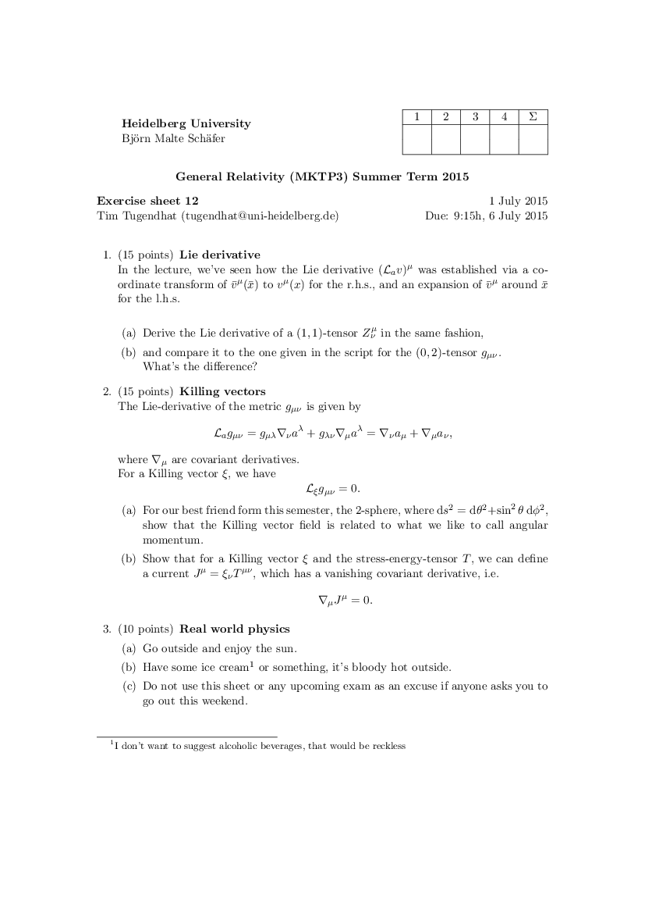 Exercise 12](pdfs/ex-12.pdf)

[ Exercise 13](pdfs/ex-13.pdf)

[ Solution 1](pdfs/sol-01.pdf)

[ Solution 2](pdfs/sol-02.pdf)

[ Solution 3](pdfs/sol-03.pdf)

[ Solution 4](pdfs/sol-04.pdf)

[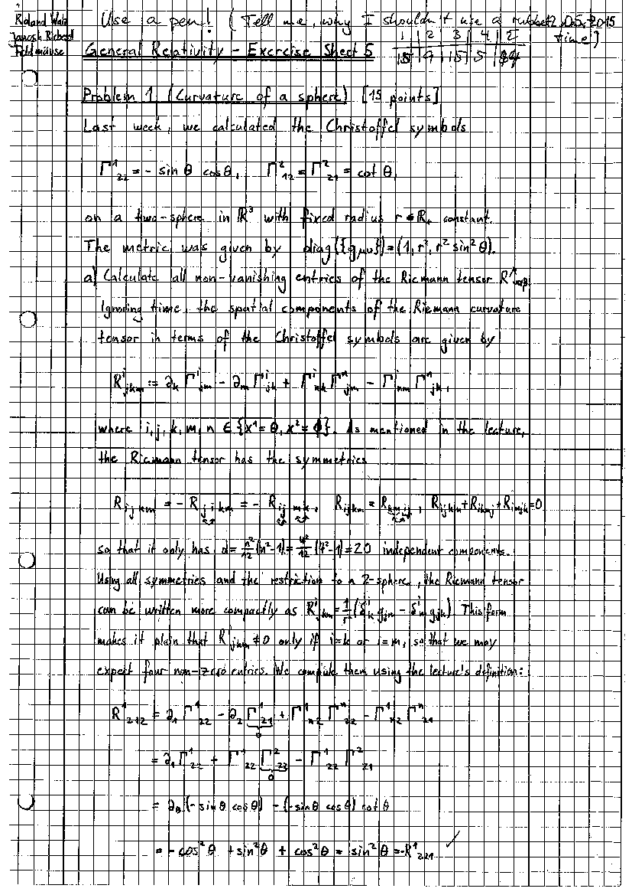 Solution 5](pdfs/sol-05.pdf)

[ Solution 6](pdfs/sol-06.pdf)

[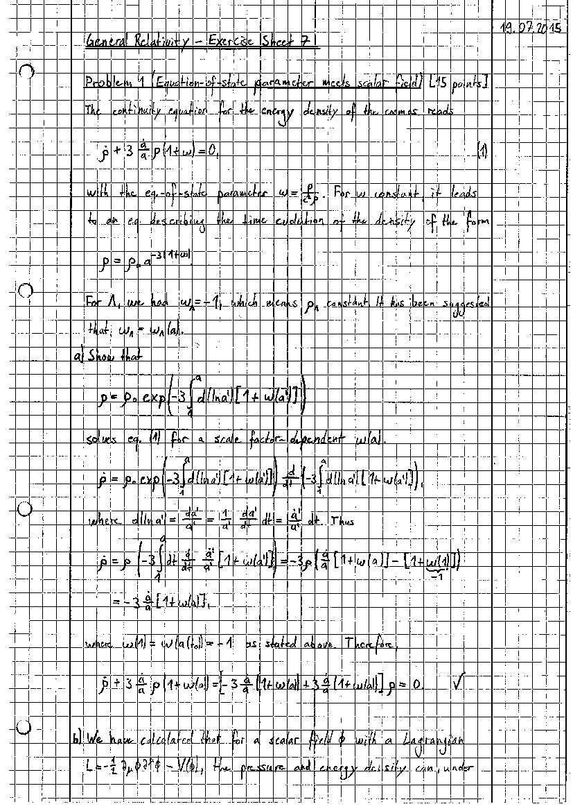 Solution 7](pdfs/sol-07.pdf)

[ Solution 8](pdfs/sol-08.pdf)

[ Solution 9](pdfs/sol-09.pdf)

[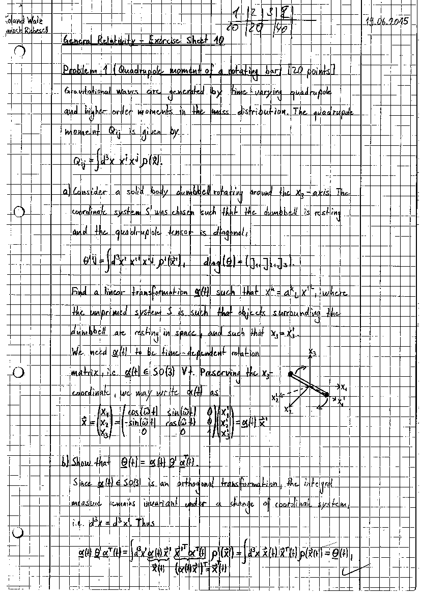 Solution 10](pdfs/sol-10.pdf)

[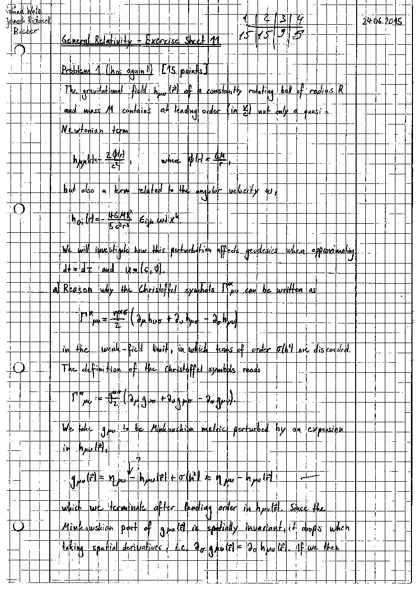 Solution 11](pdfs/sol-11.pdf)

[ Solution 12](pdfs/sol-12.pdf)

[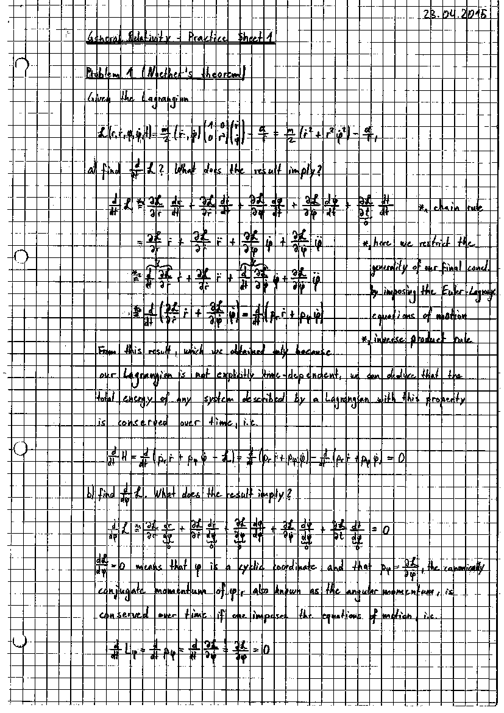 Solution 13](pdfs/sol-13.pdf)

</DocsGrid>

## Visual Accompaniment

Not super relevant but had to throw this in here because it looks so cool!

_Artist's impression of bent spacetime due to the sun's and Earth's gravity. Source: [Australia Science Channel](https://australiascience.tv/why-the-general-theory-of-relativity-is-not-just-for-physicists)_
