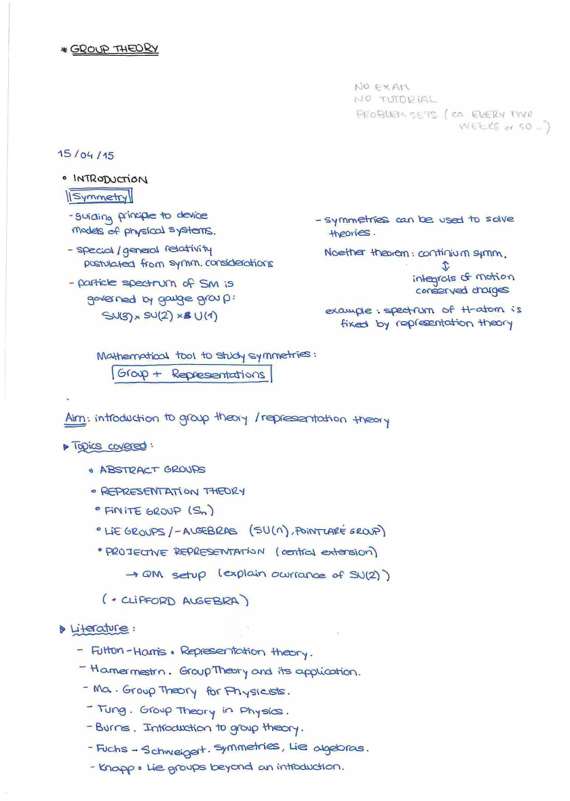
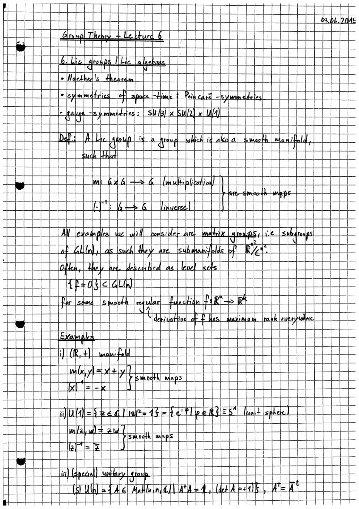
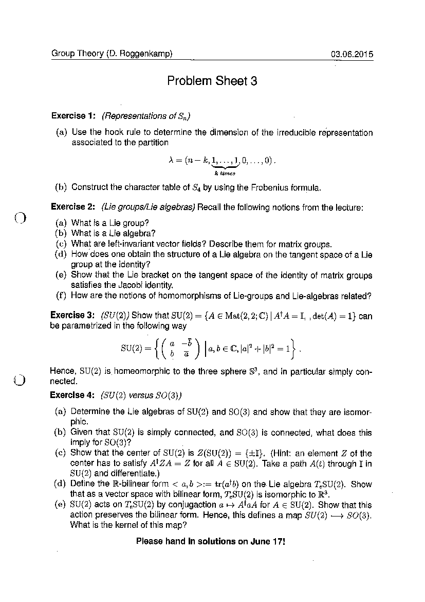
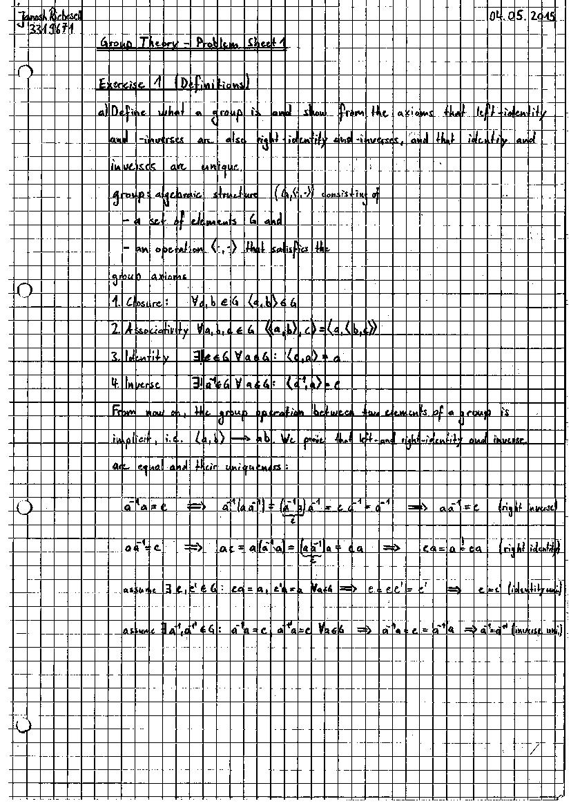
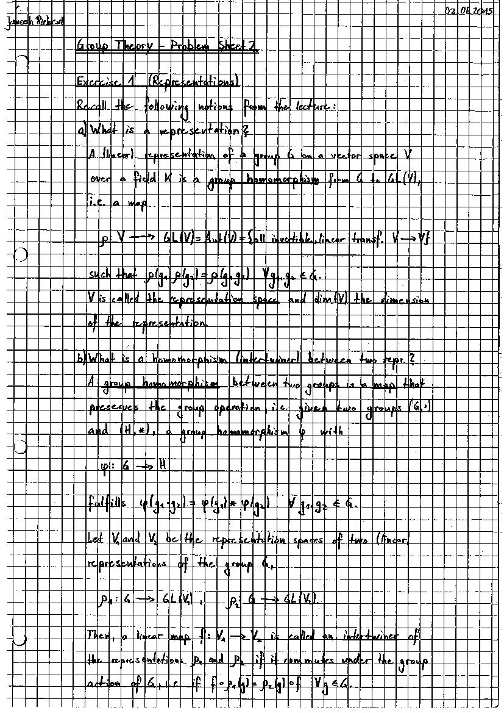
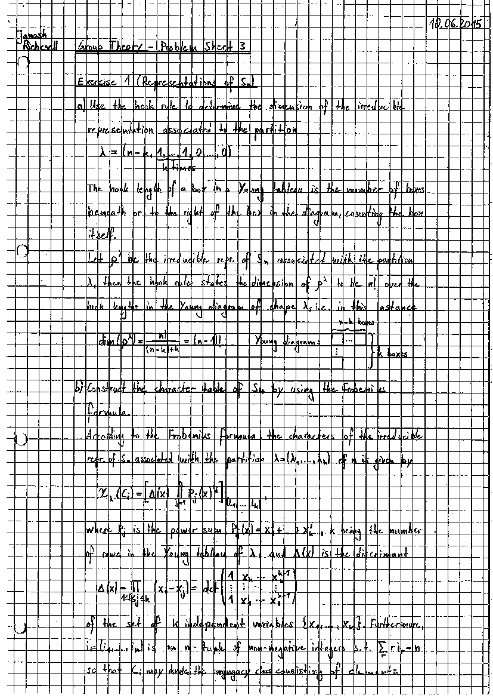

In the summer of 2015, [Prof. Daniel Roggenkamp](https://www.thphys.uni-heidelberg.de/~roggenkamp) gave a small but insightful lecture on group theory and its applications in physics at Heidelberg University.

Below are lecture notes and solutions to the exercises.

## Lecture notes

<DocsGrid>

[ Lecture 1](pdfs/lec-01.pdf)

[ Lecture 2](pdfs/lec-02.pdf)

[ Lecture 3](pdfs/lec-03.pdf)

[ Lecture 4](pdfs/lec-04.pdf)

[ Lecture 5](pdfs/lec-05.pdf)

[ Lecture 6](pdfs/lec-06.pdf)

[ Lecture 7](pdfs/lec-07.pdf)

</DocsGrid>

## Exercises

<DocsGrid>

[ Exercise 1](pdfs/ex-01.pdf)

[ Exercise 2](pdfs/ex-02.pdf)

[ Exercise 3](pdfs/ex-03.pdf)

[ Solution 1](pdfs/sol-01.pdf)

[ Solution 2](pdfs/sol-02.pdf)

[ Solution 3](pdfs/sol-03.pdf)

</DocsGrid>
