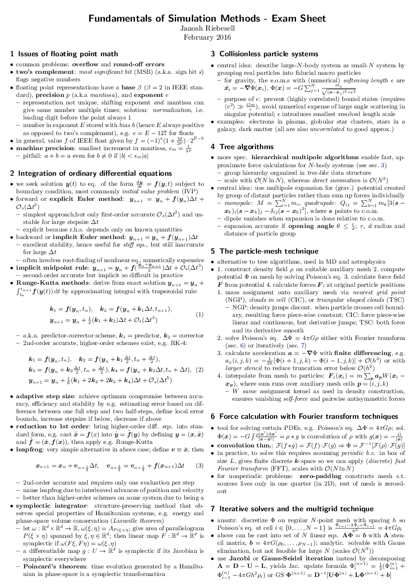
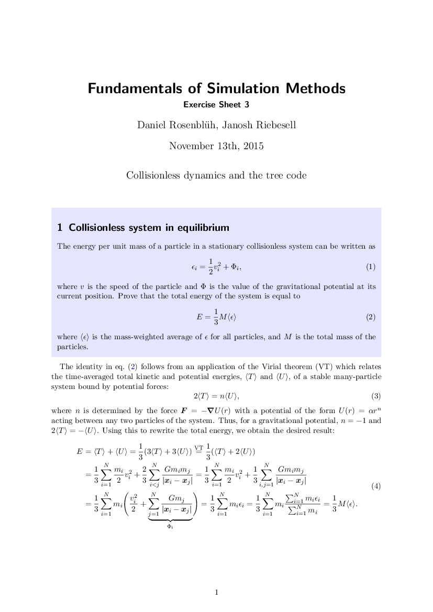
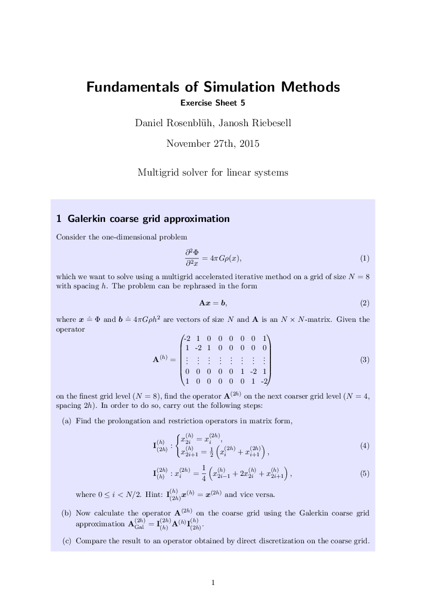
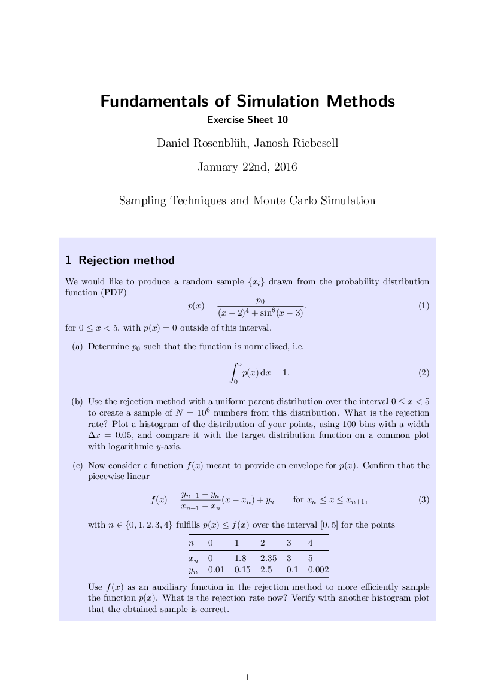

[Numerical Simulations](https://h-its.org/mbm-teaching/fundamentals-simulation-methods) was a particularly enjoyable course given by [Prof. Volker Springel](https://www.imprs-astro.mpg.de/content/prof-dr-volker-springel) in the winter term 2015/16 at Heidelberg University.

Below are solutions to all the exercises as well as to the mock and the final exam.

The corresponding codes can be found in [this repo](https://github.com/janosh/numeric-simulations).

## Exam

<DocsGrid>

[ Exam solution](pdfs/exam-sol.pdf)

[ Practice exam solution](pdfs/practice-exam-sol.pdf)

[ Exam sheet](pdfs/exam-sheet.pdf)

</DocsGrid>

## Exercises

<DocsGrid>

[ Exercise 1](pdfs/sol-01.pdf)

[ Exercise 2](pdfs/sol-02.pdf)

[ Exercise 3](pdfs/sol-03.pdf)

[ Exercise 4](pdfs/sol-04.pdf)

[ Exercise 5](pdfs/sol-05.pdf)

[ Exercise 6](pdfs/sol-06.pdf)

[ Exercise 7](pdfs/sol-07.pdf)

[ Exercise 8](pdfs/sol-08.pdf)

[ Exercise 9](pdfs/sol-09.pdf)

[ Exercise 10](pdfs/sol-10.pdf)

</DocsGrid>
