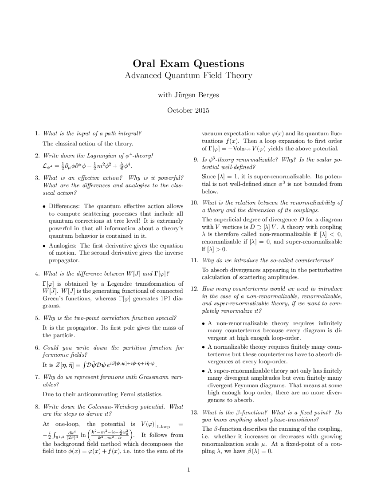
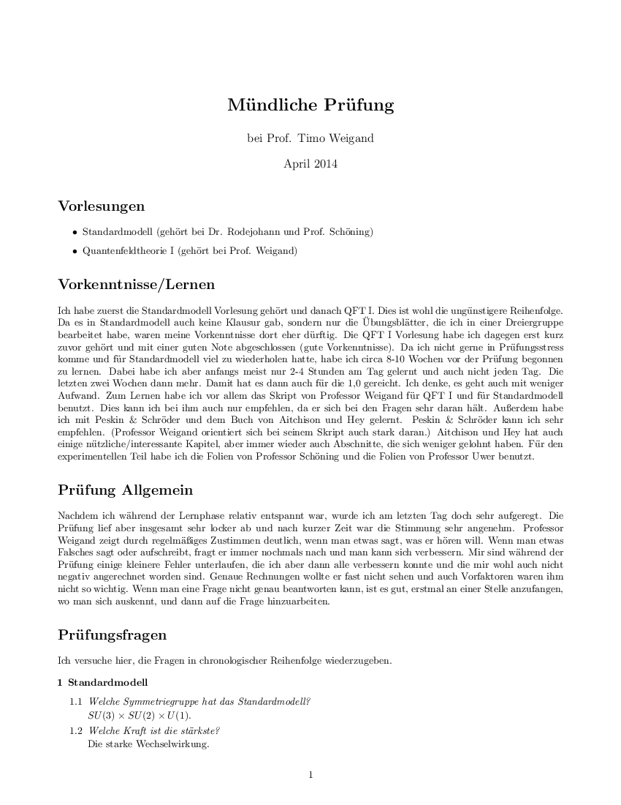

In May 2016, I had my oral exam on string theory and advanced quantum field theory with [Prof. Timo Weigand](https://www.thphys.uni-heidelberg.de/~weigand).

Below are four transcripts of past oral exams on similar topics that I used to prepare for my own. I also uploaded a transcript of my own exam with Timo and summaries of his lecture notes on string theory and advanced QFT that I wrote in order to help me memorize it.

## Transcript and summaries

<DocsGrid>

[ Transcript](pdfs/transcript.pdf)

[ QFT summary](pdfs/qft-summary.pdf)

[ String theory summary](pdfs/string-theory-summary.pdf)

</DocsGrid>

## Past exams

<DocsGrid>

[ Berges 2015](pdfs/berges-2015.pdf)

[ Jäckel 2014](pdfs/jaeckel-2014.pdf)

[ Weigand 2014](pdfs/weigand-2014.pdf)

[ Weigand 2015](pdfs/weigand-2015.pdf)

</DocsGrid>
