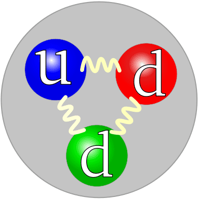

This is a compilation of notes and solutions to problem sheets for some of the physics lectures I took, most of them in Heidelberg.

During my studies, I often read the solutions to exercises uploaded by other physics students around the world. They usually opened up a new perspective or provided a way forward when I got stuck on a problem. In the hopes that I might provide similar help to others, I’m uploading some of the solutions I typed up over the years.

If you find an error or have a question, feel free drop me a line at [janosh.riebesell@gmail.com](mailto:janosh.riebesell@gmail.com).

[String Theory ](/physics/string-theory)

[QFT ](/physics/qft)

[Advanced QFT ](/physics/advanced-qft)

[General Relativity ](/physics/general-relativity)

[Group Theory ](/physics/group-theory)

[Numeric Simulations ](/physics/numeric-simulations)

[Atomic Physics ](/physics/atomic-physics)

[Statistical Physics ](/physics/statistical-physics)

[Oral exam ](/physics/oral-exam)

[Bachelor's Thesis ](/physics/bachelors-thesis)

[Master's Thesis ](/physics/masters-thesis)

