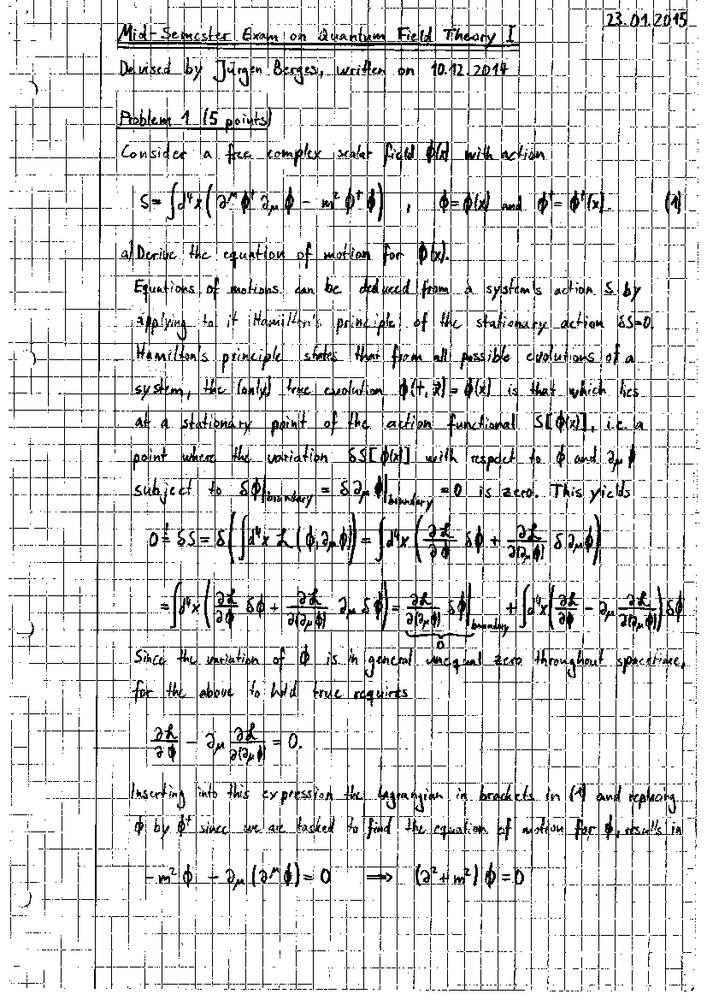
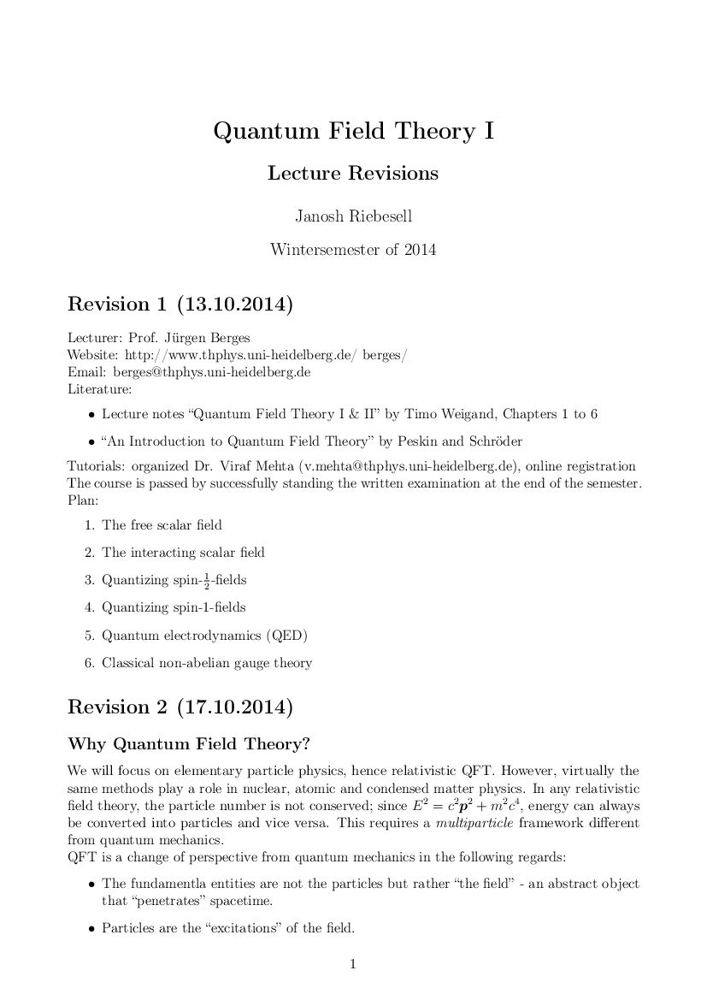
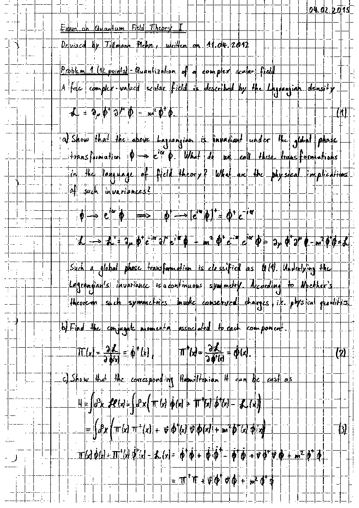
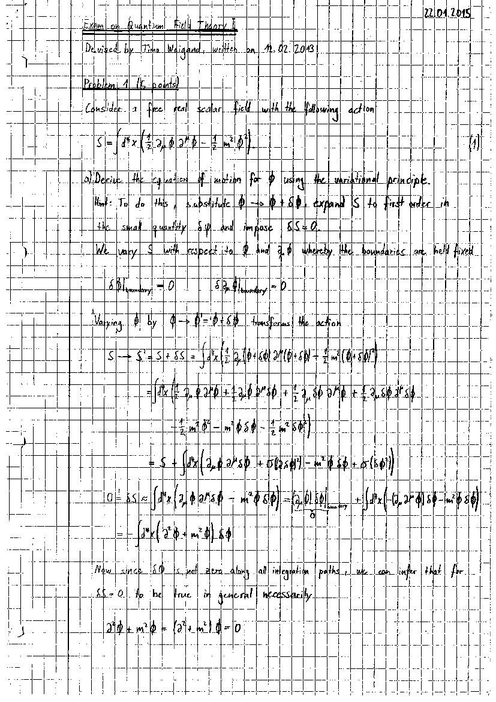

This is a collection of mock exams with my solutions and exercise as well as lecture revisions I used to prepare for the exam in [QFT I](https://www.thphys.uni-heidelberg.de/~berges/teaching.htm). The lecture was given by [Prof. Jürgen Berges](https://www.thphys.uni-heidelberg.de/~berges/people.htm) at Heidelberg University in the winter of 2014/15.

## Exam material

<DocsGrid>

[ Berges midterm exam](pdfs/berges-midterm-exam.pdf)

[ Berges midterm solution](pdfs/berges-midterm-solution.pdf)

[ Bies model exam](pdfs/bies-model-exam.pdf)

[ Exercise revision 1](pdfs/exercise-revision-1.pdf)

[ Exercise revision 2](pdfs/exercise-revision-2.pdf)

[ Imperial college exam](pdfs/imperial-college-exam.pdf)

[ Imperial college solution](pdfs/imperial-college-solution.pdf)

[ Lecture revisions](pdfs/lecture-revisions.pdf)

[ Plehn exam](pdfs/plehn-exam.pdf)

[ Weigand exam 1](pdfs/weigand-exam-1.pdf)

[ Weigand exam 2](pdfs/weigand-exam-2.pdf)

</DocsGrid>
