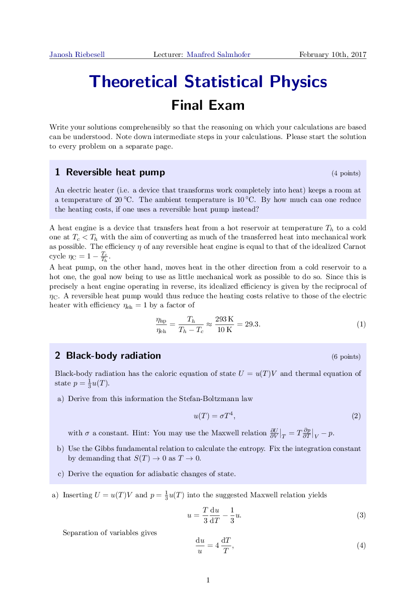
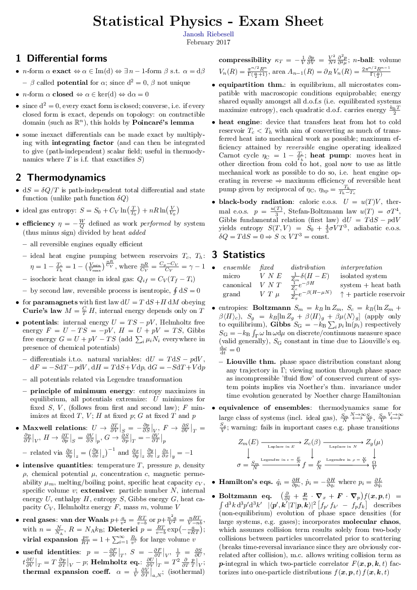
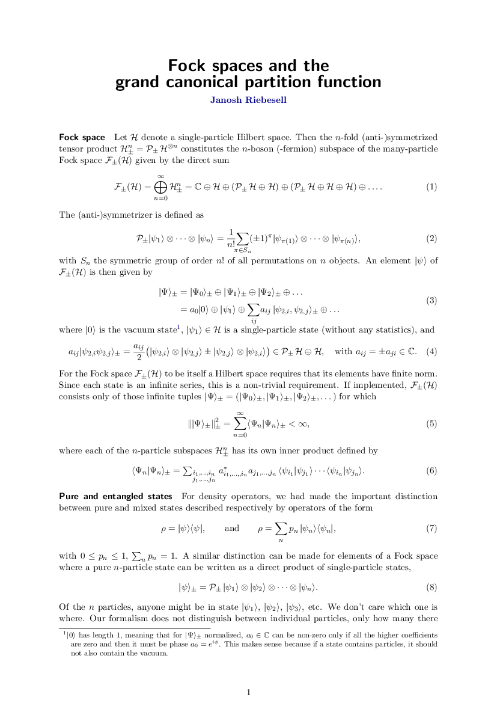
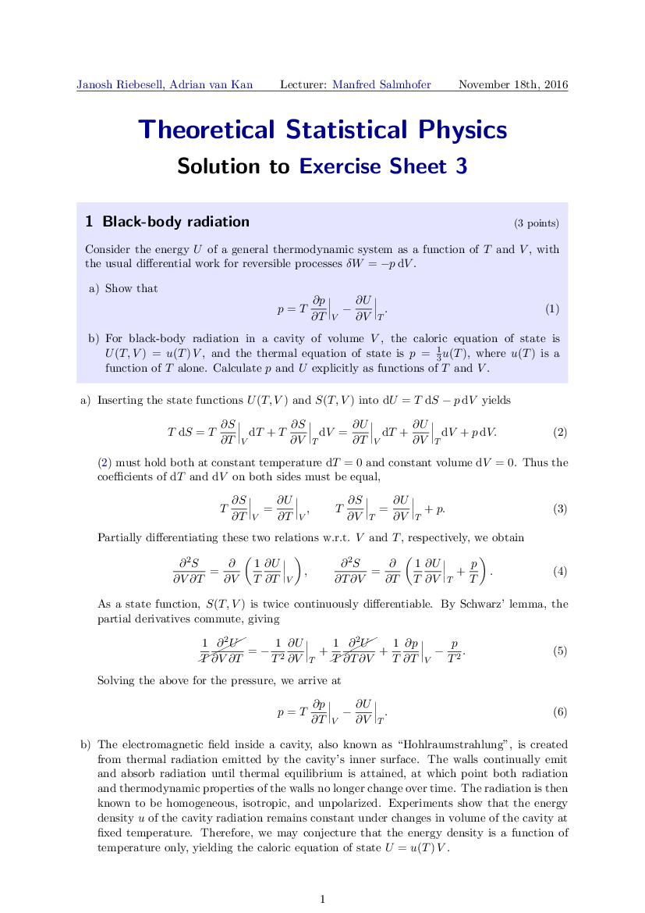
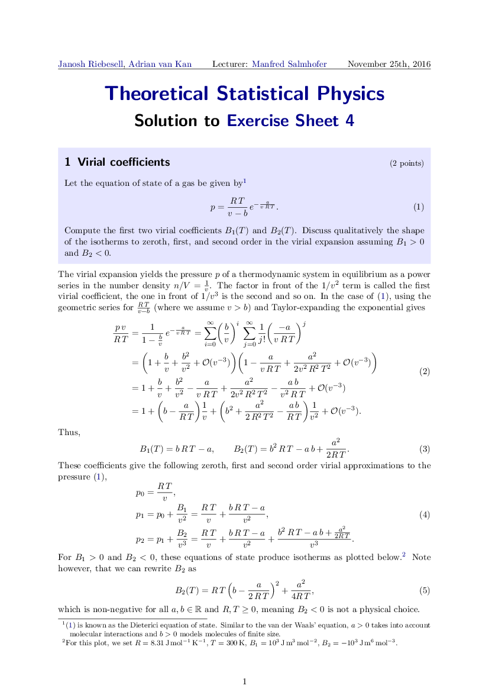
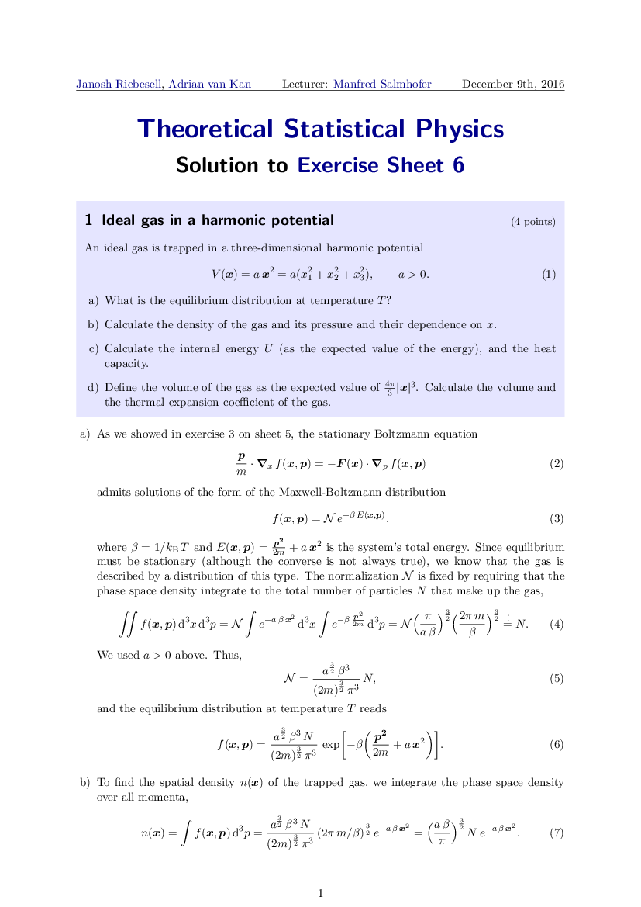
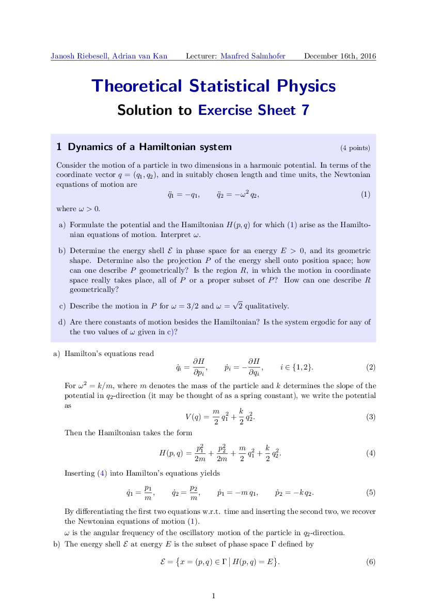
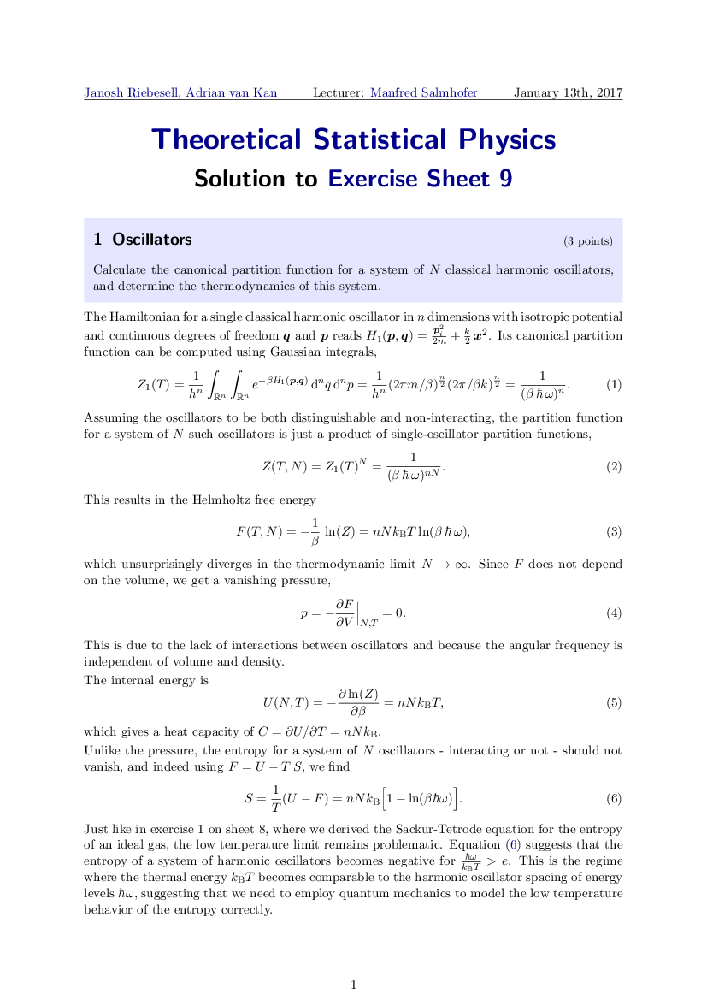
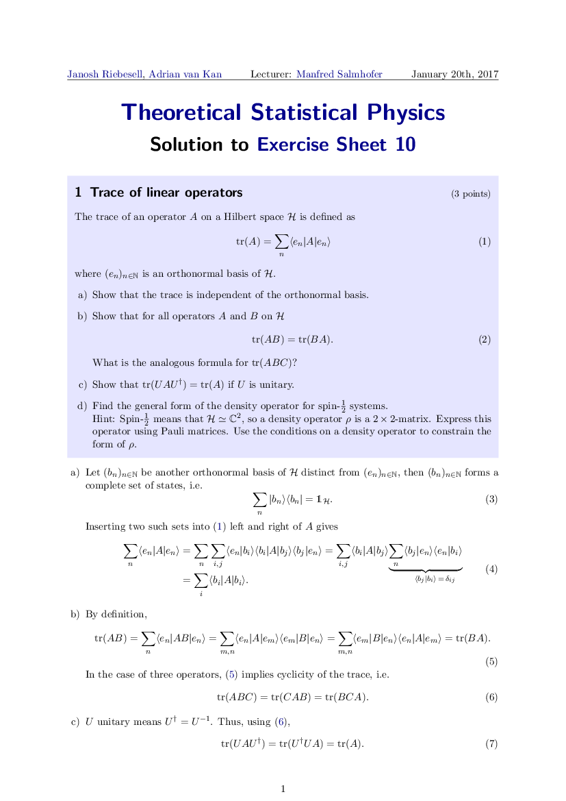
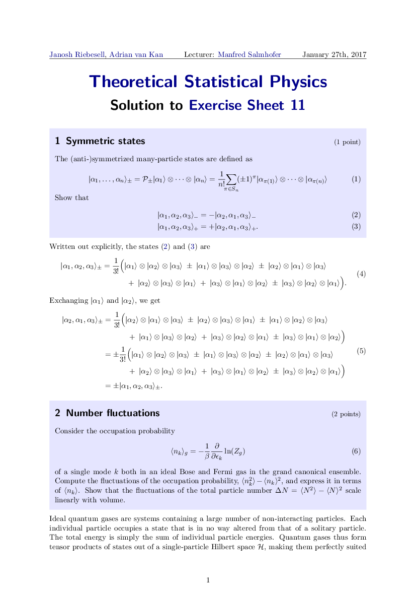

I had the pleasure of attending [Prof. Manfred Salmhofer](https://www.thphys.uni-heidelberg.de/~salmhofer)'s lecture on statistical physics at Heidelberg University in the fall of 2016.

Below you can find solutions to all the exercises as well as the final exam.

## Exam and preparation

<DocsGrid>

[ Final exam](pdfs/final-exam.pdf)

[ Ewerz exam solution](pdfs/ewerz-sol.pdf)

[ Exam sheet](pdfs/exam-sheet.pdf)

[ Fock spaces](pdfs/fock-spaces.pdf)

</DocsGrid>

## Exercises

<DocsGrid>

[ Exercise 1](pdfs/sol-01.pdf)

[ Exercise 2](pdfs/sol-02.pdf)

[ Exercise 3](pdfs/sol-03.pdf)

[ Exercise 4](pdfs/sol-04.pdf)

[ Exercise 5](pdfs/sol-05.pdf)

[ Exercise 6](pdfs/sol-06.pdf)

[ Exercise 7](pdfs/sol-07.pdf)

[ Exercise 8](pdfs/sol-08.pdf)

[ Exercise 9](pdfs/sol-09.pdf)

[ Exercise 10](pdfs/sol-10.pdf)

[ Exercise 11](pdfs/sol-11.pdf)

</DocsGrid>
