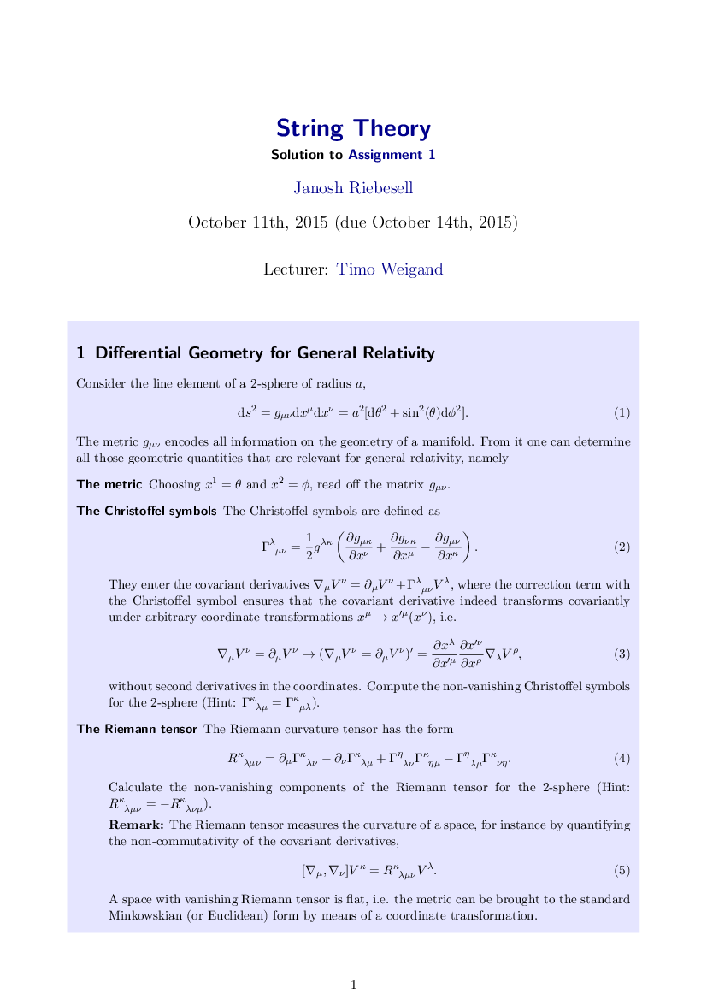
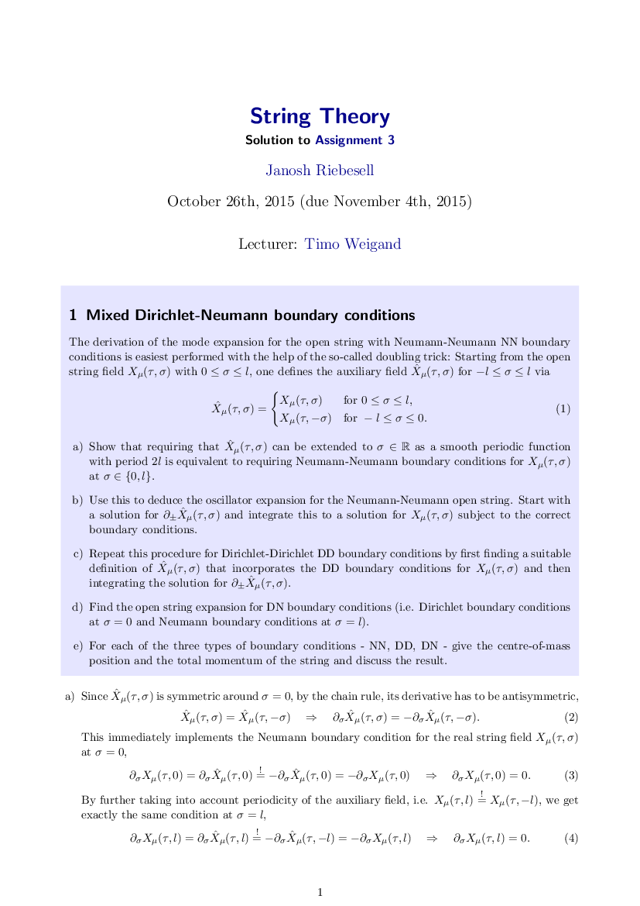
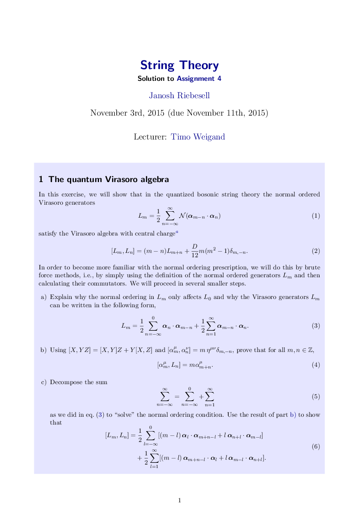
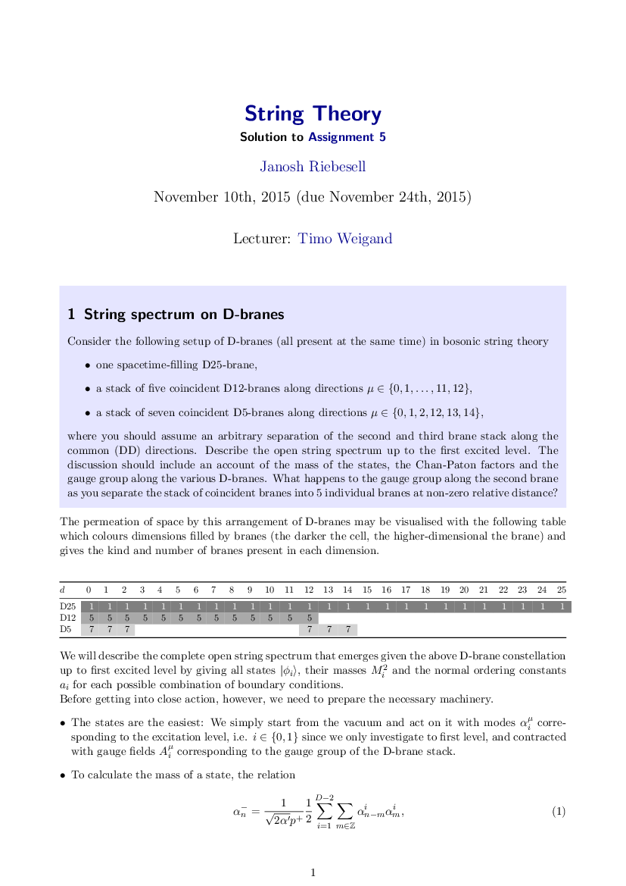
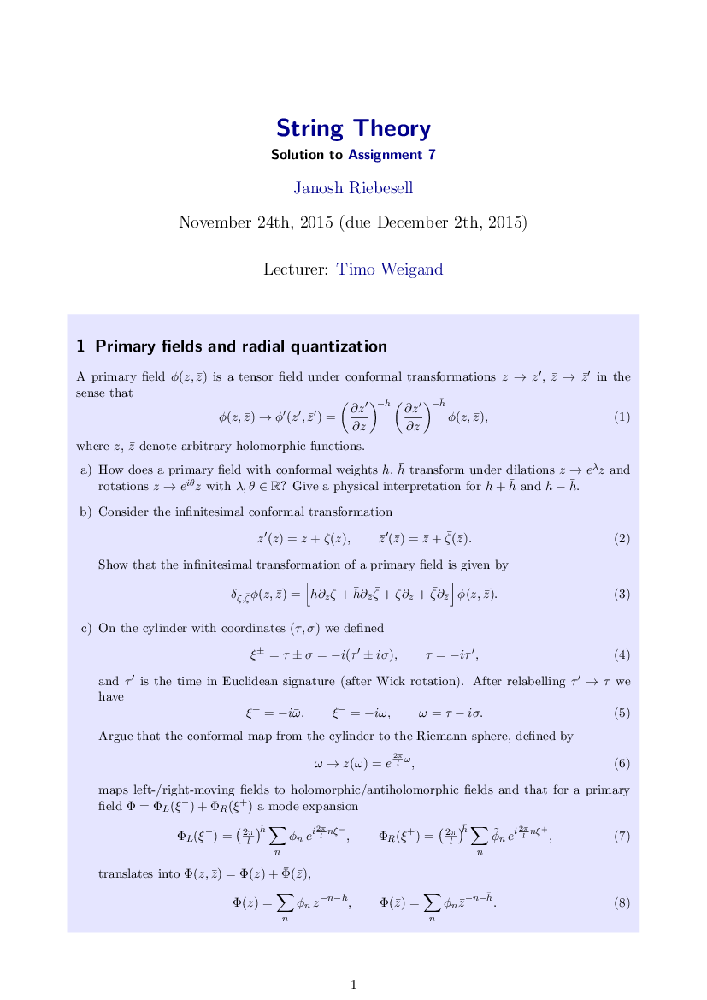

This is a collection of notes and solutions I typed up for both the final exam and the exercises handed out in the [string theory lecture](http://www.thphys.uni-heidelberg.de/~weigand/Strings-2015.html) by [Prof. Timo Weigand](https://www.thphys.uni-heidelberg.de/~weigand/) given at Heidelberg University in the winter semester of 2015/16.

## Exam

<DocsGrid>

[ Exam solution](pdfs/exam-sol.pdf)

[ Exam sheet](pdfs/exam-sheet.pdf)

</DocsGrid>

## Exercises

<DocsGrid minWidth="8em" align="center">

[ Exercise 1](pdfs/sol-01.pdf)

[ Exercise 2](pdfs/sol-02.pdf)

[ Exercise 3](pdfs/sol-03.pdf)

[ Exercise 4](pdfs/sol-04.pdf)

[ Exercise 5](pdfs/sol-05.pdf)

[ Exercise 7](pdfs/sol-07.pdf)

[ Exercise 8](pdfs/sol-08.pdf)

[ Exercise 9](pdfs/sol-09.pdf)

</DocsGrid>
