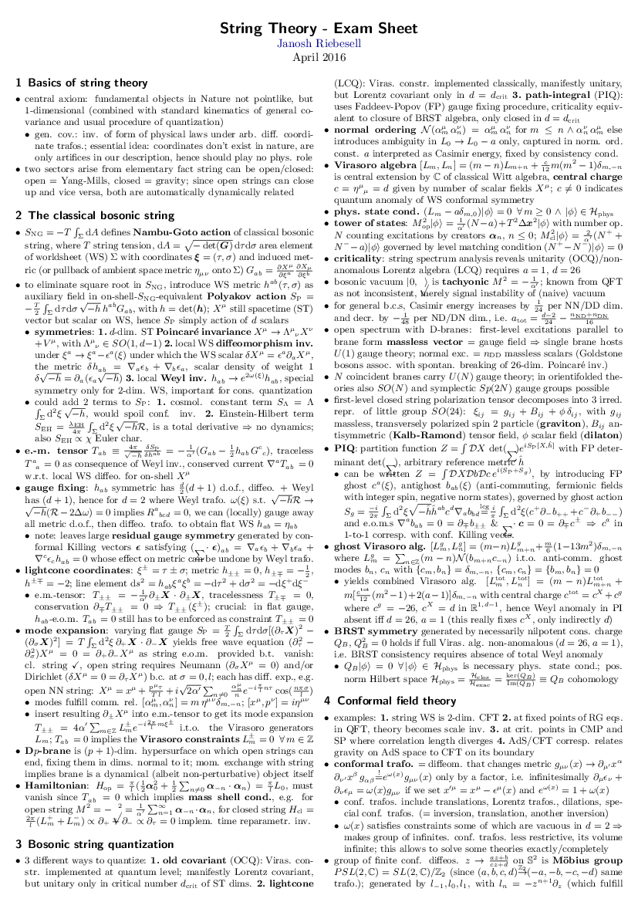

This is a collection of notes and solutions I typed up for both the final exam and the exercises handed out in the [string theory lecture](http://www.thphys.uni-heidelberg.de/~weigand/Strings-2015.html) by [Prof. Timo Weigand](https://www.thphys.uni-heidelberg.de/~weigand/) given at Heidelberg University in the winter semester of 2015/16.

## Exam

## Exercises

