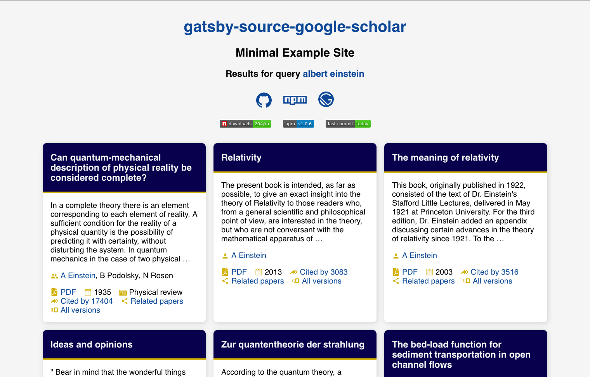

[](https://www.gatsbyjs.org/packages/gatsby-source-google-scholar)

## [gatsby-source-google-scholar](https://www.gatsbyjs.org/packages/gatsby-source-google-scholar)

A [Gatsby](https://www.gatsbyjs.org) source plugin that pulls metadata for scientific publications from [Google Scholar](https://scholar.google.com).

Available on [NPM](https://www.npmjs.com/package/gatsby-source-google-scholar). Install via

```shell
yarn add gatsby-source-google-scholar
```
