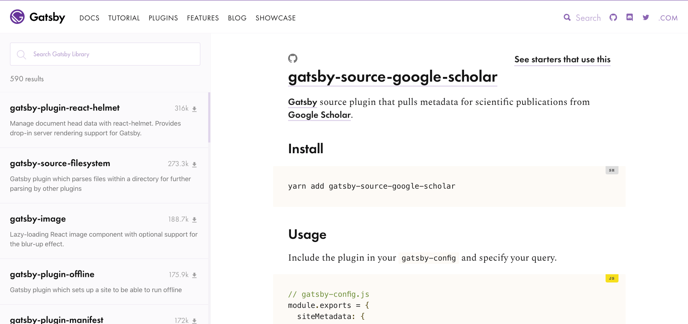

A [Gatsby](https://gatsbyjs.org) source plugin that pulls metadata for scientific publications from [Google Scholar](https://scholar.google.com).

[](https://gatsbyjs.org/packages/gatsby-source-google-scholar)

Available on [NPM](https://npmjs.com/package/gatsby-source-google-scholar). Install via

```sh
yarn add gatsby-paginate
```
