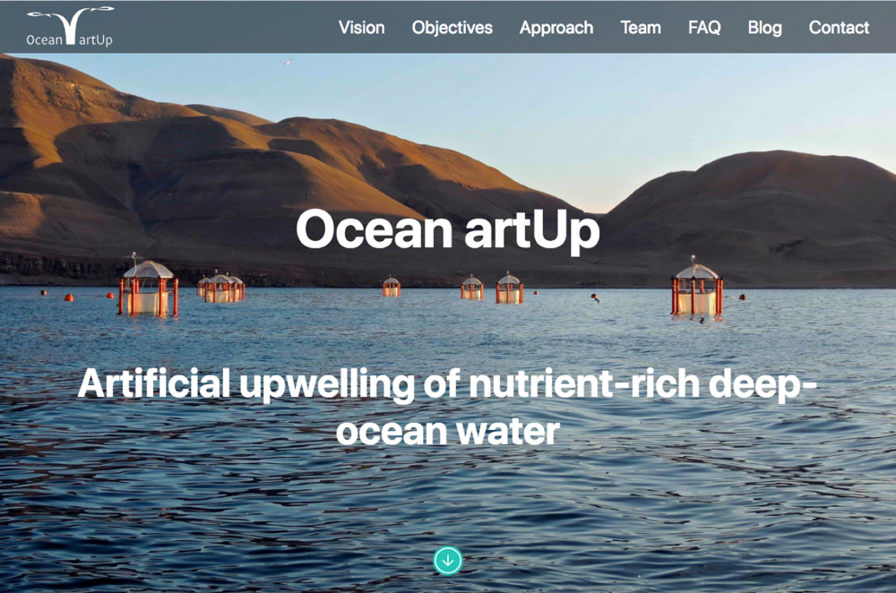

## [Ocean artUp](https://ocean-artup.eu)

A site I created for my dad to promote his newest research project: an ERC Advanced Grant-funded study that aims to assess the economic viability, potential environmental risks and possible increase in oceanic CO2 sequestration due to artificially-induced uplift of nutrient-rich deep water to the ocean’s sunlit surface layer.
