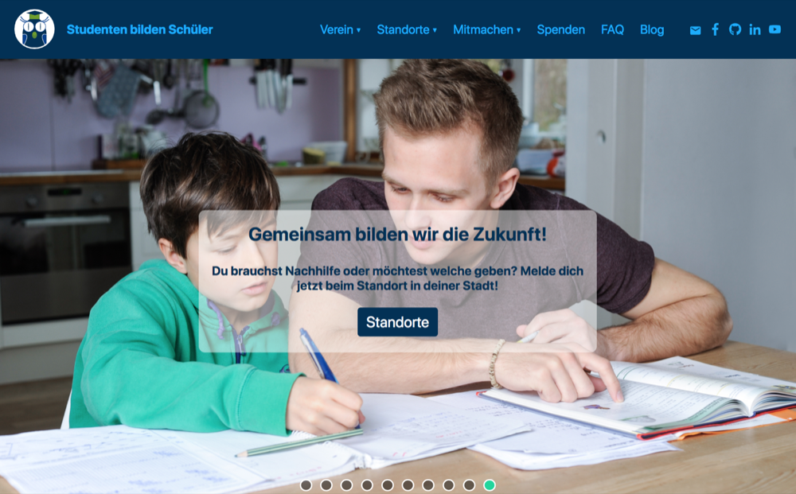

## [Studenten bilden Schüler](https://studenten-bilden-schueler.de)

A German student-run nonprofit initiative that I co-run. SbS has about 1000 active members providing free tuition to children from underprivileged families as well as - more recently - refugees in over 20 university towns all over Germany. Our goal is to thereby contribute to more equal educational opportunities for all disadvantaged memebers of society.

We used to have a really old-school homepage powered by [Joomla](https://www.joomla.org). That's all in the past now, luckily. Instead, we now sport a shiny new [Gatsby](https://www.gatsbyjs.org) site, designed with [`styled-components`](https://www.styled-components.com), managed through [Contentful](https://www.contentful.com) and hosted on [Netlify](https://www.netlify.com)'s blazing fast CDN. Can you believe that you get all that goodness for free nowadays! :)
