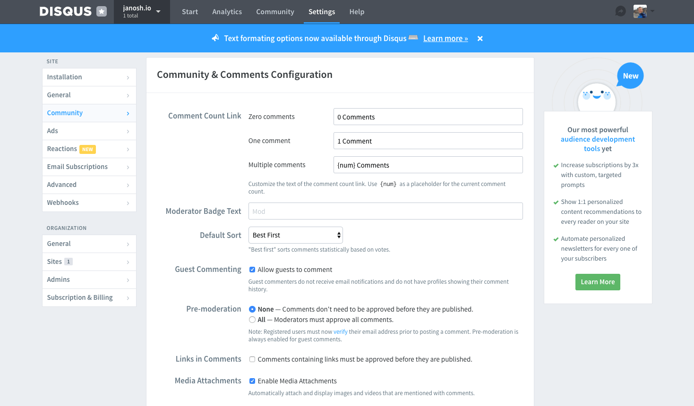

If you’re running a Gatsby blog (or any React-powered blog for that matter) and you’ve started adding some content to it, the next thing to think about is how to increase engagement among your visitors. A great way to do that is to allow them to ask questions and express their views on what you’ve written. This will make your blog seem much more lively and interactive. The good news is, this is easy. I just went through that process and the only thing that took time was deciding which service to use.

## Available services

There are many options out there for adding comment functionality, several of them specifically targeted at static sites. The following list was compiled from a [2017 Gatsby Spectrum chat](https://spectrum.chat/gatsby-js/general/whats-the-best-way-to-make-commenting-system~0c7e3f0f-8737-4948-9c52-0d20dfe37a05). It is by no means exhaustive, but should serve as a good starting point:

- [Disqus](https://disqus.com) [[mention](https://spectrum.chat/gatsby-js/general/whats-the-best-way-to-make-commenting-system~0c7e3f0f-8737-4948-9c52-0d20dfe37a05?m=MTUxMTIzMDE0NjY2MQ==)]
- [Staticman](https://staticman.net) [[mention](https://spectrum.chat/gatsby-js/general/whats-the-best-way-to-make-commenting-system~0c7e3f0f-8737-4948-9c52-0d20dfe37a05?m=MTUzNDkxODUxMDk4OA==)]
- [Facebook comments](https://npmjs.com/package/react-facebook) [[mention](https://spectrum.chat/gatsby-js/general/whats-the-best-way-to-make-commenting-system~0c7e3f0f-8737-4948-9c52-0d20dfe37a05?m=MTU0MTEwNTQyNDI1MA==)]
- [JustComments](https://just-comments.com) [[mention](https://spectrum.chat/gatsby-js/general/whats-the-best-way-to-make-commenting-system~0c7e3f0f-8737-4948-9c52-0d20dfe37a05?m=MTU0MTQ0MzcxMTgxMQ==)] (has a [Gatsby plugin](https://gatsbyjs.org/packages/gatsby-plugin-just-comments))
- [TalkYard](https://talkyard.io) [[mention](https://spectrum.chat/gatsby-js/general/whats-the-best-way-to-make-commenting-system~0c7e3f0f-8737-4948-9c52-0d20dfe37a05?m=MTUxNjMzMzM5MTU5NA==)]
- [Gitalk](https://gitalk.github.io) [[mention](https://github.com/gatsbyjs/gatsby/issues/12209#issuecomment-471165136)]

All of these are worth checking out. Staticman, for instance, took an interesting approach. Essentially, you set up your own HTML form for writing comments, let it send a POST request on submission to one of their endpoints. From this Staticman will automatically submit a pull request to your site's repo which you can accept or deny. If that isn't a nerdy way of doing comment moderation, I don't know what is. It's just a gimmick though. This has the big advantage of keeping everything static (hence the name). All your data is in one place (your repo) as opposed to having to be loaded through JavaScript embeds or iframes (short for [inline frame](https://developer.mozilla.org/en-US/docs/Web/HTML/Element/iframe)) on the fly. It will remain there even if Staticman is ever discontinued. With the other services, you depend on an external platform to deliver your comments.

Of course, in return you have the disadvantage of increased manual setup including putting together the comment form and hooking it up to Staticman. Depending on your use case, this degree of customizability may well be an advantage. In my case, though, I just wanted something fast with as little manual configuration and setup as possible.

For this reason, I ended up going with Disqus. It has a number of other advantages as well.

- It [seems to be by far the most widely used service](https://datanyze.com/market-share/comment-systems/disqus-market-share) with a market share of 66% (as of this writing), twice that of the runner up Facebook Comments with 32%.
- It is low maintenance. [Moderating your comments and maintaining your forum](https://help.disqus.com/moderation/moderating-101) is easy.
- It provides official [React support](https://github.com/disqus/disqus-react).
- It offers a [generous free tier](https://disqus.com/pricing).
- It’s easy to comment: Disqus has a large existing user base and the onboarding experience for new users is fast since you can register with your Google, Facebook or Twitter account. You can also easily share your comment on a post through those channels.
- Its commenting interface has a distinct but unobtrusive look that many users will instantly recognize and trust.
- All Disqus components are lazy-loaded, meaning they won't negatively impact the load times of your posts (unless someone is specifically following a link to one of the comments in which case it takes a little longer than on a purely static site).

You should, however, consider the privacy implications of letting a third party store your visitors’ comments and potentially track their browsing behavior. You may want to consult the [Disqus privacy policy](https://help.disqus.com/terms-and-policies/disqus-privacy-policy), [their privacy FAQs](https://help.disqus.com/terms-and-policies/privacy-faq) (specifically the last question on GDPR compliance) and inform your users [how to edit their data sharing settings](https://help.disqus.com/terms-and-policies/how-to-edit-your-data-sharing-settings). If these concerns don't outweigh the benefits for you, here's how to get started with Disqus.

## Installing Disqus

Here are the steps for adding Disqus comments to your own blog:

1. [Sign-up to Disqus](https://disqus.com/profile/signup). During the process, you'll have to choose a `shortname` for your site. This is how Disqus will identify comments coming from your site. Copy that for later.
2. Install the Disqus React package

   ```sh
   yarn add disqus-react
   ```

3. Add the `shortname` from step 1 to your `.env` and `.env.example` files and call it something like `GATSBY_DISQUS_NAME` so that people forking your repo will know that they need to supply this value to get comments to work. (You need to prefix the environment variable with `GATSBY_` in order to [make it available to client-side code](https://gatsbyjs.org/docs/environment-variables/#client-side-javascript).)

   ```sh:title=.env.example
   # enables Disqus comments below blog posts
   GATSBY_DISQUS_NAME=insertValue
   ```

   ```sh:title=.env
   GATSBY_DISQUS_NAME=yourOwnSiteShortname
   ```

4. Go to your blog post template (usually `src/templates/post.js`) and import the `DiscussionEmbed` React component.

   ```js:title=src/templates/post.js
   import React from 'react'
   import { graphql } from 'gatsby'
   import { DiscussionEmbed } from 'disqus-react' // highlight-line
   ...
   ```

   Then define your Disqus configuration object

   ```js
   const disqusConfig = {
     shortname: process.env.GATSBY_DISQUS_NAME,
     config: { identifier: slug, title },
   }
   ```

   where `identifier` must be a string or number that uniquely identifies the post. Finally, add `DiscussionEmbed` near the end of the JSX of your post template.

   ```js:title=src/templates/post.js
   return (
     <Global>
       ...
       <PageBody>
         ...
         <DiscussionEmbed {...disqusConfig} /> // highlight-line
       </PageBody>
     </Global>
   )
   ```

And you're done. You should now see the Disqus comment form appear beneath your blog post just like the one below this post.

## Comment counts in post previews

If you'd like your blog post previews to show a count of the number of comments each post received, simply import `disqus-react`'s `CommentCount` in the relevant post preview component and provide it the same config object as `DiscussionEmbed`.

```js:title=src/components/postMeta/index.js
import React from 'react'
import { Link } from 'gatsby'
import { CommentCount } from 'disqus-react' // highlight-line

import { Meta, TagList, Calendar, Timer, Comments } from './styles'

export const disqusConfig = ({ slug, title }) => ({
  shortname: process.env.GATSBY_DISQUS_NAME,
  config: { identifier: slug, title },
})

const PostMeta = ({ title, slug, date, timeToRead, tags }) => (
  <Meta>
    <span>
      <Calendar size="1.2em" />
      {date}
    </span>
    <span>
      <Timer size="1.2em" />
      {timeToRead} min read
    </span>
    <span>
      <Comments size="1.2em" />
      // highlight-start
      <Link to={slug + `#disqus_thread`}>
        <CommentCount {...disqusConfig({ slug, title })} />
      </Link>
      // highlight-end
    </span>
    <TagList tags={tags} />
  </Meta>
)

export default PostMeta
```

The config object `disqusConfig` is now an exported function to keep things [DRY](https://wikipedia.org/wiki/Don%27t_repeat_yourself) and make it reusable by the post template component above where it was just an object.

You can customize what string the `CommentCount` component displays depending on how many comments a post has by going to your Disqus admin settings [as described here](https://help.disqus.com/installation/customizing-comment-count-link-text). For instance, you might want to change the text "0 comments" to something more inspiring like "Start a discussion!". :wink:



That's it. You should be all set with Disqus now. Let me know if you have questions or comments below and happy blogging! :sunglasses:
