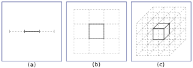
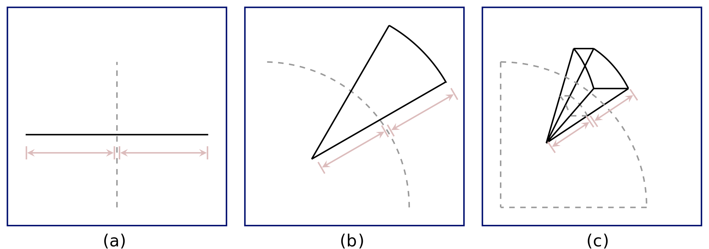
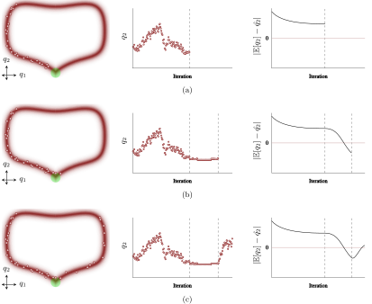
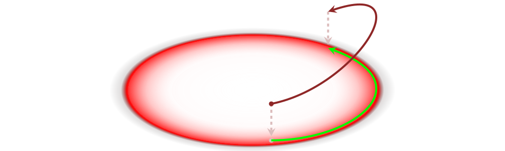

> This post is without original content, providing merely a summary of the first 3 sections of [Michael Betancourt](https://betanalpha.github.io)'s excellent [introduction to Hamiltonian Monte Carlo](https://arxiv.org/abs/1701.02434). Most images were taken from there and slightly modified.

Hamiltonian Monte Carlo (HMC) was originally developed by [Duane et al.](https://sciencedirect.com/science/article/pii/037026938791197X) in the late 1980s as Hybrid Monte Carlo in the context of Quantum Chromodynamics, specifically lattice computations that attempted to understand the structure of protons and neutrons comprising atomic nuclei. Radford Neal was the first to realize the potential of HMC in applied statistics as part of his [pioneering work in the mid 1990s on Bayesian neural networks](http://citeseerx.ist.psu.edu/viewdoc/download?doi=10.1.1.446.9306&rep=rep1&type=pdf).

Over the ensuing decades, HMC made a rather reluctant entry into modern statistics. This is mostly due to two reasons:

- We have only recently begun to understand why HMC works well in practice, particularly on difficult, high-dimensional problems.
- Unlike many popular techniques in machine learning, HMC does not appeal to fragile heuristics. Rather it is built upon a firm theoretical foundation of differential geometry. This being an advanced field of mathematics not included in statistical training meant it was a difficult algorithm to approach for the majority of both theoretical and applied statisticians. As a result, its dissemination into applied research was inhibited.

To understand how modern problems in statistics naturally lead to the use of a formalism like HMC, we first need to take a look at the geometry of high-dimensional probability distributions and how they cripple even advanced statistical algorithms such as Markov chain Monte Carlo (MCMC) which are highly efficient in lower dimensions. From this perspective, we can identify parts of MCMC that require increased sophistication or replacement to scale to high-dimensional problems.

## 1. Computing Expectations

The goal in statistics is to evaluate expectations $\expec_\pi[f]$ of some observable (a.k.a. target function) $f$ with respect to some target probability distribution $\pi$ over a $d$-dimensional sample space $\Qcal$. For example, in the context of machine learning we might be interested in extracting information from a posterior distribution over model configuration space, a process known as Bayesian inference. Assuming the sample space is smooth, we can represent the target distribution $\pi$ as a smooth probability density function $\pi: \Qcal \to \reals_+$ and expectations as integrals,

$$
\expec_\pi[f] = \int_\Qcal \dif\vec q \, \pi(\vec q) \, f(\vec q).
$$

To compute these integrals explicitly, we first need to define a parametrization of $\Qcal$, i.e. a mapping $P: \reals^d \to \Qcal$ such that every point $\vec q \in \Qcal$ can be uniquely specified by $d$ real numbers. Unfortunately, for all but the simplest target distributions we will still be unable to evaluate these integrals analytically, requiring instead the use of numerical methods to approximate them.

### 1.1&nbsp; Focus on what matters

In order to scale to the complex problems at the frontiers of applied statistics, we must be clever about where we evaluate the target density $\pi(\vec q)$ and observable $f(\vec q)$. This requires finding the regions of sample space that generate the largest contributions to the expectation $\expec_\pi[f]$.

A naive approach would be to focus our attention on areas where the integrand $\pi(\vec q) \, f(\vec q)$ is largest. In fact, since we are interested in a generalizable algorithm, we shouldn't make any assumptions on the properties of the target function (even though exploiting such knowledge can be a major source of improvement in specialized applications ([Mira, Solgi, Imparato, 2013](https://link.springer.com/article/10.1007/s11222-012-9344-6) [[arXiv](https://arxiv.org/abs/1012.2983)]; [Oates, Girolami, Chopin, 2016](https://rss.onlinelibrary.wiley.com/doi/pdf/10.1111/rssb.12185)). Letting ourselves be guided solely by the target density is a good first step towards generalizability since in practice, we are often interested in computing expectations for multiple different target functions (e.g. mean and variance) with respect to a single target distribution. Thus our sampling should be concentrated in a neighborhood around the mode, i.e. the area where the target density $\pi(\vec q)$ is maximized.

This intuition is implemented by several earlier methods for statistical parameter estimation, such as [maximum likelihood estimators](https://en.wikipedia.org/wiki/Maximum_likelihood_estimation) and [Laplace approximations](https://metacademy.org/graphs/concepts/laplace_approximation). However, besides conflicting with _true_ generalizability (since we're exploiting specific details of the target density), this intuition is fatally naive. It misses a critical insight which, as we will see, explains why such methods fail in high dimensions.

Expectation values are determined by accumulating the integrand $\pi(\vec q) \, f(\vec q)$ over _the volume_ $\dif \vec q$ of parameter space. One of the unintuitive characteristics of high-dimensional spaces is that there is always much more volume on the outside of any given neighborhood than the inside.

_To illustrate the distribution of volume in increasing dimensions, consider a rectangular partitioning centered around a distinguished point such as the mode. The relative weight of the center partition is **(a)** 1/3 in one dimension, **(b)** 1/9 in two dimensions , **(c)** and only 1/27 in three dimensions. In $d$ dimensions there are $3^{d-1}$ neighboring partitions. Very quickly the volume in the center partition becomes negligible compared to the neighboring volume. This effect only amplifies if we consider larger regions around the mode, i.e. partitions beyond the nearest neighbors. For instance, for next-to-nearest neighbors, the base would be $5^{d-1}$._

This is irrespective of the parametrization we choose and can, for instance, also be seen in spherical coordinates.

_The infinitesimal volume slice on the inside of some spherical shell (dashed lines) centered on the mode once again becomes more and more negligible compared to the slide outside the shell as the dimension of the parameter space increases. **(a)** In one dimension the spherical shell is a line. Interior and exterior volumes are equal. **(b)** In two dimensions the spherical shell becomes a circle with more volume immediately outside the shell than immediately inside. **(c)** In three dimensions the spherical shell is the surface of a sphere with even larger difference between interior and exterior volume._

So even though the density is largest around the mode, unless we're dealing with low-dimensional spaces, there is not much volume there. To identify the regions of parameter space that dominate expectations we should instead consider _the product of density and volume_. In high dimensions, the volume behaves very differently from the density, resulting in a tension that pushes the important regions of parameter space away from the mode further out towards the tails of the distribution into a region known as the **typical set**.

_In high dimensions a probability density $\pi(\vec q)$ will concentrate around its mode, but the volume $\dif\vec q$ over which we integrate that density is much larger away from the mode. Contributions to expectations are determined by the product $\pi(\vec q) \, \dif\vec q$. In sufficiently high dimensions, this condition is satisfied only in a nearly-singular region of $\Qcal$ called the typical set. ([This plot only shows a 10-dimensional independent, identically-distributed unit Gaussian. Hence the finite width of the typical set.](https://stats.stackexchange.com/questions/297996/plotting-the-typical-set-of-a-gaussian-distribution). $\vec q$ is the full 10-dimensional vector in parameter space and $q$ in the above figure denotes its radial component.)_

As the dimensionality increases, the typical set becomes more narrow and more singular.[^1] This is a result of [_concentration of measure_](https://en.wikipedia.org/wiki/Concentration_of_measure) and means that the region of relevance for expectations becomes ever more sharply defined. Whatever happens outside the typical set essentially becomes irrelevant for expectations. Performing evaluations anywhere else is thus a waste of computation.

> As a side note, the singular nature of the typical set in high dimensions also explains why brute force methods such as [quadrature](https://en.wikipedia.org/wiki/Numerical_integration) scale so poorly to high dimensions. A grid of length $N$ distributed uniformly in a $d$-dimensional space contains $N^d$ points and hence requires $N^d$ evaluations of the integrand. Unless $N$ is very large, however, it is unlikely that any of these points will intersect the typical set, and the exponentially-growing cost of averaging over the grid yields increasingly poor approximations to expectations. In general, framing algorithms by how they quantify the typical set is a handy way to quickly intuit how an algorithm will perform in practice.

This is excellent news as it means that we don't have to worry about what's happening in the vast sample space as a whole since we can accurately estimate expectations by only averaging over the tiny subset of $\Qcal$ that is the typical set. Of course, understanding that we want to focus all our efforts on there is only the first step. How to construct an algorithm that can find the typical set of arbitrary target distributions in large sample spaces is another and more difficult problem altogether. Applied statistics has developed several strategies for this task, but one of the most generic, and certainly most useful is [**Markov chain Monte Carlo**](https://en.wikipedia.org/wiki/Markov_chain_Monte_Carlo) (MCMC) ([Robert, Casella, 1999](https://link.springer.com/chapter/10.1007%2F978-1-4757-3071-5_6); [Brooks et al., 2011](https://books.google.co.uk/books?hl=en&lr=&id=qfRsAIKZ4rIC)).

## 2. Markov Chain Monte Carlo

As the name suggests, MCMC uses a Markov chain $\Ccal$ to stochastically explore the typical set, generating (in its simplest implementation) a random random walk across the region of high probability from which we can compute accurate expectation estimates. Given sufficient computational resources a properly designed Markov chain is theoretically guaranteed to eventually explore the typical set of _any_ distribution. However in practice, the more relevant question is whether a given Markov chain will explore the typical set in the finite computation time we can afford. In this section we will introduce the algorithm behind MCMC as well as its ideal and pathological behavior.

To generate a Markov chain as a progression of points in parameter space, we sequentially apply a random map $\mathbb{T}(\vec q',\vec q)$ known as a _Markov transition_. $\mathbb{T}(\vec q',\vec q)$ stochastically transports us from our current position $\vec q$ to a new point $\vec q'$, adhering on average to some proposal probability density $\Qcal(\vec q',\vec q)$ for the point $\vec q'$.

_A three-state Markov system. $A$, $B$ and $C$ are the possible values of $q$ and $q'$, and the numbers next to the edges are the transition probabilities assigned to them by $\mathbb{T}(\vec q',\vec q)$._

Unconstrained Markov chains will simply wander through parameter space and hence are not useful for computing expectations. If however, the Markov transition preserves the target distribution, i.e. if

$$
\pi(\vec q) = \int_\Qcal \dif \vec q' \, \pi(\vec q') \, \mathbb{T}(\vec q,\vec q'),
$$

then by generating an ensemble of samples from the target distribution and applying the Markov transition, we get a new ensemble that is still distributed according to the target distribution. So long as this condition holds, the Markov transition will eventually drift into, and then across, the typical set from every initial point, i.e. no matter where in parameter space we initialize the process. Given sufficient time the samples $\Ccal = \{q_1, \dots, q_N\}$ of the corresponding Markov chain (sometimes called its history), yield a representative quantification of the typical set. Thus, we can estimate expectations across the typical set -- and by the arguments of [sec. 1](#1-computing-expectations) across the entire parameter space -- by averaging the target function over this history,

$$
\hat f = \frac{1}{|\Ccal|} \sum_{q \in \Ccal} f(q),
$$

$|\Ccal| = N$ is called the cardinality of the chain. Up to some technicalities, such MCMC estimators _will_ converge to the true expectations,

$$
\lim_{|\Ccal| \to \infty} \hat f = \expec_\pi[f].
$$

Of course, due to our finite computational resources, this asymptotic behavior is of limited practical use. In order to develop a robust tool we need to know how Markov chains behave after only finitely many transitions.

### 2.1&nbsp; Ideal behavior

Under ideal conditions, Markov chains explore the target distribution in three distinct phases.

_**(a)** First the Markov chain has to converge to the typical set and estimators suffer from initial biases. **(b)** Once the Markov chain finds the typical set and performs its first traverse, the bias decreases rapidly and the estimators become much more accurate. **(c)** As the Markov chain refines its exploration of the typical set, it gradually reduces estimator errors towards zero._

Once the chain has entered the third phase, MCMC estimators satisfy the central limit theorem

$$
\hat f_N \sim \Ncal(\Ebb_\pi[f], \sigma_\text{MCMC}),
$$

where the **standard error** is

$$
\sigma_\text{MCMC} = \sqrt{\frac{\sigma_\pi^2[f]}{n_\text{eff}}},
$$

i.e. the square root of the variance of $f$ with respect to $\pi$ over the **effective sample size**

$$
n_\text{eff} = \frac{N}{1 + 2 \sum_{i=1}^\infty \rho_i},
$$

with $\rho_i$ the lag-$i$ autocorrelation of $f$ over the history of the chain. $n_\text{eff}$ takes into account possible correlations between successive samples in the chain. If a point in the chain is strongly correlated with one of its predecessors, the amount of new information it provides about the typical set is reduced. $n_\text{eff}$ quantifies the actual number of*independent* samples contained in the Markov chain. In practice this number can be estimated from the chain itself, although care must be taken to avoid biases ([Geyer, 1992](https://jstor.org/stable/2246094?seq=1#metadata_info_tab_contents); [Gelman et al., 2014](https://taylorfrancis.com/books/9780429113079)).

Because the part of the Markov chain generated during the initial walk into the typical set biases the estimators, it is common practice to "warm up" the Markov chain by discarding a chosen number of early samples. Warm-up can also be used to empirically optimize any degrees of freedom such as reducing or increasing the stepsize of the Markov transition without biasing the subsequent estimators.

### 2.2&nbsp; Pathological Behavior

When the target distribution $\pi$ exhibits certain types of pathological behavior, Markov transitions will have trouble exploring and MCMC will fail. For instance, a target distribution with a typical set that pinches into a region of high curvature poses difficulties for most Markov transitions as they are reluctant to maneuver into tight regions. The resulting Markov chain will thus not contain samples of parts of the typical set, biasing the estimators.

_In practice, pathological regions of the typical set often cause Markov chains to get "stuck". **(a)** Initially the Markov chain explores only well-behaved regions of the typical set, resulting in a bias of the estimators. **(b)** If the Markov chain is run long enough, it will get stuck near the boundary of the pathological region, slowly correcting the estimators. **(c)** Eventually the chain escapes to explore the rest of the typical set. This process repeats, causing the resulting estimators to oscillate around the true expectations and inducing strong biases even for very long chains unless the exploration is improbably stopped at exactly the right time._

Whether or not a target distribution is pathological for a given MCMC implementation depends on how exactly the Markov transition interacts with the features of that distribution. Some transitions are generically more robust to certain features than others. Robustness can be improved by carefully tuning parameters of the transition such as stepsize.

A sufficient condition that guarantees the ideal behavior, i.e. the central limit theorem for MCMC estimators, is called **geometric ergodicity** ([Roberts and Rosenthal, 2004](http://emis.ams.org/journals/PS/images/getdoc510c.pdf)). Unfortunately, it is extremely difficult to verify theoretically for all but the simplest problems, requiring instead the use of empirical diagnostics. The most powerful of these is the split $\hat R$ statistic ([Gelman et al., 2014](https://taylorfrancis.com/books/9780429113079)), which can be computed by generating multiple Markov chains $\{\Ccal_1,\dots,\Ccal_k\}$ each of length $|\Ccal_i| = N$ initialized at different points for the same distribution. Let $x$ be a random variable drawn uniformly from the combined samples of all chains $\Ccal = \sum_{i=1}^k \Ccal_1$. Then in the limit $N, k \to \infty$, $\hat R$ is given by

$$
\hat R = \frac{\expec(\var(x \,|\, \Ccal)) + \var(\expec(x \,|\, \Ccal))}{\expec(\var(x \,|\, \Ccal))}.
$$

By the [law of total variance](https://en.wikipedia.org/wiki/Law_of_total_variance), the numerator is the variance of the chain, and the denominator is the total variance minus the variance of the the individual chain means. If the chains are all drawing from the same distribution, they will have the same mean, and thus $\hat R$ should be approximately one. On the other hand, if there _are_ pathologies that frustrate geometric ergodicity, they induce inconsistencies amongst the estimators of different chains in the ensemble resulting in large values of $\hat R$. Thus, when $\hat R$ is not near the nominal value of 1, we should be suspicious both of geometric ergodicity being satisfied and the practical utility of any estimators.

### 2.3&nbsp; The Metropolis-Hastings Algorithm

So far we basically assumed the Markov transition as a given. However, constructing it is itself a non-trivial problem. Fortunately, various procedures exist for automatically generating appropriate transitions for a given target distribution. The foremost amongst these is called the Metropolis-Hastings algorithm ([Metropolis et al., 1953](https://aip.scitation.org/doi/abs/10.1063/1.1699114); [Hastings, 1970](https://academic.oup.com/biomet/article/57/1/97/284580)). It is comprised of two steps: a proposal and a correction. The former is a stochastic perturbation of the current state while the latter rejects proposals that stray too far from the typical set. More formally, let $\Qbb(\vec q',\vec q)$ be the probability density of proposing $\vec q'$ given the current state $\vec q$. The probability of accepting this proposal is

$$
a(\vec q',\vec q) = \min \! \left(1, \frac{\Qbb(\vec q,\vec q')\,\pi(\vec q')}
{\Qbb(\vec q',\vec q)\,\pi(\vec q)}\right).
$$

The original MCMC algorithm still in common use today and usually called **Random Walk Metropolis** (RWM), utilizes a Gaussian as its proposal mechanism,

$$
\Qbb(\vec q',\vec q) = \Ncal(\vec q',\vec q,\mat\Sigma),
$$

Since this choice of $\Qbb(\vec q',\vec q)$ is symmetric under the exchange $\vec q' \leftrightarrow \vec q$, the proposal densities cancel, leaving the compact form

$$
a(\vec q',\vec q) = \min\!\left(1,\frac{\pi(\vec q')}{\pi(\vec q)}\right).
$$

RWM is simple to implement and offers a nice intuition. The proposal distribution is biased towards large volumes, i.e. the tails of the target distribution, while the Metropolis correction rejects those proposals that jump into neighborhoods where the density is too small. The combined procedure then preferentially selects out those proposals that fall into neighborhoods of high probability mass, concentrating towards the desired typical set.

Because of its conceptual simplicity and ease of implementation, RWM is still popular in many applications. Unfortunately, this simplicity comes with very poor scaling behavior both for many dimensions and for complex target distribution. The geometrical perspective presented in [sec. 1](#1-computing-expectations) is very powerful in illuminating these issues. As the dimension of the target distribution increases, the exterior volume of the typical set overwhelms its interior volume so that almost every RWM proposal will produce a point outside the typical set. Since the density of these points is very small, the acceptance probability becomes negligible and almost all proposals will be rejected. The resulting Markov chain will barely be able to move. We can increase the acceptance probability by shrinking the stepsize for new proposals but that will often make the Markov chain so slow that it is unable to move through the entire typical set in acceptable time, thereby biasing the MCMC estimators.

Consequently, if we want to scale MCMC to high-dimensional probability distributions, we need a better way of exploring the typical set, one that uses available knowledge about the geometry of the typical set to traverse it efficiently.

## 3. Hamiltonian Monte Carlo

In order to make large jumps away from the current point, we need Markov transitions that can follow the contours of the typical set with high probability mass. Hamiltonian Monte Carlo is the unique procedure for automatically generating this coherent exploration for sufficiently well-behaved target distributions. This section will provide some intuition on how we can generate the desired transitions by carefully exploiting the differential structure of the target density and then explain how to construct the Markov transition.

### 3.1&nbsp; Informing Markov Transitions

If, as we assumed, the sample space is smooth, a natural way of encoding direction information is with a vector field aligned with the typical set, acting as a guide through the neighborhood of largest target probability. So instead of random, uninformed jumps, we follow the direction assigned to each point for a small distance. This will move us to a new point in the typical set with a new direction to follow and so on. Repeating this process many times traces out a trajectory through the typical set that efficiently moves us to unexplored, uncorrelated regions far away from the starting point.

The question now becomes how to construct a vector field aligned with the typical set using only information that we can extract from the target distribution. The answer is quite simple. The target distribution's differential structure is readily available by simply taking the gradient which very naturally defines a vector field pointing, at each point in space, in the direction of largest ascent in probability. Of course, simply following that gradient would only lead us towards the mode of the target density, not along the typical set. This ties nicely into our earlier discussion about parametrization. Because the target density depends on our choice of parameterization, so too will its gradient. Thus the gradient can only direct us towards parameterization-sensitive neighborhoods like the mode, not the parameterization-invariant region that is the typical set.

To incorporate the information in the gradient into our Markov transition in a constructive way, we need to complement it with additional geometric constraints that remove the dependence on any particular parameterization while also twisting the directions to align with the typical set. Luckily, there is an elegant procedure for doing just that in [differential geometry](https://en.wikipedia.org/wiki/Differential_geometry). We won't go into any technical detail here and instead jump straight to the perhaps unsurprising conclusion (given that the method is called _Hamiltonian_ Monte Carlo): the tools we need to correct the density gradient are exactly the ones used in classical physics.

In other words, for every probabilistic system there is a mathematically equivalent physical system that is much easier to handle. To make the connection clearer, instead of trying to reason about a mode, a gradient and a typical set, we can equivalently reason about a planet, a gravitational field and an orbit. The probabilistic endeavor of exploring the typical set then becomes the physical calculation of finding a stable orbit for the satellite around the planet.

Since these are two different perspectives of the same mathematical system, they suffer the same pathologies. If we place the satellite at rest above the surface, it will follow the gradient of the gravitational field and crash into the planet's surface, just as naive, purely density-informed trajectories crash into the mode. The physical picture, however, provides an immediate solution: we can maintain a stable orbit by endowing our satellite with just the right amount of _momentum_ such that the centrifugal force of its motion exactly cancels out the gravitational attraction.

Transferring this physical intuition to the probabilistic perspective, the key to twisting the gradient into a vector field aligned with the typical set is to expand our original probabilistic system by introducing auxiliary momenta. Just like in the physical system, we can’t just add those momenta arbitrarily, however. They need to be endowed with a probabilistic structure that ensures conservative dynamics. Remarkably, there is _only one_ procedure for doing this: Hamiltonian Monte Carlo.

### 3.2&nbsp; Phase Space and Hamilton’s Equations

Conservative dynamics require that the [**phase space**](https://en.wikipedia.org/wiki/Phase_space) volume of a physical system over the course of its evolution be exactly preserved. Any compression or expansion of an infinitesimal volume element in one dimension of position or momentum space must be compensated by a counterbalancing expansion or compression in one or more other dimensions such that the volume of any neighborhood in phase space remains unchanged.

To mimic this behavior in the probabilistic setting we introduce auxiliary momenta $\vec p_n$ for every target space parameter $\vec q_n$, thus doubling the dimensionality of the system.

$$
\vec q_n \to (\vec p_n, \vec q_n).
$$

Conservation of phase space volume can be ensured by making these auxiliary momenta _dual_ to the target parameters, meaning they transform in the opposite way under any reparameterization. Using the new momenta, we can then lift the target distribution onto a joint probability distribution in phase space called the **canonical distribution**. We do this with a conditional probability distribution over the auxiliary momenta,

$$
\pi(\vec q,\vec p) = \pi(\vec p\,|\,\vec q) \, \pi(\vec q).
$$

Thus, to lift an initial point in parameter space into one in phase space we simply sample from the conditional distribution $\pi(\vec p\,|\,\vec q)$ over the momenta. Assuming the initial point was in the typical set of the target distribution, this guarantees that the lift will also fall into the typical set in phase space. Moreover, it ensures that by marginalizing out the momenta we always recover the target density. Hence any trajectories exploring the typical set in phase space will project down to trajectories exploring the typical set in target space as shown below.

_Trajectories exploring the typical set of a probability distribution in phase space. That phase space distribution marginalizes to the target distribution, thus projecting us from the phase space to the target distribution's typical set._

Because of the duality of the target parameters and the auxiliary momenta, the corresponding probability densities also transform oppositely to each other. In particular, the canonical density $\pi(\vec q,\vec p)$ does not depend on a particular choice of parameterization, and we can write it in terms of an invariant **Hamiltonian**,

$$
\pi(\vec q,\vec p) = e^{-H(\vec q,\vec p)}.
$$

Appealing to the physical analogy, the value of the Hamiltonian at any point in phase space is called the _energy_ at that point. Because of the decomposition of the joint density, the Hamiltonian $H(\vec q,\vec p) = -\log\pi(\vec q,\vec p)$ decomposes into two terms,

$$
H(\vec q,\vec p) = -\log\pi(\vec p\,|\,\vec q) - \log\pi(\vec q) \equiv K(\vec p,\vec q) + V(\vec q),
$$

which -- again following the physical analogy -- we can interpret as the kinetic and potential density of the target distribution, respectively. The potential energy is completely determined by the target distribution while the kinetic energy is unconstrained and must be specified by the HMC implementation.

Now, to gather the fruits of this entire introduction, because the Hamiltonian captures the geometry of the typical set, we can use it to generate the vector field aligned with the typical set of the canonical distribution and, ultimately, the trajectories we are after. The equations that give rise to this vector field are known as **Hamilton’s equations**,

$$
\begin{aligned}
\frac{\dif\vec q}{\dif t}
&= +\frac{\partial H}{\partial\vec p}
= +\frac{\partial K}{\partial\vec p}
\\
\frac{\dif\vec p}{\dif t}
&= -\frac{\partial H}{\partial\vec q}
= -\frac{\partial K}{\partial\vec q} - \frac{\partial V}{\partial\vec q}.
\end{aligned}
$$

Following this Hamiltonian vector field for some time $t$ generates trajectories $\phi_t(\vec q, \vec p)$, that rapidly move through phase space while being constrained to the typical set. Projecting these trajectories back down to the target space yields the efficient exploration of the target typical that we want!

## 4. HMC in Practice

This section combines content from the [Stan Reference Manual](https://mc-stan.org/docs/2_19/reference-manual/hamiltonian-monte-carlo) and Betancourt's introduction to HMC. It looks at how to implement approximate Hamiltonian dynamics using numerical integration. This would over time incur an accumulating numerical error which we can prevent by correcting with a Metropolis acceptance step.

In most implementations of HMC, the auxiliary density $\pi(\vec p \,|\, \vec q)$ for the momenta is a multivariate Gaussian that does not actually depend on the parameters $\vec q$, i.e.

$$
\vec p \sim \pi(\vec p) = \Ncal(0, \mat\Sigma).
$$

The $d \times d$-dimensional covariance matrix $\mat\Sigma$ acts as a Euclidean metric to rotate and scale the target distribution. In most applications, this matrix is either the identity matrix (i.e., unit diagonal) or estimated from warmup draws and optionally restricted to a diagonal matrix. The inverse $\mat\Sigma^{-1}$ is the mass matrix, and will be a unit matrix, diagonal, or dense if $\mat\Sigma$ is.

Generating a transition from the current position in sample space $\vec q$ requires two stages and is then subject to a Metropolis accept step.

1. First, we sample values for the momenta $\vec p \sim \Ncal(0, \mat\Sigma)$ (independently of the current position). This (along with exchanging potential for kinetic energy) is what allows us to explore different level sets with each new Hamiltonian evolution since we start with a new energy completely independent from the previous transition at every step. This also ensures that lower energy sets are more likely since the Gaussian has a higher density for small values of $|\vec p|$. Next, the joint system $(\vec q, \vec p)$ made up of the current coordinates and momenta is evolved via Hamilton’s equations which, since $K(\vec p,\cancel{\vec q}) = -\log\pi(\vec p)$ is independent of position, simplify to
   $$
   \frac{\dif\vec q}{\dif t}
   = \frac{\partial K}{\partial\vec p},
   \qquad
   \frac{\dif\vec p}{\dif t}
   = -\frac{\partial V}{\partial\vec q}.
   $$
2. This leaves a differential equation with $2d$ variables to solve. Most HMC implementations use the leapfrog integrator to advance this system in time. Due to its symplectic nature, leapfrog is particularly well-suited to provide stable results for Hamiltonian systems. The leapfrog algorithm takes small discrete steps of time $\epsilon$ and alternates between half-step updates of the momenta and full-step updates of the coordinates.
   $$
   \begin{aligned}
     &\vec p(t + \epsilon/2) = \vec p(t) - \frac{\epsilon}{2} \frac{\partial V}{\partial \vec q}\biggr|_{\vec q(t)}\\[1em]
     &\vec q(t + \epsilon) = \vec q(t) + \epsilon \, \frac{\partial K}{\partial \vec p}\biggr|_{\vec p(t + \epsilon/2)}\\[1em]
     &\vec p(t + \epsilon) = \vec p(t + \epsilon/2) - \frac{\epsilon}{2} \frac{\partial V}{\partial \vec q}\biggr|_{\vec q(t + \epsilon)}
   \end{aligned}
   $$
   By computing $L$ leapfrog steps, we evolve the system by a total time of $L \, \epsilon$. Since every step of the leapfrog integrator incurs an error proportional to $\epsilon^3$, the global error after $L$ steps is of order $\epsilon^2$.
3. If the leapfrog integrator were perfect, there would be no need to do any additional randomization per transition beyond generating a random momenta. Instead, what is done in practice to account for numerical errors during integration is to apply a **Metropolis acceptance step**, where the probability of keeping the proposal is
   $$
   \min\Bigl(1, \exp\bigl(H(\vec q_\text{i},\vec p_\text{i}) - H(\vec q_\text{f},\vec p_\text{f})\bigr)\Bigr),
   $$
   where $\vec q_\text{i} = \vec q(t)$ and $\vec q_\text{f} = \vec q(t + L \, \epsilon)$ and likewise for $\vec p$. If a proposal is rejected, the previous parameter value $\vec q_\text{i}$ is returned and reused to initialize the next iteration.

## Further Reading

- The go-to paper for a more in-depth and more theory-heavy introduction to HMC is [MCMC using Hamiltonian dynamics](https://arxiv.org/abs/1206.1901), a review from 2011 by Radford Neal, the guy who originally ported the method from physics to statistics.
- Two really nice blog posts with awesome animations illustrating the different sampling behavior of Metropolis Hastings and HMC:
  - [Alex Rogozhnikov](https://arogozhnikov.github.io/2016/12/19/markov_chain_monte_carlo.html)
  - [Richard McElreath](http://elevanth.org/blog/2017/11/28/build-a-better-markov-chain) (MPI for Evolutionary Anthropology in Leipzig)
- There are also some interesting HMC questions on StackExchange:
  - [HMC: Intuition and justification behind a Gaussian-distributed momentum variable?](https://stats.stackexchange.com/questions/320200)
  - [HMC Mass Matrix Terminology](https://stats.stackexchange.com/questions/229106)

If this post got you excited about HMC and asymptotically exact posterior inference even in high-dimensional distributions and you want to start getting your own hands dirty, I highly recommend the post ["A tour of probabilistic programming language APIs"](https://colcarroll.github.io/ppl-api) by Colin Carroll where he compares many (all?) of the currently available frameworks that implement HMC-sampling and what they each have to offer.
