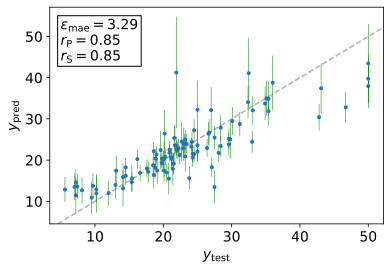
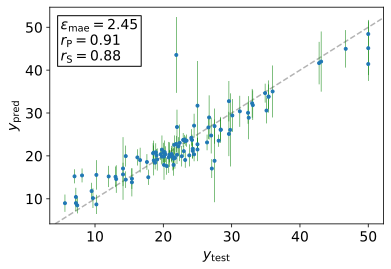

import bimodalProps from './bimodal'

This post is a guide on how to use the [Hamiltonian Monte Carlo (HMC) transition kernel](https://tensorflow.org/probability/api_docs/python/tfp/mcmc/HamiltonianMonteCarlo) provided by [TensorFlow Probability](https://tensorflow.org/probability) to train Bayesian neural networks (BNN) by sampling from their posterior distribution. If you haven't heard of HMC before, check out this [short introduction](/blog/hmc-intro). Or, if you just want the 30-second elevator pitch: HMC is a Markov chain Monte Carlo (MCMC) algorithm that avoids the random walk behavior of simpler MCMC methods (such as Metropolis-Hastings or Gibbs sampling) by using Hamilton's equations of classical mechanics to take a series of first-order-gradient-informed steps through an auxiliary phase space which can be projected down onto the probability density you care about. This allows it to massively speed up mixing (i.e. generating a Markov chain of less correlated samples) and converge on higher dimensional target distributions. Although -- upfront disclaimer -- not necessarily all the way up to the tens of thousands to several million dimensions of the posterior distribution of typical neural networks. Whether or not you'll be able to achieve mixing over such huge numbers of dimensions depends strongly on the shape and complexity of the network's posterior and, of course, on your computational resources.

> The code in this guide was written for [TensorFlow (TF) v2.1](https://pypi.org/project/tensorflow) and [TensorFlow Probability (TFP) v0.9](https://pypi.org/project/tensorflow-probability).

## Simple Example

To first get a feel for what HMC is doing, let's start with a simple example and visualize it. Let's define a two-dimensional bimodal distribution $\pi(\vec x)$ consisting of two Gaussians that are almost completely disjoint,

$$
\pi(\vec x) = \Ncal(\vec\mu_1, \mat\Sigma) + \Ncal(\vec\mu_2, \mat\Sigma)
$$

where

$$
\vec\mu_1 = (2,-2)^T,
\quad
\vec\mu_2 = (-2,2)^T,
\quad
\mat\Sigma = I_2 = \begin{pmatrix} 1 & 0 \\ 0 & 1 \end{pmatrix}.
$$

Multimodal distributions where the modes barely overlap typically pose difficulties to MCMC algorithms. This is because exploring them fully requires entering and passing through a region of low probability density which, by the very nature of MCMC, is a rare event.

Let's see how many samples HMC requires to achieve mixing, i.e. to jump from whichever mode we sample first to the other. Once both modes are covered with roughly equal numbers of samples, we can use the generated Markov chain $\Ccal$ to compute accurate expectation values with respect to $\pi$. For example, say we have an observable $f(\vec x)$ and we're interested in the value it's likely to take given the probabilities for different $\vec x$ under $\pi(\vec x)$,

$$
\expec_\pi[f] = \int_{\Rbb^2} \pi(\vec x) \, f(\vec x) \, \dif\vec x.
$$

If the Markov chain has converged, we can get an unbiased estimate for this expectation value, by averaging over samples in the chain,

$$
\expec_\pi[f] \approx \hat f = \frac{1}{|\Ccal|} \sum_{\vec x \in \Ccal} f(\vec x),
$$

Here's the code to generate $\Ccal$ using TFP:

```py:title=bimodal.py
import numpy as np
import plotly.graph_objects as go
import tensorflow as tf
import tensorflow_probability as tfp

tfd = tfp.distributions

normals_2d = [
    tfd.MultivariateNormalDiag([2, -2]),
    tfd.MultivariateNormalDiag([-2, 2]),
]
bimodal = tfd.Mixture(tfd.Categorical([0.5, 0.5]), normals_2d)


@tf.function(experimental_compile=True)
def sample_chain(*args, **kwargs):
    """@tf.function JIT-compiles a static graph for tfp.mcmc.sample_chain.
    This significantly improves performance, especially when enabling XLA.
    https://tensorflow.org/xla#explicit_compilation_with_tffunction
    https://github.com/tensorflow/probability/issues/728#issuecomment-573704750
    """
    return tfp.mcmc.sample_chain(*args, **kwargs)


step_size = 1e-3
kernel = tfp.mcmc.NoUTurnSampler(bimodal.log_prob, step_size=step_size)
adaptive_kernel = tfp.mcmc.DualAveragingStepSizeAdaptation(
    kernel,
    num_adaptation_steps=500,
    # pkr: previous kernel results, new_ss: new step size
    step_size_setter_fn=lambda pkr, new_ss: pkr._replace(step_size=new_ss),
    step_size_getter_fn=lambda pkr: pkr.step_size,
    log_accept_prob_getter_fn=lambda pkr: pkr.log_accept_ratio,
)
chain, trace, final_kernel_results = sample_chain(
    kernel=adaptive_kernel,
    num_results=200,
    current_state=tf.constant([0.1, 0]),
    return_final_kernel_results=True,
)

xr = np.linspace(-6, 6, 13)
domain = np.stack(np.meshgrid(xr, xr), -1).reshape(-1, 2)

density_plot = go.Surface(
    x=xr, y=xr, z=bimodal.prob(domain).numpy().reshape(len(xr), -1)
)
samples_plot = go.Scatter3d(x=chain[:, 0], y=chain[:, 1], z=bimodal.prob(chain))

fig = go.Figure(data=[density_plot, samples_plot])
fig.update_layout(height=700, title_text=f"step size: {step_size}")
```

These awkward `lambda` functions passed to `adaptive_kernel` are only necessary due to temporary inconsistencies in TFP's `mcmc` module. They will be unnecessary once that receives a good refactor [as stated here](https://github.com/tensorflow/probability/issues/549#issuecomment-529092462). If you're reading this post several months down the line, then perhaps all you need to write is

```py
adaptive_kernel = tfp.mcmc.DualAveragingStepSizeAdaptation(
    kernel, num_adaptation_steps=adapt_steps
)
```

The plot you get from running `bimodal.py` should look similar to this.

<LazyPlot {...bimodalProps} />

_Bimodal distribution decorated by 100 HMC samples which already managed to jump the gap between modes._

During the Hamiltonian evolution that's simulated to obtain each new sample in the chain $\Ccal$, the potential energy $V$ corresponds to the negative log of the probability density shown above, $V(\vec x) = -\log \pi(\vec x)$. The two peaks thus correspond to holes (though more shallow than in the above plot due to the log) in the otherwise flat surface on which the Hamiltonian simulation takes place. The starting point from which the simulation kicks off is randomly initialized. It then takes a few iterations before the head of the chain "falls" into one of the holes. Once there, Hamiltonian dynamics will likely move around there for a while and gather samples from that region of increased probability/decreased potential energy. To eventually transition between the two modes requires starting out a Hamiltonian step with a particularly large initial momentum. The momenta are randomly sampled from a diagonal Gaussian, $\vec p \sim \Ncal(0, \mat\mat\Sigma)$, at the start of each new evolution (independent of the current position). This ensures that lower energy points are more likely to be sampled since the Gaussian has a higher density for small values of $|\vec p|$. Only if we happen to sample a momentum that's sufficiently large and is pointing in the right direction can we overcome the potential barrier between the two modes.

## HMC Routines

Now let's look at actually applying HMC to the parameters of a neural network. For each parameter, we assume a Gaussian prior. First, let's define a few functions to handle the grunt work in this exercise.

```py:title=bnn/hmc.py
import functools as ft

import tensorflow as tf
import tensorflow_probability as tfp

from bnn import build_net, chunks, target_log_prob_fn_factory


def pre_train_nn(X_train, y_train, nodes_per_layer, epochs=100):
    """Pre-train NN to get good starting point for HMC.

    Args:
        nodes_per_layer (list): the number of nodes in each dense layer
        X_train (Tensor or np.array): training samples
        y_train (Tensor or np.array): training labels

    Returns:
        Tensor: list of arrays specifying the weights of the trained network
        model: Keras Sequential model
    """
    layers = [tf.keras.layers.Dense(n, activation="relu") for n in nodes_per_layer]
    layers[-1].activation = tf.identity  # Make last layer linear.
    model = tf.keras.Sequential(layers)

    model.compile(loss="mse", optimizer="adam")
    model.fit(X_train, y_train, epochs=epochs, verbose=0)
    return model.get_weights(), model


def trace_fn(current_state, kernel_results, summary_freq=10, callbacks=[]):
    """Can be passed to the HMC kernel to obtain a trace of intermediate
    kernel results and histograms of the network parameters in Tensorboard.
    """
    step = kernel_results.step
    with tf.summary.record_if(tf.equal(step % summary_freq, 0)):
        for idx, tensor in enumerate(current_state):
            count = idx // 2 + 1
            name = ("w" if idx % 2 == 0 else "b") + str(count)
            tf.summary.histogram(name, tensor, step=step)
        return kernel_results, [cb(*current_state) for cb in callbacks]


@tf.function(experimental_compile=True)
def sample_chain(*args, **kwargs):
    """Compile static graph for tfp.mcmc.sample_chain to improve performance.
    """
    return tfp.mcmc.sample_chain(*args, **kwargs)


def run_hmc(
    target_log_prob_fn,
    step_size=0.01,
    num_leapfrog_steps=10,
    num_burnin_steps=1000,
    num_results=1000,
    current_state=None,
    resume=None,
    log_dir="logs/hmc/",
    sampler="nuts",
    step_size_adapter="dual_averaging",
    **kwargs,
):
    """Use adaptive HMC to generate a Markov chain of length num_results.

    Args:
        target_log_prob_fn {callable}: Determines the stationary distribution
        the Markov chain should converge to.

    Returns:
        burnin(s): Discarded samples generated during warm-up
        chain(s): Markov chain(s) of samples distributed according to
            target_log_prob_fn (if converged)
        trace: the data collected by trace_fn
        final_kernel_result: kernel results of the last step (in case the
            computation needs to be resumed)
    """
    err = "Either current_state or resume is required when calling run_hmc"
    assert current_state is not None or resume is not None, err

    summary_writer = tf.summary.create_file_writer(log_dir)

    step_size_adapter = {
        "simple": tfp.mcmc.SimpleStepSizeAdaptation,
        "dual_averaging": tfp.mcmc.DualAveragingStepSizeAdaptation,
    }[step_size_adapter]
    if sampler == "nuts":
        kernel = tfp.mcmc.NoUTurnSampler(target_log_prob_fn, step_size=step_size)
        adaptive_kernel = step_size_adapter(
            kernel,
            num_adaptation_steps=num_burnin_steps,
            step_size_setter_fn=lambda pkr, new_step_size: pkr._replace(
                step_size=new_step_size
            ),
            step_size_getter_fn=lambda pkr: pkr.step_size,
            log_accept_prob_getter_fn=lambda pkr: pkr.log_accept_ratio,
        )
    elif sampler == "hmc":
        kernel = tfp.mcmc.HamiltonianMonteCarlo(
            target_log_prob_fn,
            step_size=step_size,
            num_leapfrog_steps=num_leapfrog_steps,
        )
        adaptive_kernel = step_size_adapter(
            kernel, num_adaptation_steps=num_burnin_steps
        )

    if resume:
        prev_chain, prev_trace, prev_kernel_results = resume
        step = len(prev_chain)
        current_state = tf.nest.map_structure(lambda chain: chain[-1], prev_chain)
    else:
        prev_kernel_results = adaptive_kernel.bootstrap_results(current_state)
        step = 0

    tf.summary.trace_on(graph=True, profiler=False)

    chain, trace, final_kernel_results = sample_chain(
        kernel=adaptive_kernel,
        current_state=current_state,
        previous_kernel_results=prev_kernel_results,
        num_results=num_burnin_steps + num_results,
        trace_fn=ft.partial(trace_fn, summary_freq=20),
        return_final_kernel_results=True,
        **kwargs,
    )

    with summary_writer.as_default():
        tf.summary.trace_export(name="hmc_trace", step=step)
    summary_writer.close()

    if resume:
        chain = nest_concat(prev_chain, chain)
        trace = nest_concat(prev_trace, trace)
    burnin, samples = zip(*[(t[:-num_results], t[-num_results:]) for t in chain])
    return burnin, samples, trace, final_kernel_results


def predict_from_chain(chain, X_test, uncertainty="aleatoric+epistemic"):
    """Takes a Markov chain of NN configurations and does the actual
    prediction on a test set X_test including aleatoric and optionally
    epistemic uncertainty estimation.
    """
    err = f"unrecognized uncertainty type: {uncertainty}"
    assert uncertainty in ["aleatoric", "aleatoric+epistemic"], err

    if uncertainty == "aleatoric":
        post_params = [tf.reduce_mean(t, axis=0) for t in chain]
        post_model = build_net(post_params)
        y_pred, y_var = post_model(X_test, training=False)

        return y_pred.numpy(), y_var.numpy()

    if uncertainty == "aleatoric+epistemic":
        restructured_chain = [
            [tensor[i] for tensor in chain] for i in range(len(chain[0]))
        ]

        def predict(params):
            post_model = build_net(params)
            y_pred, y_var = post_model(X_test, training=False)
            return y_pred, y_var

        preds = [predict(chunks(params, 2)) for params in restructured_chain]
        y_pred_mc_samples, y_var_mc_samples = tf.unstack(preds, axis=1,)
        y_pred, y_var_epist = tf.nn.moments(y_pred_mc_samples, axes=0)
        y_var_aleat = tf.reduce_mean(y_var_mc_samples, axis=0)
        y_var_tot = y_var_epist + y_var_aleat
        return y_pred, y_var_tot


def nest_concat(*args, axis=0):
    """Utility function for concatenating a new Markov chain or trace with
    older ones when resuming a previous calculation.
    """
    return tf.nest.map_structure(lambda *parts: tf.concat(parts, axis=axis), *args)
```

## BNN Routines

`bnn/hmc.py` imports a module containing functions for building, initializing and calculating the loss (negative log probability) of BNN's with Gaussian posterior. Here's what that module looks like.

```py:title=bnn/__init__.py
import functools as ft

import tensorflow as tf
import tensorflow_probability as tfp


def dense(inputs, w, b, activation=tf.identity):
    return activation(tf.matmul(inputs, w) + b)


def build_net(params, activation=tf.nn.relu):
    def model(X, training=True):
        for w, b in params[:-1]:
            X = dense(X, w, b, activation)
        # final linear layer
        X = dense(X, *params[-1])
        y_pred, y_log_var = tf.unstack(X, axis=-1)
        y_var = tf.exp(y_log_var)
        if training:
            return tfp.distributions.Normal(loc=y_pred, scale=tf.sqrt(y_var))
        return y_pred, y_var

    return model


def bnn_log_prob_fn(X, y, params, get_mean=False):
    """Compute log likelihood of predicted labels y given features X and params.

    Args:
        X (np.array): 2d feature values.
        y (np.array): 1d labels (ground truth).
        params (list): [[w1, b1], ...] containing 2d/1d arrays for weights/biases.
        get_mean (bool, optional): Whether to return the mean log
            probability over all labels for diagnostics, e.g. to
            compare train and test set performance.

    Returns:
        tf.tensor: Sum or mean of log probabilities of all labels.
    """
    net = build_net(params)
    labels_dist = net(X)
    if get_mean:
        return tf.reduce_mean(labels_dist.log_prob(y))
    return tf.reduce_sum(labels_dist.log_prob(y))


def prior_log_prob_fn(w_prior, b_prior, params):
    log_prob = 0
    for w, b in params:
        log_prob += tf.reduce_sum(w_prior.log_prob(w))
        log_prob += tf.reduce_sum(b_prior.log_prob(b))
    return log_prob


def target_log_prob_fn_factory(w_prior, b_prior, X_train, y_train):
    # This signature is forced by TFP's HMC kernel which calls log_prob_fn(*chains).
    def target_log_prob_fn(*params):
        if not isinstance(params[0], (list, tuple)):
            params = chunks(params, 2)
        log_prob = prior_log_prob_fn(w_prior, b_prior, params)
        log_prob += bnn_log_prob_fn(X_train, y_train, params)
        return log_prob

    return target_log_prob_fn


def tracer_factory(X, y):
    return lambda params: ft.partial(bnn_log_prob_fn, X, y, get_mean=True)(params)


def chunks(lst, n):
    # Subdivide lst into successive n-sized chunks.
    return [lst[i : i + n] for i in range(0, len(lst), n)]


def get_random_initial_state(w_prior, b_prior, nodes_per_layer, overdisp=1.0):
    """Draw random samples for weights and biases of a NN according to some
    specified priors. distributions. This set of parameter values can serve as a
    starting point for MCMC or gradient descent training.
    """
    init_state = []
    for n1, n2 in zip(nodes_per_layer, nodes_per_layer[1:]):
        w_shape, b_shape = [n1, n2], n2
        # Use overdispersion > 1 for better R-hat statistics.
        w = w_prior.sample(w_shape) * overdisp
        b = b_prior.sample(b_shape) * overdisp
        init_state.append([tf.Variable(w), tf.Variable(b)])
    return init_state
```

### MAP Routines

Finally, to save some time and computation let's try to initialize our Hamiltonian simulation from a good starting point by first training a maximum a posteriori (MAP) network. We can then extract its parameter values and plug them into the HMC kernel as initial state. The hope is that by doing so, HMC will require less warm up before finding its way into high-probability regions of parameter space. If you're unfamiliar with [MAP](https://en.wikipedia.org/wiki/Maximum_a_posteriori_estimation), it's basically just maximum likelihood inference combined with some priors for regularization.

```py:title=bnn/map.py
import numpy as np
import tensorflow as tf


def get_map_trace(target_log_prob_fn, state, n_iter=1000, save_every=10, callbacks=[]):
    optimizer = tf.optimizers.Adam()

    @tf.function
    def minimize():
        optimizer.minimize(lambda: -target_log_prob_fn(*state), state)

    state_trace, cb_trace = [], [[] for _ in callbacks]
    for i in range(n_iter):
        if i % save_every == 0:
            state_trace.append(state)
            for trace, cb in zip(cb_trace, callbacks):
                trace.append(cb(state).numpy())
        minimize()

    return state_trace, cb_trace


def get_best_map_state(map_trace, map_log_probs):
    # map_log_probs[0/1]: train/test log probability
    test_set_max_log_prob_idx = np.argmax(map_log_probs[1])
    # Return MAP params that achieved highest test set likelihood.
    return map_trace[test_set_max_log_prob_idx]


def get_nodes_per_layer(n_features, net_taper=(1, 0.5, 0.2, 0.1)):
    nodes_per_layer = [int(n_features * x) for x in net_taper]
    # Ensure the last layer has two nodes so that output can be split into
    # predictive mean and learned loss attenuation (see eq. (7) of
    # https://arxiv.org/abs/1703.04977) which the network learns individually.
    nodes_per_layer.append(2)
    return nodes_per_layer
```

## Boston Housing

Finally, let's look at a concrete example by training a network with HMC to predict Boston housing prices and compare its performance with the MAP network. (The following is a [VS Code-style Jupyter notebook](https://code.visualstudio.com/docs/python/jupyter-support-py), the `# %%` are cell delimiters.)

```py:title=boston-housing-hmc.py
# %%
import tensorflow as tf
import tensorflow_probability as tfp

from bnn import (
    get_random_initial_state,
    target_log_prob_fn_factory,
    tracer_factory,
)
from bnn.hmc import predict_from_chain, run_hmc
from bnn.map import get_best_map_state, get_map_trace, get_nodes_per_layer

# %%
# About the data: https://kaggle.com/c/boston-housing
train, test = tf.keras.datasets.boston_housing.load_data()
X_train, y_train, X_test, y_test = [arr.astype("float32") for arr in [*train, *test]]


# %%
weight_prior = tfp.distributions.Normal(0, 0.2)
bias_prior = tfp.distributions.Normal(0, 0.2)


# %%
log_prob_tracers = (
    tracer_factory(X_train, y_train),
    tracer_factory(X_test, y_test),
)

n_features = X_train.shape[-1]
random_initial_state = get_random_initial_state(
    weight_prior, bias_prior, get_nodes_per_layer(n_features)
)

trace, log_probs = get_map_trace(
    target_log_prob_fn_factory(weight_prior, bias_prior, X_train, y_train),
    random_initial_state,
    n_iter=3000,
    callbacks=log_prob_tracers,
)
best_map_params = get_best_map_state(trace, log_probs)


# %%
map_nn = bnn.build_net(best_map_params)
map_y_pred, map_y_var = map_nn(X_test, training=False)


# %%
bnn_log_prob_fn = target_log_prob_fn_factory(weight_prior, bias_prior, X_train, y_train)
_, samples, _, _ = run_hmc(bnn_log_prob_fn, current_state=best_map_params)
hmc_y_pred, hmc_y_var = predict_from_chain(samples, X_test)
```

We can plot the predicted means (`map_y_pred`, `hmc_y_pred`) against the test set's ground truth (`y_test`) to get an idea of the quality of predictions. Moreover, let's plot the predicted standard deviation (`map_y_var ** 0.5`, `hmc_y_var ** 0.5`) as error bars to see if the network's Bayesian nature affords as any useful information about the confidence in its predictions. If it's any good at estimating its own uncertainty, we'd expect points deviating from the parity line ($y_\text{test} = y_\text{pred}$) to exhibit increased predicted variance. And indeed, with a few exceptions, that's what we get for both MAP and HMC.


_**MAP** predictions vs ground truth_


_**HMC** predictions vs ground truth_

The full code including the boring parts for generating plots can be found on [GitHub](https://github.com/janosh/thermo/blob/main/src/bnn/hmc.py).

## Future prospects

TFP is still in the process of adding more functionality to its `mcmc` module. For instance, both the [`NoUTurnSampler`](https://github.com/tensorflow/probability/blob/23573a10f203bf740e69f52387bbe8070703eda5/tensorflow_probability/python/experimental/mcmc/nuts.py#L75) and the [`DualAveragingStepSizeAdaptation`](https://github.com/tensorflow/probability/blob/23573a10f203bf740e69f52387bbe8070703eda5/tensorflow_probability/python/mcmc/dual_averaging_step_size_adaptation.py#L97) appeared only days before this post was published. They're both great improvements over the regular [`HamiltonianMonteCarlo`](https://tensorflow.org/probability/api_docs/python/tfp/mcmc/HamiltonianMonteCarlo) kernel and [`SimpleStepSizeAdaptation`](https://tensorflow.org/probability/api_docs/python/tfp/mcmc/SimpleStepSizeAdaptation), respectively. The former enables HMC to scale to even larger problems in terms of state space dimensionality while the latter should allow the kernel to converge to optimal step sizes faster. I'm excited to see where this is headed.

## Further reading

- [A tour of probabilistic programming language APIs](https://colcarroll.github.io/ppl-api) by Colin Carroll. His entire blog is about MCMC and probabilistic programming and he has a bunch more really interesting posts on those topics. I highly recommend checking those out.
- There's also an interesting [arXiv paper by the TFP team](https://arxiv.org/abs/2002.01184) published in Feb 2020 that explains what motivated the design decisions in their `mcmc` module.
