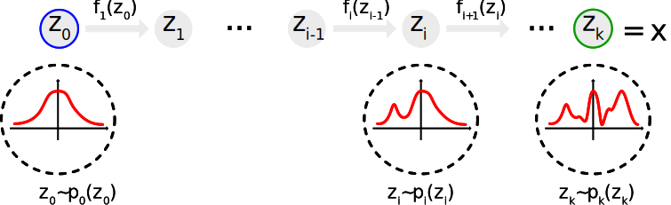

I'm a big fan of Feynman's technique of learning something new by trying to explain it to someone else. So in this post, I'll try to explain normalizing flows (NF), a relatively simple yet powerful new tool in statistics for constructing expressive probability distributions from simple base distribution using smooth bijective transformations. It's a hot topic right now and has exciting applications in the context of probabilistic modeling and inference.

Before we get started, huge thanks to [Papamakarios et al.](https://arxiv.org/abs/1912.02762), [Lilian Weng](https://lilianweng.github.io/lil-log/2018/10/13/flow-based-deep-generative-models) and [Adam Kosiorek](https://akosiorek.github.io/ml/2018/04/03/norm_flows.html) from whom I learned most of what follows.

## The Big Picture

First, let's take a step back and look at which developments preceded NFs and how they fit into the larger setting of a machine learning subfield known as deep generative models (DGM). There are currently three types of DGMs:

- variational autoencoders (VAE) [[Kingma et al. in 2013](https://arxiv.org/abs/1312.6114)]
- generative adversarial networks (GAN) [[Goodfellow et al. in 2014](http://papers.nips.cc/paper/5423-generative-adversarial-nets)]
- flow-based generative networks (FGN) [[Rezende et al. in 2015](https://arxiv.org/abs/1505.05770)]

Here's a brief explanation for each:

- VAEs consist of two trapezoidal neural networks connected at their narrow sides. The first one, known as the encoder, goes from wide to narrow and learns a latent, lower-dimensional representation $\vec z$ of the input $\vec x$. The second one, known as the decoder, goes from narrow back to wide. Together, they indirectly maximize the likelihood of the data they generate through variational inference (hence the name VAE). Their objective is to maximize the evidence lower bound (ELBO) of generated data given the observed data (which is tractable unlike the likelihood itself). This implicitly drives the approximate posterior to resemble the true one since the difference between likelihood and ELBO is the Kullback-Leibler divergence between true and approximate posterior. And this divergence becomes ever smaller as the ELBO is being raised.
- GANs are an example of likelihood-free inference. They cleverly recast the unsupervised learning problem of trying to generate realistic new data into a supervised one by introducing an adversarial discriminator network whose goal it is to learn to distinguish real data from samples produced by the generator model. The two models constantly try to outwit each other as they engage in this zero-sum game (a.k.a. minimax objective).
- FGNs consist of a sequence of invertible transformations. Unlike VAEs and GANs, FGNs explicitly attempt the difficult problem of density estimation where the goal is to learn the underlying probability distribution $p(\vec x)$ of the observed data. To do so, they use _normalizing flows_. The loss function to minimize in this case is the negative log-likelihood of observed data which (unlike for the VAE) in this case can be made tractable by the change of variables formula as we'll see below.

The cool thing about FGNs is that a sufficiently accurate proxy for the posterior $p(\vec x)$ enables a host of useful downstream applications such as

- **data generation**: drawing statistically independent (i.e. new and unobserved) one-shot samples of $p(\vec x)$ (important for Bayesian inference),
- **density estimation**: predict the rareness of future events or infer latent variables,
- **sample completion**: fill in incomplete data (e.g. image or audio samples).

## What are Normalizing Flows?

The problem that normalizing flows aim to address is turning a simple distribution into a complex, multi-modal one in an invertible manner. Why would we want to do that? Training a machine learning model usually means tuning its parameters to maximize the probability of observed training data under the model. To quantify this probability, we have to assume some probability distribution as the model's output. In classification, this is typically a categorical distribution and in regression usually a Gaussian, mostly because it's the only non-uniform continuous distribution we really know how to deal with. However, assuming the model output to be distributed according to a Gaussian is problematic because the world is complicated and the true probability density function (PDF) of actual data will in general be completely unlike a Gaussian.

Luckily, we can take a simple distribution like a Gaussian, sample from it and then transform those samples using smooth bijective functions which essentially performs a change of variables in probability distributions. Repeating this process multiple times can quickly result in a complex PDF for the transformed variable. Danilo Rezende formalized this in [his 2015 paper](https://arxiv.org/abs/1505.05770) on normalizing flows.

## Definition

Let $\vec x \in \reals^d$ be a continuous, real random variable. We would like to know its joint distribution $p_x(\vec x)$. However, we know from the get-go that this is too complicated an expression to write down or manipulate exactly. So we contend ourselves with indirectly constructing as accurate an approximation as possible.

For that we can use flow-based modeling. The main idea behind that is to express $\vec x$ as a transformation $f$ of a real vector $\vec z$ sampled from a simpler distribution $p_z(\vec z)$:

$$
\vec x = f(\vec z)
\quad\text{with}\quad
\vec z \sim p_z(\vec z). \tag{1}
$$

$p_z(\vec z)$ is called the_base distribution_of the model. It's usually a diagonal-covariance Gaussian. (To connect terminology with latent-variable models such as VAEs, $p_z(\vec z)$ is also sometimes referred to as the prior and $\vec z$ as the latent variable. However, as [Papamakarios et al. rightly point out in their excellent review](https://arxiv.org/abs/1912.02762), $\vec z$ is not actually latent (unobserved) since knowing $\vec x$ uniquely determines the corresponding $\vec z = f^{-1}(\vec x)$.)

The transformation $f$ and base distribution $p_z(\vec z)$ are the_only_two defining properties of a flow model. Both may have their own parameters denoted $\vec\phi$ and $\vec\psi$, respectively. Together, $f*\vec\phi$ and $p*z(\vec z; \psi)$ induce a family of distributions over $\vec x$ parameterized by $\vec\theta = \{\vec\phi, \vec\psi\}$ (as usual in variational inference). If we're doing posterior inference, we can only get as close to the true posterior as the most similar member of this family. (We won't always indicate the dependence on these parameters to simplify notation but in the following, $f$ actually refers to $f*\vec\phi$ and $p_z(\vec z)$ to $p_z(\vec z; \psi)$.)

### Change of Variables for Probability Distributions

For flow models to be tractable, $f$ must be a diffeomorphism. This is just a fancy way of saying it has to be invertible (bijective) and differentiable (smooth). As a corollary, $\vec z$ and $\vec x$ must be of equal dimension (else $f$ could not be invertible). Given these constraints, the generated density $p_x(\vec x)$ is well-defined and computable in practice from the base distribution $p_z(\vec z)$ by a change of variables.

$$
p_x(\vec x)
= p_z(\vec z) \ \bigl|\det J_f(\vec z)\bigr|^{-1}, \tag{2}
$$

where $J_f(\vec z)$ denotes the Jacobian of $f$ at $\vec z$, that is the $d \times d$-matrix of first-order partial derivatives,

$$
J_f(\vec z)
= \frac{\partial f(\vec z)}{\partial \vec z}
= \begin{pmatrix}
    \frac{\partial f_1}{\partial z_1} & \cdots & \frac{\partial f_1}{\partial z_d} \\
    \vdots & \ddots & \vdots\\
    \frac{\partial f_d}{\partial z_1} & \cdots & \frac{\partial f_d}{\partial z_d} \\
\end{pmatrix}.
$$

Derivation

Eq. (2) follows from the [change of variables theorem](https://wikipedia.org/wiki/Integration_by_substitution#Substitution_for_multiple_variables) (a.k.a. integration by substitution, integration's pendant to the chain rule of differentiation). By definition of probability

$$
\int_{\reals^d} p_z(\vec z) \ \dif z
= 1
= \int_{\reals^d} p_x(\vec x) \ \dif x,
$$

If under the transformation $f$ an infinitesimal neighborhood $\dif\vec z$ around $\vec z$ is mapped to an infinitesimal neighborhood $\dif\vec x$ around $\vec x = f(\vec z)$, then, due to conservation of probability mass, this equality has to hold locally, i.e. $p_z(\vec z) \ \dif z = p_x(\vec x) \ \dif x$. We can rewrite this as

$$
p_x(\vec x)
= p_z(\vec z) \left|\det\frac{\dif \vec z}{\dif \vec x}\right|
= p_z(\vec z) \left|\det\frac{\dif f^{-1}(\vec x)}{\dif \vec x}\right|
= p_z(\vec z) \left|\det\frac{\dif f(\vec z)}{\dif \vec z}\right|^{-1}.
$$

In the last step we used two things:

- the _inverse function theorem_ which states that for $f$ continuously differentiable (which it is, in our case, by definition), we have

  $$
  \frac{\dif f^{-1}(\vec x)}{\dif \vec x}
  = \frac{\dif \vec z}{\dif \vec x}
  = \left[\frac{\dif \vec x}{\dif \vec z}\right]^{-1}
  = \left[\frac{\dif f(\vec z)}{\dif \vec z}\right]^{-1},
  $$

- and $\det(\mat M^{-1}) = \det(\mat M)^{-1}$ because $\det(\mat M) \det(\mat M^{-1}) = \det(\mat M \ \mat M^{-1}) = \det(I) = 1$.

Intuitively, think of $f$ as expanding and contracting the space $\reals^d$ so as to mold $p_z(\vec z)$ into $p_x(\vec x)$. The absolute Jacobian determinant $|\det J_T(\vec z)|$ then measures the change of volume of a small neighborhood around $\vec z$ under $f$, i.e. the ratio of volumes of corresponding neighborhoods in $\vec x$- and $\vec z$-parametrization of space. Hence we divide by it to account for the stretching or contracting of space under $f$.

The cool thing about diffeomorphisms is that they form a group under composition. Again, this is a fancy way of saying that successively applying multiple diffeomorphisms always results in a new transformations that is itself a diffeomorphism. Given $f_1$ and $f_2$, the inverse and Jacobian determinant of their composition $f_2 \circ f_1$ are

$$
\begin{aligned}
  (f_2 \circ f_1)^{-1} &= f_1^{-1} \circ f_2^{-1}\\[1ex]
  \det J_{f_2 \circ f_1}(\vec z) &= \det J_{f_2}\bigl(f_1(\vec z)\bigr) \cdot \det J_{f_1}(\vec z).
\end{aligned}
$$

Therefore, we can apply a series of transformations $f_i$, $i \in \{1, \dots, k\}$ to generate a normalizing flow,

$$
\vec z_k = \underbrace{f_k \circ \dots \circ f_1}_{f_{xz}}(\vec z_0), \qquad \vec z_0 \sim p_0(\vec z_0), \tag{3}
$$

where $\vec z = \vec z_0$ and $\vec x = \vec z_k$. The probability distributions $p_x(\vec x) = p_k(\vec z_k)$ and $p(\vec z) = p_0(\vec z_0)$ of the random variables at both ends of the flow can be related by repeatedly applying eq. (2),

$$
\vec z_k \sim p_k(\vec z_k) = p_0(\vec z_0) \ \prod_{i=1}^k
\left|
  \det \frac{\partial f_i(\vec z_{i-1})}{\partial \vec z_{i-1}}
\right|^{-1}. \tag{4}
$$

This flow can transform a simple base distribution such as a multivariate Gaussian into a complicated multi-modal one as illustrated below.

_A normalizing flow transforming a simple distribution $p_0(\vec z_0)$ step by step into a complex one $p_k(\vec z_k)$ approximating some target distribution $p_x(\vec x)$. Source: [Lilian Weng](https://lilianweng.github.io/lil-log/2018/10/13/flow-based-deep-generative-models.html)_

You may have already guessed that the word 'flow' in normalizing flow refers to the trajectories that a collection of samples from $p_z(\vec z)$ move along as transformations are applied to them, sort of like the particles in a compressible fluid undergoing stirring motions to achieve a certain pattern. The modifier 'normalizing' comes from the fact that we renormalize the resulting density $p_i(\vec z_{i-1})$ after every transformation $f_i$ by its Jacobian determinant $|\det J_{f_i}(\vec z_{i-1})|$ in order to retain a normalized probability distribution at every step.

## Usage

There are two ways we might want to use a flow model.

1. We can generate samples using eq. (1).
2. We can evaluate the model's density at a given point using eq. (2).

For practical applications, depending on which of these we need (and we might need both), we must ensure that certain computational operations can be performed efficiently.

1. To draw samples, we need the ability to sample $p_z(\vec z)$ and to compute the forward transformation $f$.
2. To evaluate the model’s density, we need to perform the inverse transformation $f^{-1}$, calculate its Jacobian determinant $\det J_f(\vec z)$ and finally evaluate the density $p_z(\vec z)$.

Of course, before using it, we first need to fit the model.

## Fitting a Normalizing Flow

As with many probabilistic models, we fit a normalizing flow by minimizing the divergence between its output $p_x(\vec x; \vec\psi)$ and the target distribution $p_x^*(\vec x)$. The knobs and dials at our disposal are the model's parameters $\vec\theta = \{ \vec\phi, \vec\psi \}$ for the base distribution $p_z(\vec z; \vec\psi)$ and the transformation $f_\vec\phi$. By far the most common measure of discrepancy between $p_x(\vec x; \vec\psi)$ and $p_x^*(\vec x)$ is the Kullback–Leibler (KL) divergence. There are two equivalent ways of expressing it. Which one to choose depends on whether it's easier to sample from the target or the base distribution.

### Sampling the target density

This loss function is useful in cases where we have or can generate samples from the target distribution $p_x^*(\vec x)$.

$$
\begin{aligned}
\Lcal(\vec\theta)
&= D_\text{KL}\bigl(p_x^*\ || \ p_x(\vec x; \vec\psi)\bigr) \\[1ex]
&= \int_{\reals^d} p_x^*(\vec x) \ \log\left(\frac{p_x^*(\vec x)}{p_x(\vec x; \vec\psi)}\right) \ \dif\vec x \\[1ex]
&= -\int_{\reals^d} p_x^*(\vec x) \ \log p_x(\vec x; \vec\psi) \ \dif\vec x + \int_{\reals^d} p_x^* \ \log  p_x^*(\vec x) \ \dif\vec x \\[1ex]
&= -\expec_{p_x^*}\Bigl(\log p_x(\vec x; \vec\theta)\Bigr) + \const \\[1ex]
&= -\expec_{p_x^*}\left[\log p_z \!\left(f_{\vec\phi}^{-1}(\vec x); \vec\psi\right) + \log\left|\det J_{f_{\vec\phi}^{-1}}(\vec x) \right|\right] + \const.
\end{aligned}
$$

Given a set of samples $\{\vec x_n\}_{n=1}^N$ from $p_x^*(\vec x)$, we can obtain an unbiased Monte Carlo estimate of $\Lcal(\vec\theta)$ as

$$
\Lcal(\vec\theta)
\approx - \frac{1}{N} \sum_{n=1}^N \left[\log p_z(f_{\vec\phi}^{-1}\left(\vec x_n; \vec\psi\right) + \log\left| \det J_{f_{\vec\phi}^{-1}}(\vec x_n) \right|\right] + \const. \tag{5}
$$

We can then iteratively minimize $\Lcal(\vec\theta)$ using stochastic gradient descent by differentiating eq. (5) with respect to $\vec\theta$, yielding

$$
\begin{aligned}
&\nabla_{\vec\phi} \Lcal(\vec\theta)
\approx -\frac{1}{N} \sum_{n=1}^N \nabla_{\vec\phi}\log p_z\left(f_{\vec\phi}^{-1}(\vec x_n); \vec\psi\right) + \nabla_{\vec\phi} \log\left| \det J_{f_{\vec\phi}^{-1}}(\vec x_n)\right| \\[1ex]
&\nabla_{\vec\psi} \Lcal(\vec\theta)
\approx -\frac{1}{N} \sum_{n=1}^N \nabla_{\vec\psi} \log p_z\left(f_{\vec\phi}^{-1}(\vec x_n); \vec\psi\right).
\end{aligned}
$$

Finding a minimum of eq. (5) is equivalent to finding the maximum likelihood estimates for the flow model's parameters given the samples $\{\vec x_n\}_{n=1}^N$. Thus to fit a flow to maximum likelihood, besides sampling from $p_x^*(\vec x)$, we need to be able to differentiate the transformation $f_{\vec\phi}^{-1}(\vec x)$, its Jacobian determinant $\det J_{f_{\vec\phi}^{-1}}(\vec x)$ and the base density $p_z(\vec z; \vec\psi)$.

### Sampling the base density

Alternatively, we can swap the order of arguments of the KL divergence to obtain a slightly different loss function:

$$
\begin{aligned}
\Lcal(\vec\theta)
&= D_\text{KL}\bigl(p_x(\vec x; \vec\theta) \ || \ p_x^*(\vec x)\bigr) \\
&= \expec_{p_x(\vec x; \vec\theta)} \Bigl(\log p_x(\vec x; \vec\theta)  - \log p_x^*(\vec x)\Bigr) \\
&= \expec_{p_z(\vec z; \vec\psi)} \Bigl(\log p_z(\vec z; \vec\psi) - \log\bigl|\det J_{f_{\vec\phi}}(\vec z)\bigr| - \log p_x^*\bigl(f_\vec\phi(\vec z)\bigr)\Bigr).
\end{aligned}
$$

We used eqs. (1) and (2) in the last step to replace $\vec x$ with $\vec z$. This loss function comes in handy if we can sample from the base density $p_z(\vec z)$ and are able to evaluate the target density $p_x^*(\vec x)$ (at least up to a normalizing constant which becomes an additive constant under the log and drops out in the gradient).

By generating a set of samples $\{\vec z_n\}_{n=1}^N$ from $p_z(\vec z; \vec\psi)$, the gradient of $\Lcal(\vec\theta)$ can be estimated as

$$
\nabla_{\vec\phi} \Lcal(\vec\theta)
\approx -\frac{1}{N} \sum_{n=1}^N \nabla_{\vec\phi} \log\left| \det J_{f_{\vec\phi}}(\vec z_n) \right|
+ \nabla_{\vec\phi}\log p_z^*\bigl(f_{\vec\phi}(\vec z_n)\bigr).
$$

The gradient with respect to $\vec\psi$ isn't strictly necessary since any adjustment to the parameters of the base distribution $p_z(\vec z; \vec\psi)$ can be absorbed into the transformation $f_\vec\phi$. We can fit with respect to $\vec\phi$ only without loss of generality.

This loss function requires that we be able to differentiate $f_\vec\phi$ and its Jacobian determinant. It works even if we can't evaluate the base density nor perform the inverse transform $f_{\vec\phi}^{-1}$. (Of course, we will still need these if we want to evaluate the fitted model's density.)

This loss function is chosen when using normalizing flows in the context of e.g. _variational inference_ or _model distillation_. The latter is an exciting application in which a flow model is trained to replace a target model whose density $p_x^*(\vec x)$ can be evaluated but is otherwise inconvenient, e.g. difficult to sample. Two examples of model distillation with flows are [Parallel WaveNets by van den Oord et al.](https://arxiv.org/abs/1711.10433) and [Boltzmann Generators by Noé et al](https://arxiv.org/abs/1812.01729).

---

In their original paper, Rezende et al. introduced two simple families of transformations known as _planar_ and _radial_ flows that satisfy these constraints. These are, however, only useful for low-dimensional random variables and so we will not cover them here. Since the original paper was published in 2015, a host of additional flows have been and continue to be developed. A class of these that are widely applicable yet still have decent expressivity are known as _affine coupling flows_.

## Affine Coupling Flows

To use normalizing flows in actual computation, we are constrained to transformations whose Jacobian is easy to calculate. This makes developing flows with greater expressivity non-trivial. It turns out, though, that by introducing dependencies between different dimensions of the input variable, versatile flows with a tractable Jacobian are possible. Specifically, if dimension $i$ of the transformed variable depends only on dimensions $\{1, \dots, i\}$ of the input variable, then the Jacobian of this transformation is triangular. And a triangular matrix has a determinant given simply by the product of diagonal entries.

Two types of transformation that follow this line of thought are known as RNVP and NICE. They form the heart of a Boltzmann generator, which hopefully finally explains how all of the above ties into the actual topic of this post. So let's take a closer look at these and before diving into Boltzmann generators themselves.

### RNVP

RNVP stands for _real-valued non-volume preserving_ and was introduced by [Dinh et al. in 2017](https://arxiv.org/abs/1605.08803)). It's also referred to as _affine coupling layer_. It splits the input dimensions into two parts:

- The first $j$ dimensions of the input variable $\vec z$ remain unaltered.
- The remaining $d - j$ dimensions undergo an affine transformation, that is they are scaled and translated. Both scaling and translation are functions of the first $j$ dimensions.

$$
f_\text{RNVP}
= \begin{cases}
\vec x_{1:j} = \vec z_{1:j} \\
\vec x_{j+1:d} = \vec z_{j+1:d} \odot \exp({S(\vec z_{1:j})}) + T(\vec z_{1:j}) \tag{5}
\end{cases}
$$

where $\odot$ is the element-wise Hadamard product and $S(\cdot)$ and $T(\cdot)$ are the scale and translation functions, respectively, both mapping $\mathbb{R}^j \mapsto \mathbb{R}^{d-j}$. The crucial point here is that since $\vec x_{1:j}$ and $\vec z_{1:j}$ are identical, $S$ and $T$ don't have to be invertible themselves for eq. (4) to be easily invertible as a whole. We can simply get back from $\vec x$ to $\vec z$ by computing

$$
f_\text{RNVP}^{-1}
= \begin{cases}
\vec z_{1:j} = \vec x_{1:j} \\
\vec z_{j+1:d} = (\vec x_{j+1:d} - T(\vec x_{1:j})) \oslash \exp(S(\vec x_{1:j})),
\end{cases}
$$

with $\oslash$ denoting Hadamard division. Moreover, since the Jacobian is lower triangular,

$$
\vec J_\text{RNVP} =
\begin{pmatrix}
  \unity_j & \mat 0_{j\times(d-j)} \\[1ex]
  \frac{\partial \vec x_{j+1:d}}{\partial \vec z_{1:j}} & \diag(\exp(S(\vec z_{1:j})))
\end{pmatrix},
$$

its determinant is easy to compute:

$$
\det(\vec J_\text{RNVP})
= \prod_{j=1}^{d-j}\exp\Bigl(S(\vec z_{1:j})\Bigr)_j
= \exp\left(\sum_{j=1}^{d-j} S(\vec z_{1:j})_j\right).
$$

It's worth emphasizing that since $f_\text{RNVP}^{-1}$ does not require computing $S^{-1}$ or $T^{-1}$ and $\det(\vec J_\text{RNVP})$ does not involve computing the Jacobian determinants $\det(J_S)$ or $\det(J_T)$, those functions can be _arbitrarily_ complex and thus are usually implemented as deep non-invertible neural networks.

Since a single affine coupling layer leaves some dimensions (channels) of the random variable unchanged, such layers usually appear in pairs of two with their channels reversed so that the combined block transforms all channels.

While there are more expressive flows, RNVP is still the most generally applicable because both sampling and evaluating probabilities of external samples is efficient. This is because all elements of $S$ and $T$ can be computed in parallel since all inputs $\vec z$ are available from the start. $\vec x$ therefore pops out in a single forward pass.

### NICE

Developed two years earlier by the same guys ([Dinh, et al. 2015](https://arxiv.org/abs/1410.8516)), NICE stands for non-linear independent component estimation. It's an _additive_ coupling layer, i.e. simply RNVP without the scaling factor.

$$
f_\text{NICE}
= \begin{cases}
\vec x_{1:j} = \vec z_{1:j} \\
\vec x_{j+1:d} = \vec z_{j+1:d} + T(\vec z_{1:j})
\end{cases}
$$

and

$$
f_\text{NICE}^{-1}
= \begin{cases}
\vec z_{1:j} = \vec x_{1:j} \\
\vec z_{j+1:d} = \vec x_{j+1:d} - T(\vec x_{1:j})
\end{cases}
$$

## Further Reading

Normalizing flows seem to really be taking off at the moment. Here's an incomplete list of awesome resources on the topic.

- Ari Seff created a [super helpful 3blue1brown-style video](https://youtube.com/watch?v=i7LjDvsLWCg) explaining the basics of normalizing flows.
- Some of the guys at DeepMind involved in the development of NFs [published a very thorough and very readable review article](https://arxiv.org/abs/1912.02762) on the subject just days after I published this post. (I updated this post with some of the insights I gained there.)
- Andrej Karpathy created [a repo with PyTorch implementations of the most commonly used flows](https://github.com/karpathy/pytorch-normalizing-flows) (also just days after this post).
- PyMC3 has a [very helpful notebook](https://docs.pymc.io/notebooks/normalizing_flows_overview.html) showcasing how to work with flows in practice and comparing it to their NUTS-based HMC implementation.

I've also started compiling [a repo of helpful resources on NFs](https://github.com/janosh/awesome-normalizing-flows). Feel free to submit PRs to gather even more sources and advice on this topic.
