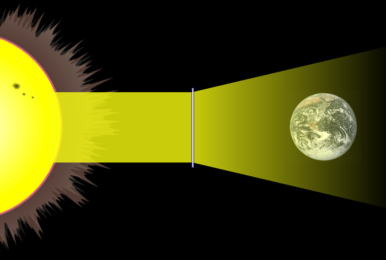

If the Paris climate agreement has achieved nothing else, it at least gave scientists and the world a concrete target for the total rise in average temperatures that we absolutely do not want to exceed. It's a mere 2˚C. Admittedly, this number was plucked entirely from thin air. Yep, you read that right. You'd think it's the result of decades of climate science wrestling with the question how much we can change our planet's atmospheric composition before catastrophic repercussions kick in. You might even assume there was a magic threshold at around 2˚C global warming where a bunch of independent climate models all predicted some devastating positive feedback loops would start to kick in. But no. [Turns out](https://theconversation.com/why-is-climate-changes-2-degrees-celsius-of-warming-limit-so-important-82058) the 2˚C target is the result of a 1975 [back-of-the-envelope calculation](http://pure.iiasa.ac.at/id/eprint/365) by some Yale _economist_ called William D. Nordhaus.

But alright, at least we finally have a goal that the global community was able to agree upon. Admittedly not the entire global community. There were a few exceptions. [18 countries signed but to this day have yet to ratified](https://climateanalytics.org/briefings/ratification-tracker) the Paris agreement. Except for Nicaragua which initially refused (but later relented) because they considered the agreement too lax (!), most of the other 18 nations have pretty obvious personal interests in mind: they are either big coal burners like Turkey or oil and gas exporters like Russia and Iran.

_Signatories (yellow) and parties (ratifiers) (blue) to the Paris Agreement. Incidentally, check out how Donald Trump managed to isolate the US from the rest of the world by proclaiming its intent to withdraw from the accord entirely._

But I digress. As I was saying, we now have a goal and even if it's an arbitrary one, at least it gives some guidance, makes the discussions on how to mitigate global warming more tangible and the process of implementing countermeasures more calculable. For instance, hot on the heels of the Paris agreement followed a bunch of publications estimating our chance of actually achieving our objective of staying below 2˚C global warming. The consensus was alarmingly low. [One nature study put it at a scant 5%](https://www.nature.com/articles/nclimate3352).

I think it's fair to say that, as a result of the Paris agreement, more and more members of the scientific community have looked into our chances of actually getting off our fossil fuel addiction in time to prevent disaster, and many of them are beginning to think our current know-how and political will for reducing green house gas emissions are simply insufficient. This has lead to increased interest in geoengineering (aka climate engineering). Basically it's a catch all term for a wide variety of possible measures we might take to either

- prevent the CO~2~ we produce from ending up in the atmosphere and oceans,
- pull the CO~2~ we already emitted out of the atmosphere and store it some place where it's not as harmful, or
- somehow mitigate the effects high atmospheric and oceanic CO~2~ concentration will have on our planet's ecosystems and weather patterns.

Geoengineering used to be a bad word in climate science. In fact, it still is for many. There are two main reasons for this.

1. Geoengineering essentially propagates further intervention in a planetary system of incredible complexity, inscrutable interdependencies and non-linear feedback loops that we really don't understand. Hence, many consider it naive to think that we could turn some knobs and dials on our climate and actually create the effect we anticipate.
2. Many of the initial efforts in geoengineering confirmed this, showing that climate interventions either
   - lead to different outcomes than were intended,
   - are impossible to deploy on sufficiently large scales to make a difference globally, or
   - would be so prohibitively expensive that just brute-forcing our transition to renewable energies would result in more bang for the buck.

So for the climate science community -- or at least part's of it -- to turn back to geoengineering after such disheartening initial findings could be seen as an act of desperation. Personally, I think there's still enough of a chance it might help us in the long run that we should keep it on the table and research it further. With that said and with this lengthy introduction out of the way, I'd like to use this post to look into two options for engineering our planet's climate that seem particularly promising to me.

## Space sunshade

Yes, you read that right, **a space sunshade for planet Earth**. I'm aware that this sounds completely outlandish and like straight out of science fiction.

_Fresnel space lens suspended at the first Lagrange point $L1$ where the sun's and Earth's gravitational forces cancel. Credit: [Wikipedia][1]_

However, this idea is surprisingly old and by now there are many different variants in discourse. Of course, that in itself doesn't make it more feasible. However, capability of launching large payloads into orbit has seen huge leaps recently thanks to companies like [SpaceX](https://www.spacex.com) with its [Falcon Heavy](https://en.wikipedia.org/wiki/Falcon_Heavy) and upcoming [Big ~~Fucking~~ Falcon Rocket (BFR)](<https://en.wikipedia.org/wiki/BFR_(rocket)>). At the same time, the cost per kilogram of launching something into low earth orbit (LEO) has dropped significantly.

_The declining cost of launching people and cargo into space. Adjusted for inflation, U.S. launch vehicles to LEO only. Credit: [FutureTimeline.net](https://www.futuretimeline.net/data-trends/6.htm)_

The second one, on the other hand, is quite straightforward and very much brute-force: simply **suck all the excess CO~2~ we produced back out of the atmosphere**.

_The world's first commercial carbon capture plant built by Climeworks in Switzerland. It removes CO~2~ directly from ambient air. Credit: [Climeworks](https://www.climeworks.com)_

_Contour plot of the effective potential due to gravity and the centrifugal force in the Sun-Earth system. Credit: [Wikipedia][2]_

[1]: https://en.wikipedia.org/wiki/Space_sunshade
[2]: https://en.wikipedia.org/wiki/lagrangian_point
