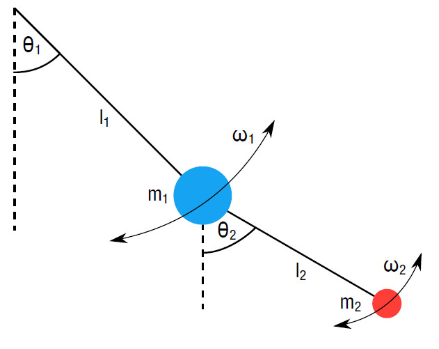

<section class="landing">

<h2 class="section-title">Notes on Physics</h2>

This is a compilation of notes and solutions to problem sheets for some of the physics lectures I took, most of them in Heidelberg, Germany. Hopefully, they can be useful to others. If you find errors, please [open an issue]({issues}).

<DocsGrid>

[String Theory ](physics/string-theory)

[QFT ](physics/qft)

[Advanced QFT ](physics/advanced-qft)

[General Relativity ](physics/general-relativity)

[Group Theory ](physics/group-theory)

[Numerical Simulations ](physics/numerical-simulations)

[Atomic Physics ](physics/atomic-physics)

[Statistical Physics ](physics/statistical-physics)

[QFT + Strings Oral exam ](physics/qft+strings-oral-exam)

[Bachelor's Thesis ](physics/bachelors-thesis)

[Master's Thesis ](physics/masters-thesis)

</DocsGrid>

</section>
