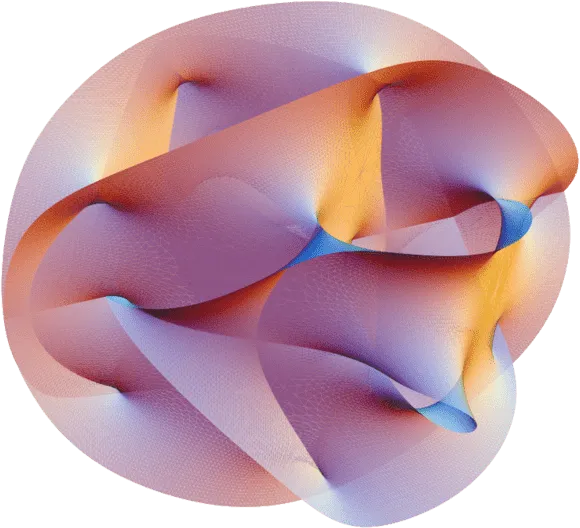
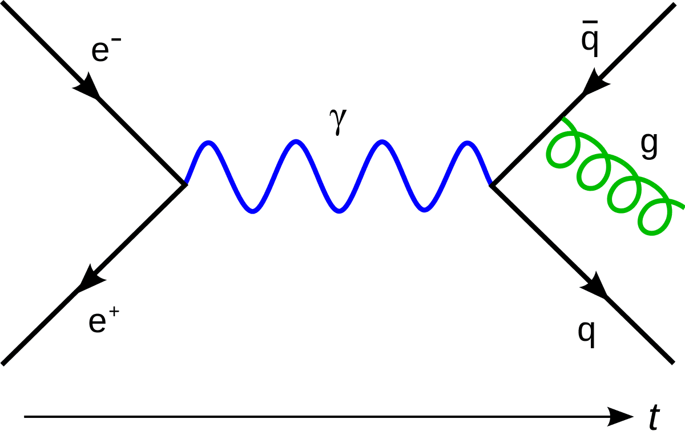
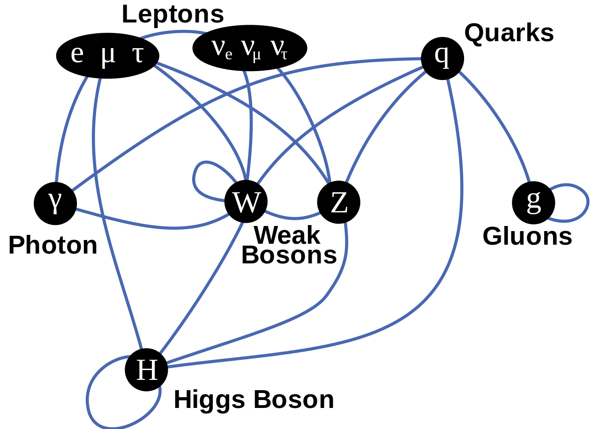
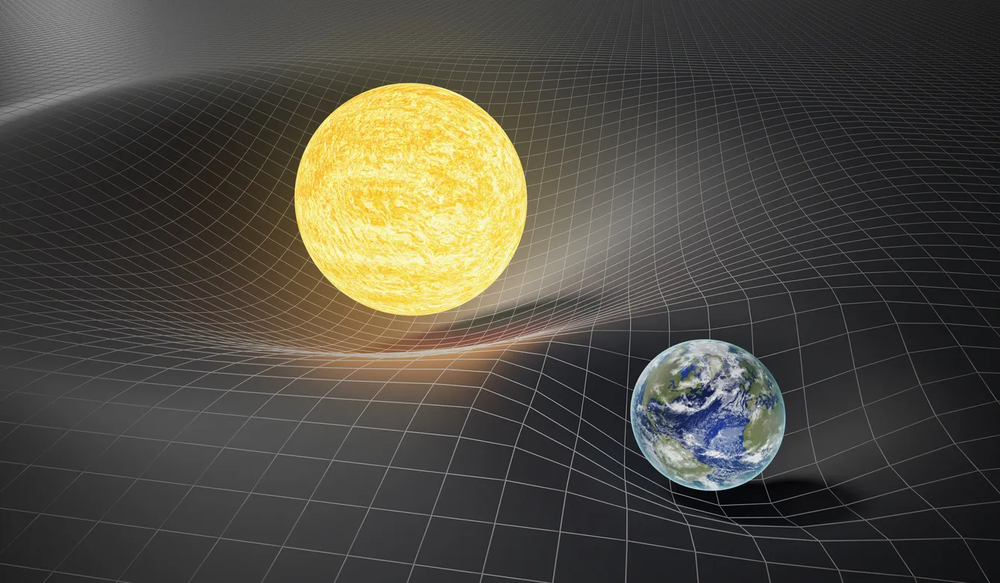
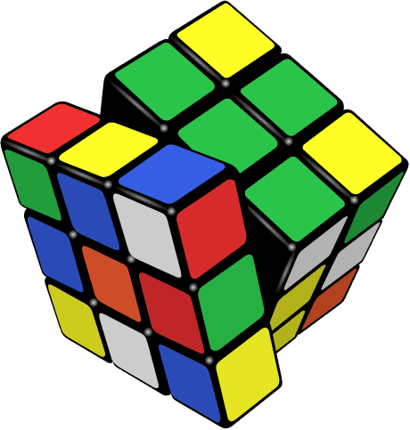
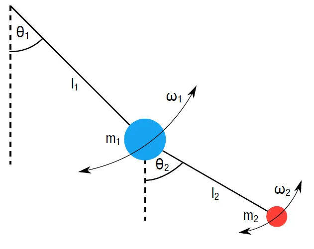
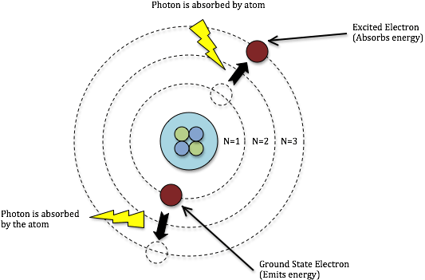
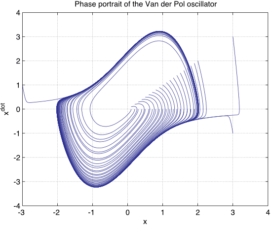
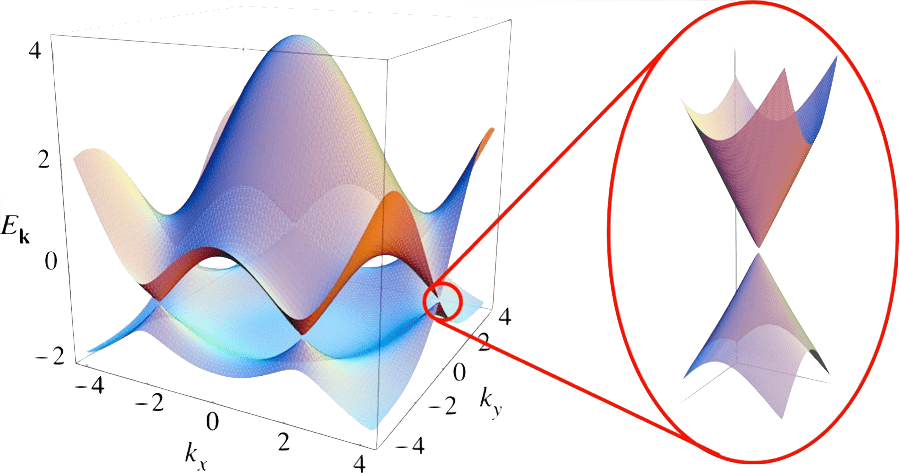
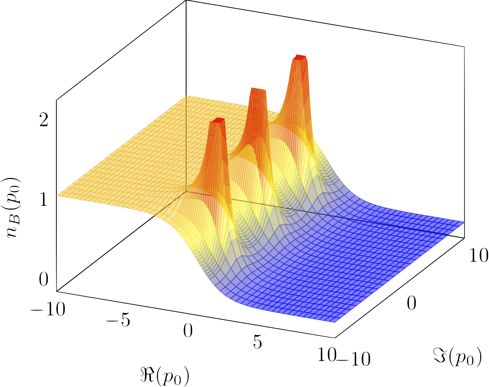

<section>
  <h2 id="notes-on-physics" class="section-title">
    <Icon icon={Atom} /> Notes on Physics
  </h2>

This is a compilation of notes and solutions to problem sheets for some of the physics lectures I took, most of them in <a href="https://www.uni-heidelberg.de/en" target="_blank" rel="noopener">Heidelberg</a>. Hopefully, they can be useful to others. If you find errors, please <a href={bugs} target="_blank" rel="noopener">open an issue</a>.

</section>

[String Theory ](physics/string-theory)

[QFT ](physics/qft)

[Advanced QFT ](physics/advanced-qft)

[General Relativity ](physics/general-relativity)

[Group Theory ](physics/group-theory)

[Numerical Simulations ](physics/numerical-simulations)

[Atomic Physics ](physics/atomic-physics)

[Statistical Physics ](physics/statistical-physics)

[QFT + Strings ](physics/advanced-qft+strings)

[Bachelor's Thesis ](physics/bachelors-thesis)

[Master's Thesis ](physics/masters-thesis)

[PhD Thesis ](physics/phd-thesis)

