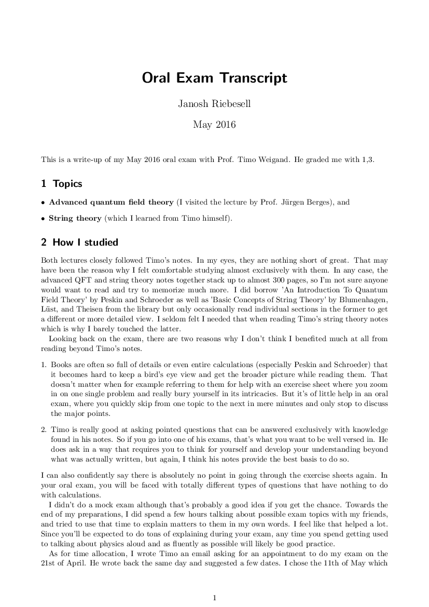
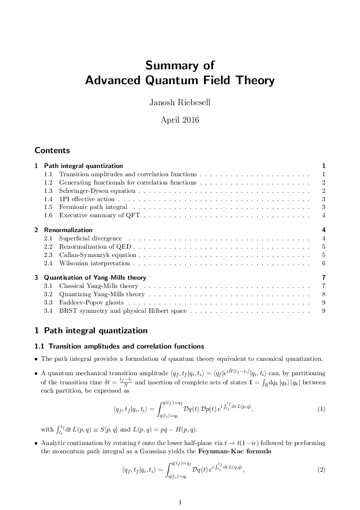
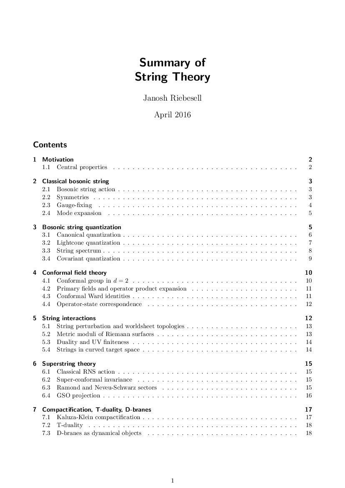
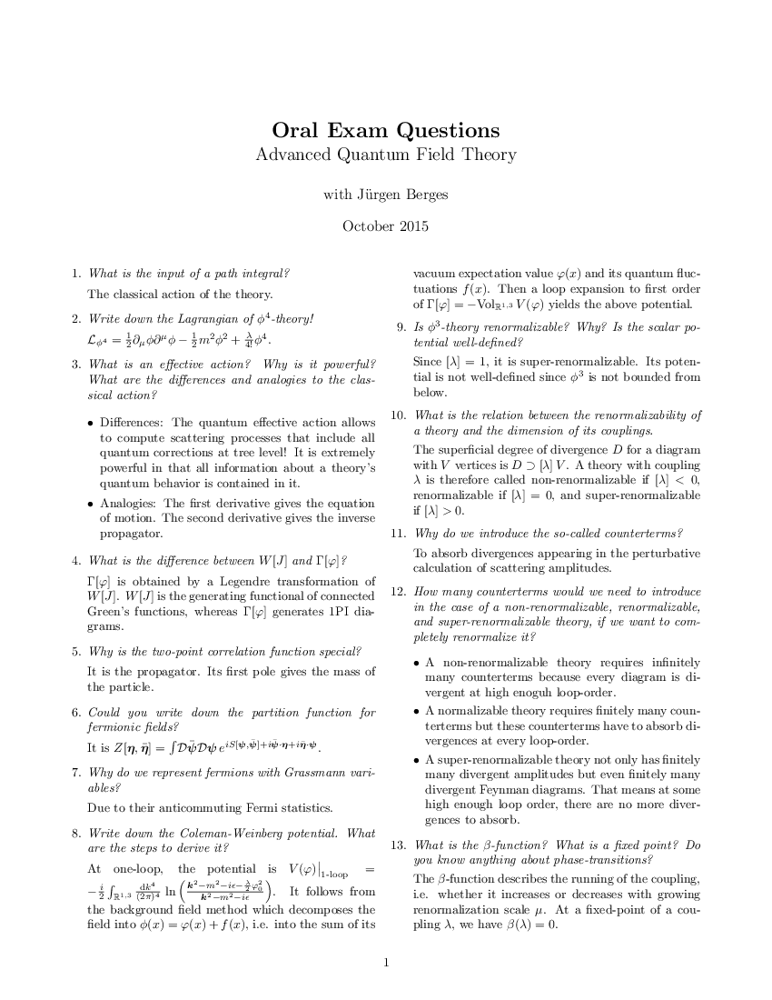
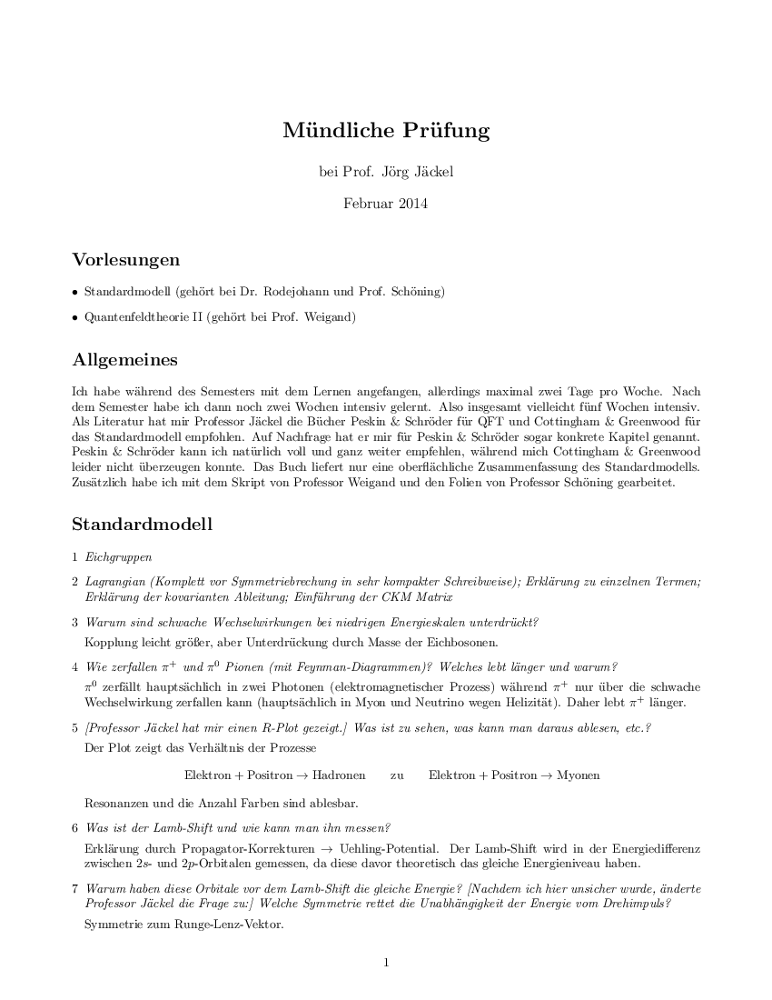
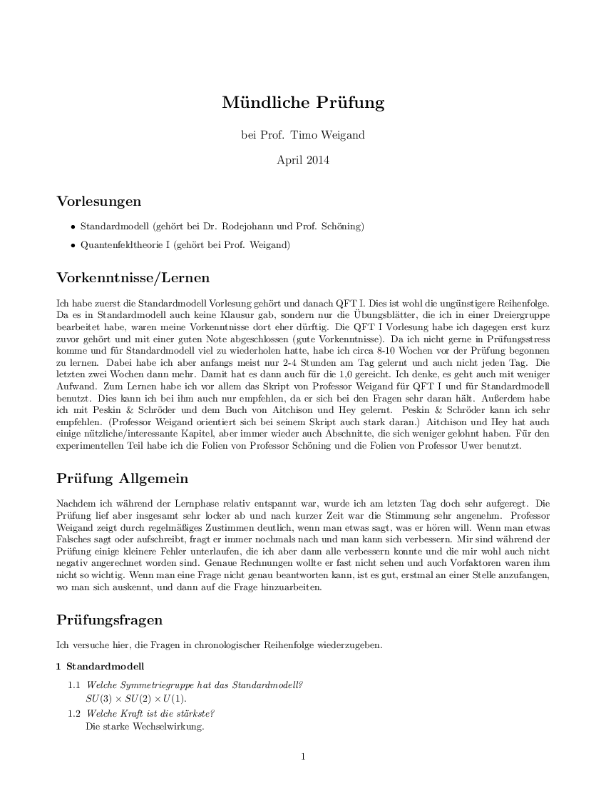
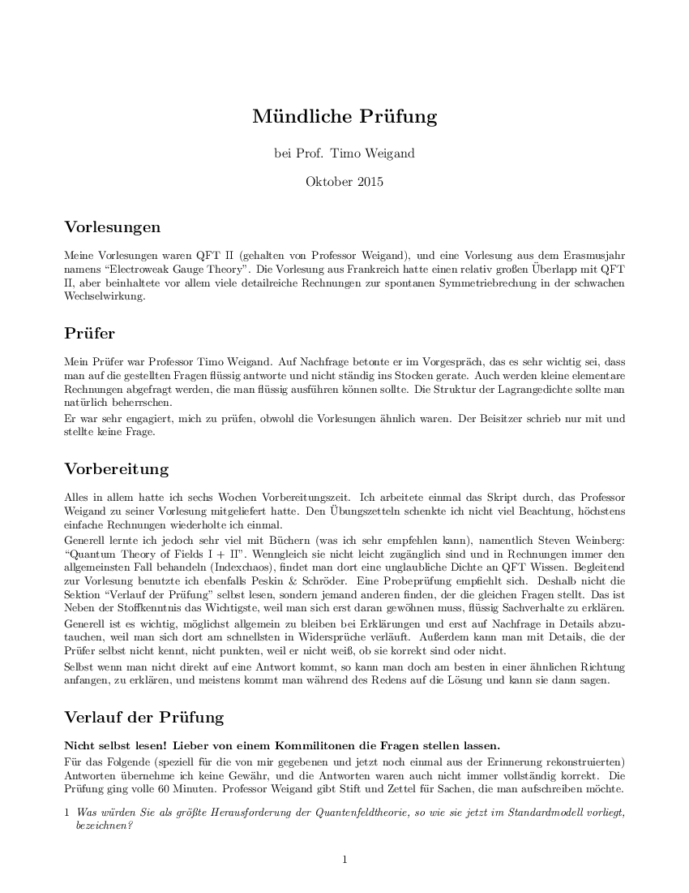

In May 2016, I had my oral exam on [string theory](/physics/string-theory) and [advanced quantum field theory](/physics/advanced-qft) with [Prof. Timo Weigand](https://www.thphys.uni-heidelberg.de/~weigand).

Below are four transcripts of past oral exams on similar topics that I used to prepare for my own. I also uploaded a transcript of my exam with Timo and summaries of his lecture notes on string theory and advanced QFT that I wrote to help me memorize them.

## Transcript and summaries

[ Transcript](./pdfs/transcript.pdf)

[ QFT summary](./pdfs/qft-summary.pdf)

[ String theory summary](./pdfs/string-theory-summary.pdf)

## Past exams

[ Berges 2015](./pdfs/berges-2015.pdf)

[ Jäckel 2014](./pdfs/jaeckel-2014.pdf)

[ Weigand 2014](./pdfs/weigand-2014.pdf)

[ Weigand 2015](./pdfs/weigand-2015.pdf)

